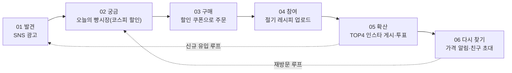
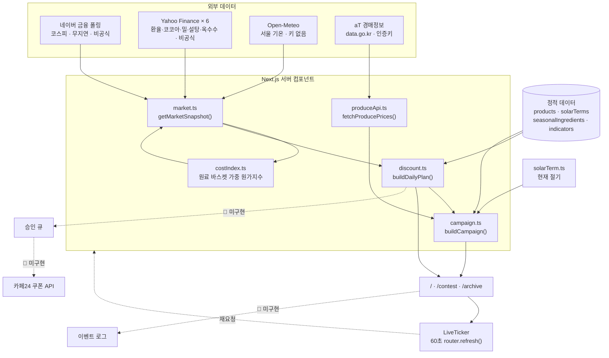
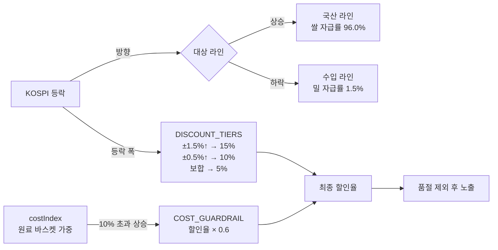
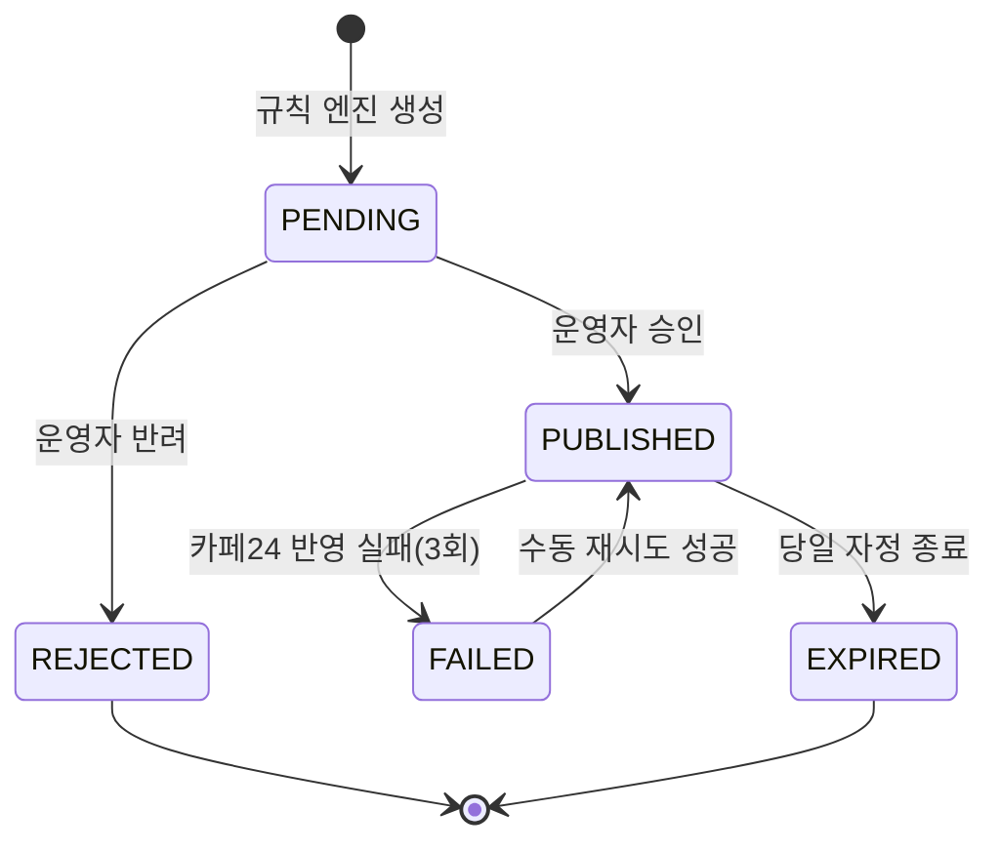
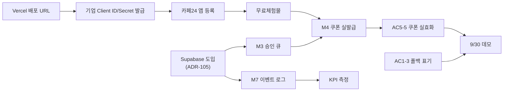

# Bread Market — 오늘의 빵시장 PRD v2.2

- **Owner 팀**: 팀1 (박수빈 · 소병윤 · 신혜원)
- **클라이언트**: ㈜스윗앤스위츠 (SWEETNSWITZ) · 웰니스 베이커리 MAKJI
- **최종 업데이트**: 2026-09-10
- **기준 코드**: `github.com/2ma1995/korea_traditional` @ `0c0a395` (계절 여정 UI 개편 + 스크롤 연출 버그 수정) — ⚠️ v2.2 시점에서 코드는 아직 BreadBuilder를 포함하고 있다. §0-2 참고
- **구현 범위**: **두 축으로 재편** — ① 코스피 연동 할인 쿠폰 + ② 절기 레시피 콘테스트 (⑤ SNS 랜딩은 두 축을 잇는 연결 장치). ②③④(ETF·FX·Index)는 여전히 설계 문서
- **마일스톤**: 9/14 기획안 발표(비대면) · 9/30 최종 발표회(대면)
- **선행 문서**: `01_VPS_BreadMarket_v0.1.md`
- **이전 버전**: `02_PRD_BreadMarket_v2.1.md`

### v2.1 → v2.2 팀 검토 반영 (2026-09-10) — 기획 중대 수정

> **팀 결정 — 빵 위에 재료를 얹어보는 인터랙티브 조합 빌더(`BreadBuilder`, `/event`)를 폐기한다.**
> 남은 두 축에 집중한다: **① 코스피 등락에 따른 제품 할인 쿠폰**, **② 절기 레시피 콘테스트**. 근거는 ADR-109.

| # | 검토 의견 | 조치 | 영향 |
|---|---|---|---|
| 1 | **인터랙티브 조합 빌더 폐기** | M6·US-2·AC2-1~2-6 전량 삭제, `/event`·`BreadBuilder.tsx`는 Won't로 이동 | CJM 7단계 → 6단계로 축소 |
| 2 | **절기 레시피 콘테스트를 두 축 중 하나로 승격, AC 상세화** | US-6 신설(AC6-1~6-8) — 업로드10일→검수1일(TOP4)→투표3일→발표 전체 흐름을 AC로 명문화 | M11 상태를 "UI 시연용"에서 "운영 흐름 확정"으로 격상 |
| 3 | ADR-108(빵 하나만 판다) | **폐기 — 대상 기능이 없어져 논거 자체가 불필요해짐**. ADR-109로 대체 | AC2-4(대체 빵 제안)도 함께 삭제 |
| 4 | U5(품절 시 대체 빵 매핑) | **삭제** — 매핑 대상이던 조합 기능이 없어짐. "재입고 계획" 확인만 남김 | §9-3 갱신 |
| 5 | 부록 A "최대 토핑 수 4" | 삭제 | — |

> ⚠️ **코드와의 간극** — 이 문서는 기획 결정을 코드보다 먼저 반영한다. `web/src`에는 아직 `BreadBuilder.tsx`·`/event`가 남아 있으므로, **개발 착수 시 이 파일들을 제거하거나 라우트를 비활성화하는 작업이 먼저 필요**하다(§4-6 착수 순서에 반영).

### v2 → v2.1 팀 검토 반영 (2026-09-10)

| # | 검토 의견 | 조치 | v2에서 이미 반영돼 있었나 |
|---|---|---|---|
| 1 | AC2-2 조합 할인가 없음. 빵만 구매 가능 | AC2-2 유지 · **ADR-108 보강** | ✅ 반영돼 있었음 |
| 2 | **품절 시 비슷한 빵으로 연계** | **AC2-4 재작성** — 제외가 아니라 **동일 라인 대체 제안** | 🆕 신규 |
| 3 | AC3-1 할인율 알림 기준을 기업에 정확히 확인 | AC3-1을 **미확정**으로 표시 · **U10 신설** | 🆕 신규 |
| 4 | AC4 쉬운 말로 | "한 줄로 말하면" 열 + "왜 필요한가" 표 | ✅ 반영돼 있었음 |
| 5 | **Given/When/Then 문장 사이에서 삭제** | **AC 전체를 한국어 조건–동작–결과 문장으로 재작성** | 🆕 신규 |
| 6 | M1 코스피 연동은 네이버로 | M1 명칭·설명에 **네이버 금융 폴링** 명시 | 🆕 신규 |
| 7 | **M4 카페24 쿠폰 발급 보류** | M4를 Must → **보류(Hold)** | 🆕 신규 |
| 8 | S1(가격 알림) → **Must** | M10으로 승격 | 🆕 신규 |
| 9 | S3(환율·금 보조 시그널) 폐기 — 다른 시세 없음 | 환율·코코아는 이미 원가 계층에 포함. **금 시세는 채택하지 않음** | ✅ v2에 이미 없었음 |
| 10 | **S5(휴장 대체 콘텐츠) 폐기** | Should에서 삭제 | 🆕 신규 |
| 11 | **C1(예측 게임) 폐기** | Won't로 이동 | 🆕 신규 |
| 12 | **C2(콘테스트)·C3(친구 초대) → Must** | M11 · M12로 승격 | 🆕 신규 |
| 13 | §5-3 계정 분리 강조 | ⭐ 표시 + 별도 행 복원 | 🆕 신규 |

> ⚠️ **범위 영향** — 이 반영으로 **Must가 9개 → 12개**가 되고 M4는 보류로 빠진다.
> 실질 개발 가용일이 10~13일인 상황에서 순증이므로, `04_TASK` 공수 추정 시 **M11(콘테스트)·M12(친구 초대)가 M10(알림)보다 뒤**라는 순서를 먼저 확정할 것. (§4-5)

---

## 0. v0.1 → v2 변경 요약

v0.1은 코드를 보지 않고 기획 문서만으로 작성했다. 저장소를 확인한 결과 **13곳이 실제 구현과 달랐다.** v2는 코드를 기준으로 다시 썼다.

| # | v0.1 가정 | 실제 구현 | v2 조치 |
|---|---|---|---|
| 1 | 구현 대상은 ① 하나 | README: **①과 ⑤ 두 개** (⑤ = 상세·랜딩 프로토타입) | 범위 확대 (§7-1) |
| 2 | 코스피 = 금융위 지수시세 **D+1** | **네이버 금융 폴링(무지연·비공식)** → Yahoo `^KS11` 폴백 | **ADR-004 폐기 → ADR-104** |
| 3 | 환율 = 수출입은행 / 금 = 금융위 | **Yahoo Finance 비공식** (`KRW=X`·`CC=F`·`ZW=F`·`SB=F`·`ZC=F`) | **ADR-103 신설 + R11** |
| 4 | 날씨 = 기상청 단기예보 | **Open-Meteo** (키 없음, 비상업 무료) | 라이선스 확인 항목 (R12) |
| 5 | Supabase DB + Prisma | **DB 없음.** Next.js ISR 캐시 + 정적 TS 데이터 | **아키텍처 전면 재작성 (§6-1)** |
| 6 | shadcn/ui | **Tailwind v4 단독**, Next 16.3.4 / React 19.2.8 | 스택 수정 |
| 7 | 영업일 1회 수집 | **`revalidate: 60`** (1분) + LiveTicker 자동 새로고침 | **호출량·비용 재산정 (§5-4)** |
| 8 | 승인 큐 구현 전제 | **미구현** — 상태 머신 코드 없음 | Must 유지 + 현황 명시 |
| 9 | 카페24 쿠폰 API 발급 | **미구현** — 쿠폰 *코드 문자열* 생성 + 복사 + makji.kr 딥링크 | **ADR-101 재작성** |
| 10 | 3층 신호 구조를 "제안" | **이미 구현됨** — `indicators.ts`의 support/cost/demand + `COST_GUARDRAIL` | **ADR-102로 승격** (코드가 정답) |
| 11 | AC2-2 "재료 올리면 할인가 적용" | `TOPPING_RULES` 주석: **재료를 올려도 가격은 안 바뀐다** (신선 농산물 미유통) | **AC2 전면 수정** |
| 12 | 품절 5종 (일반 리스크) | 국산 6종 중 **4종 품절** → 코스피 상승일 할인 대상이 3,800원 2종뿐 | **R10 신설 (심각)** |
| 13 | — | `indicators.ts`의 `source` 문자열 ≠ 실제 호출처 | **GAP 신설 (§9-3 U7)** |

> **결론** — 구현이 기획보다 앞서 있는 부분(3층 신호 구조·원가 가드레일·품절 처리·시연용 표기)이 많다. v2는 그 설계를 문서로 승격시키고, **실제 데이터 출처의 위험**을 정면으로 다룬다.

---

## 1. 개요 · 목표

### 1-1. 문제 정의 (Pain 지표 포함)

| 항목 | 5월 실측값 | 해석 |
|---|---|---|
| 로그인 | **90회 / 월** (≈3회/일) | 탐색 목적 방문이 사실상 없음 |
| 신규 가입 | **40명 / 월** | 유입 채널이 단발성 |
| 주문 | **147건**, 5/1~5/24 중 23일 발생 | 방문 트리거 불규칙 |
| 판매 SKU | **1종 (ZERO 카스테라 · `product_no=23`) = 100%** | 교차구매율 **0%** |
| 시간대 편중 | **20~24시 28.4%** / 09~15시 26.2% | 야간 소비 우세 |

> **핵심 문제** — 자사몰이 "주문 처리 창구"로만 기능하고, **방문할 이유 자체가 없다.**

> ⚠️ **v2에서 발견** — 5월에 유일하게 팔린 그 제품(`product_no=23`)이 현재 `inStock: false`다. 실판매 이력이 있는 유일한 SKU가 품절 상태다. (R10)

### 1-2. 목표

> **매일 갱신되는 "오늘 이 빵이 이 가격인 이유"를 만들어, 구매 의도가 없는 날에도 방문할 이유를 제공한다.**

| # | 목표 | 기준선 | MVP 목표 | 측정 주기 |
|---|---|---|---|---|
| O1 | 재방문 발생 | 미계측(≈0) | 계측 체계 가동 + 파일럿 15% | 일간 |
| O2 | 시세 화면 → 상품 클릭 | 미계측 | CTR ≥ 20% | 일간 |
| O3 | 할인 노출 → 구매 전환 | 미계측 | 비할인군 대비 +30% | 주간 |
| O4 | 주문당 고유 SKU 수 | **1.00** | ≥ 1.2 | 주간 |
| O5 | 프로모션 게시 리드타임 | 사람 기획 | ≤ 10분 | 일간 |
| **O6** | **광고 랜딩 → 자사몰 이동** *(⑤ 신규)* | 미계측 | 랜딩 방문 대비 딥링크 클릭 ≥ 15% | 일간 |

### 1-3. 성공 지표

**북극성 KPI — 주간 재방문율**

```
주간 재방문율 = (해당 주 2회 이상 방문한 식별 사용자) / (해당 주 방문 식별 사용자)
```

**보조 KPI**

| KPI | 기준선 | 목표 | 측정 창구 |
|---|---|---|---|
| 시세 CTR | — | 20% | 이벤트 로그 |
| 할인 전환율 | — | 비할인 대비 +30% | 이벤트 로그 + Cafe24 |
| 교차구매율 | 0% | 15% | Cafe24 주문 |
| **시세 라이브 비율** | — | **`live: true` ≥ 95%** | `MarketSnapshot.live` 집계 |
| 외부 API 비용 | — | **₩0** | 호출 카운터 |
| 쿠폰 코드 복사율 *(⑤)* | — | 랜딩 방문 대비 10% | 이벤트 로그 |

> **시세 라이브 비율**은 v2 신설 지표다. `market.ts`가 모든 외부 호출에 대해 `live: boolean`을 남기므로, **샘플 폴백으로 화면을 채운 비율**을 그대로 잴 수 있다. 이 값이 낮으면 "실시간 시장 데이터 서비스"라는 주장 자체가 흔들린다.

> ⚠️ **MVP의 정직한 한계** — 4주·현 트래픽으로 O1~O4의 통계적 유의성 확보는 불가능하다. MVP의 성공 정의는 **"파이프라인 실동작 + 계측 가능 상태의 완성"** 이다. (§8)

---

## 2. 사용자와 페르소나

| | P1 지은 (32) | P2 현우 (28) | P3 운영자 (내부) |
|---|---|---|---|
| 특징 | 글루텐 불내성 · 저당 지향 | 국내 주식 소액 투자 | 브랜드 운영진 |
| 핵심 Pain | 늘 같은 것만 삼 (SKU 1종 100%) | 관심→소비 접점 없음 | 매일 다른 이유를 못 만듦 |
| 핵심 JTBD | J1, J2, J3 | J1 | J4 |

### 2-1. Customer Journey (v2.2 — 두 축 중심 6단계로 재편)



| 단계 | 화면 | 구현 현황 | MVP 범위 |
|---|---|---|---|
| 01 발견 | 광고 랜딩 (`campaign.ts`) | 🟡 캠페인 생성 로직 있음 | **⑤ In** |
| 02 궁금 | `/` 오늘의 빵시장 — 코스피 방향·등락폭 기반 할인 | ✅ **구현됨** | **① Must** |
| 03 구매 | 쿠폰 코드 + makji.kr 딥링크 | 🟡 코드 노출까지. **카페24 API 보류(M4)** | **① Must (M9)** |
| 04 참여 | 절기 레시피 업로드 (구매자만, 10일) | 🟡 **운영 흐름 확정, 저장·업로드 미구현** | **① Must (M11)** |
| 05 확산 | 담당자 TOP4 선정(1일) → 인스타 게시 → 투표(3일) → 발표(새 절기 전날 오후) | 🟡 UI 시연용, 실 운영 미구현 | **① Must (M11)** |
| 06 다시 찾기·공유 | 가격 알림(M10) · 친구 초대(M12) | ❌ 미구현 | **① Must (M10·M12)** |

> **v2.2에서 "03 즐겨보기(절기 조합 빌더)"를 제거했다.** 이유는 두 가지다 — ① 개발 가용일(10~13일×3인) 대비 기능이 과다했다(§4-6) ② 절기별 재료·빵 페어링이라는 콘텐츠 가치는 **콘테스트(04·05단계)가 이미 담당**한다 — 사용자가 직접 레시피를 만들어 올리는 것이 조합 빌더보다 더 강한 참여 신호다.
> 04(참여)는 **구매 후에만** 가능하므로, 콘테스트 참여 자체가 03(구매)의 전환 유인이 되는 구조다.

> `/contest`·`/archive`에는 이미 **`demo-note`로 시연용임을 명시**하고 있다. 강의안 9.7(*Mock Data를 실제 데이터처럼 표시하지 않는다*)을 코드가 이미 지키고 있다.

---

## 3. 사용자 스토리와 수용 기준 (AC)

> **AC 표기 방식 (v2.1 변경)** — Given / When / Then 영문 표기를 문장에서 뺐다.
> 대신 **조건 · 동작 · 결과** 세 칸으로 나눠 쓴다. 구조는 그대로이므로 품질 게이트의 *"AC가 Given–When–Then 구조인가"* 는 계속 충족한다.
>
> | 기존 | v2.1 |
> |---|---|
> | Given | **조건** — 어떤 상태일 때 |
> | When | **동작** — 무엇이 일어나면 |
> | Then | **결과** — 무엇이 보장되는가 (수치 포함) |

### US-1 (J1) 오늘의 이유 확인

> 웰니스 소비자로서, 오늘의 시장 상황과 할인 라인업을 한 화면에서 보고 싶다. 살지 말지를 5초 안에 판단하기 위해서다.

| AC | 한 줄로 말하면 | 조건 | 동작 | 결과 | 현황 |
|---|---|---|---|---|---|
| **AC1-1** | 화면이 빠르게 뜬다 | 시세 스냅샷이 캐시에 있다 | 사용자가 오늘의 빵시장에 들어온다 | 지수·할인 라인업·근거 문구가 **p95 ≤ 500ms** 안에 보인다 | ✅ |
| **AC1-2** | **지금 시세인지, 종가인지 알려준다** | 시세 카드를 그린다 | 화면에 표시된다 | `장중 / 장 마감·종가 기준` · **출처** · **시세 시각** · `N초 전 확인`이 함께 나온다 | ✅ `LiveTicker` |
| **AC1-3 (실패)** | **가짜 값을 진짜처럼 안 보여준다** | 외부 호출이 실패해 샘플 값으로 채워졌다 (`live: false`) | 화면을 그린다 | **"예시 데이터입니다"가 화면에 표시된다** | 🔴 **미구현 — 필수 추가** |
| **AC1-4 (실패)** | 휴장일에도 화면이 산다 | 오늘이 휴장일이다 (`kospiMarketOpen === false`) | 사용자가 들어온다 | `장 마감·종가 기준`으로 표시되고, 절기 콘텐츠가 정상 노출되며 직전 할인 규칙이 유지된다 | ✅ |
| **AC1-5 (실패)** | 외부 API가 다 죽어도 화면은 뜬다 | 모든 외부 호출이 실패했다 | 사용자가 들어온다 | 샘플 폴백으로 화면이 정상 렌더되고 **5xx가 발생하지 않는다** | ✅ |

> **AC1-3이 v2의 최우선 신규 항목이다.** `market.ts`는 실패 시 `seedFrom(날짜)` 기반 의사난수로 그럴듯한 시세를 만들어 넣는다. 화면은 그것을 실제 시세와 **똑같이** 보여준다. 강의안 9.7 정면 위반이고, 발표 중 네트워크가 끊기면 **가짜 코스피가 진짜처럼 표시된다.**

### US-2 — ⛔ v2.2에서 전량 삭제

> 이전: "절기에 맞는 제철 재료를 빵 위에 올려보는" 인터랙티브 조합 빌더(`/event`, `BreadBuilder.tsx`)에 대한 사용자 스토리였다.
> **팀 결정으로 이 기능 자체를 폐기**했다 (ADR-109). AC2-1~2-6, ADR-108을 모두 폐기한다. 절기×제철재료라는 콘텐츠 가치는 **US-6(절기 레시피 콘테스트)** 가 대신 담당한다.

### US-3 (J3) 가격 알림 재방문 — ❌ 전량 미구현 · **Must로 승격 (M10)**

> 웰니스 소비자로서, 관심 등록한 빵이 할인될 때 알림을 받고 싶다. 원하는 가격에 사기 위해서다.

| AC | 한 줄로 말하면 | 조건 | 동작 | 결과 |
|---|---|---|---|---|
| **AC3-1** ⚠️ | 관심 빵이 싸지면 알려준다 | 관심 빵이 등록돼 있고, 당일 할인율이 **발송 기준치**를 넘었다 | 일일 배치가 돈다 | 알림이 **1일 최대 1회** 발송된다 |
| **AC3-2** | 알림 클릭이 재방문으로 집계된다 | 알림이 발송됐다 | 사용자가 알림을 눌러 들어온다 | `notification_open`이 기록되어 재방문 KPI에 집계된다 |
| **AC3-3 (실패)** | 같은 알림을 두 번 안 보낸다 | 24시간 내 같은 빵 알림이 이미 나갔다 | 조건이 다시 충족된다 | 발송하지 않는다 (중복률 0%) |
| **AC3-4 (실패)** | 알림 동의 없이 안 보낸다 | 사용자가 알림 수신에 동의하지 않았다 | 발송 조건이 충족된다 | 발송하지 않는다 |

> ⚠️ **AC3-1의 발송 기준치는 미확정이다.** v2까지 `+3%p 이상`으로 적었으나 **근거 없는 임의값**이었다.
> **기업에 정확히 확인할 것** (U10):
>
> | 물어볼 것 | 왜 |
> |---|---|
> | 알림 발송 기준을 **할인율 절대값**(예: 10% 이상)으로 할지, **직전 대비 상승폭**(예: +3%p)으로 할지 | 계산식 자체가 갈린다 |
> | 기준치 숫자 | 너무 낮으면 매일 울려 스팸, 너무 높으면 안 울림 |
> | 1일 최대 발송 횟수와 발송 시각 | 5월 데이터상 **20~24시가 매출 28.4%** → 20시 발송 제안 |
> | 알림 채널 (앱 푸시 / 카카오 알림톡 / 이메일) | 비용·동의 절차가 전부 다름 |
> | 마케팅 수신 동의를 카페24 회원 정보에서 받아올 수 있는지 | 없으면 별도 동의 화면 필요 |

> **전제 조건이 아직 없다** — 사용자 식별 수단과 알림 채널이 정해지지 않았다. (GAP-07)

### US-4 (J4) 운영자 승인 — ❌ 전량 미구현

> **이 스토리가 말하는 것** — 막지 담당자가 매일 "오늘 뭘 할인하지"를 고민하지 않게 만든다.
> 시스템이 **오늘의 할인안을 미리 만들어 두고**, 사람은 **승인 버튼만 누른다.**
> 누르면 실제 쇼핑몰에 쿠폰이 걸리고, 안 누르면 손님에게 아무것도 안 보인다.

| AC | 한 줄로 말하면 | 조건 | 동작 | 결과 |
|---|---|---|---|---|
| **AC4-1** | 시스템이 **할인안을 알아서 만들어 놓는다** | 오늘의 시장 데이터를 다 받아왔다 | 할인 계산 규칙이 돈다 | **① 어떤 빵을 ② 몇 % ③ 왜** 세 가지를 채운 할인안이 만들어져 **승인 대기함**에 들어간다 (`PENDING`) |
| **AC4-2** | 사람이 **승인하면 진짜 쇼핑몰에 걸린다** | 할인안이 승인 대기함에 있다 | 담당자가 승인 버튼을 누른다 | **10분 안에** 카페24에 쿠폰이 만들어지고 상태가 `게시됨`으로 바뀐다 (`PUBLISHED`) |
| **AC4-3** | **승인 안 한 건 손님한테 절대 안 보인다** | 아직 승인되지 않은 할인안이 있다 | 손님이 화면을 연다 | 그 할인안은 **화면에 나오지 않는다** (미승인 노출 0건) |
| **AC4-4 (실패)** | 카페24가 끊겨도 손님 화면은 멀쩡하다 | 쿠폰 생성이 실패했다 | 시스템이 다시 시도한다 | **최대 3번**까지만 하고 안 되면 `실패`로 표시 + 담당자에게 알림. 손님 화면은 **직전 승인 내용을 그대로 유지**한다 |
| **AC4-5** | 할인율이 **최대치를 못 넘는다** | 계산된 할인율이 최대치(기본 20%)를 넘었다 | 할인안이 만들어진다 | **최대치까지만 낮춰서** 만들고(예: 25% → 20%), 잘렸다는 사실을 기록에 남긴다 |

**왜 이 5개가 필요한가**

| AC | 없으면 생기는 일 |
|---|---|
| AC4-1 | 사람이 매일 기획해야 함 → O5 성립 안 됨 |
| AC4-2 | 화면에만 할인, 결제는 정가 |
| AC4-3 | **RFP가 금지한 "AI 자동 게시"에 해당** → 규정 위반 |
| AC4-4 | 외부 장애가 손님 화면까지 무너뜨림 |
| AC4-5 | 지수가 크게 튄 날 할인율 폭주 → 기업 손실 |

> **부분 대응은 이미 있다** — `COST_GUARDRAIL`(원가 10% 초과 상승 시 할인율 ×0.6)이 AC4-5와 같은 목적이다. 다만 **상한 클램프가 아니라 곱셈 축소**이므로, 절대 상한(예: 20%)은 별도로 필요하다.

### US-5 (⑤ SNS) 광고 랜딩 → 자사몰 — 🟡 부분 구현

> 광고를 본 잠재 고객으로서, 오늘 이 빵이 왜 좋은지 한 화면에서 보고 싶다. 바로 자사몰로 넘어가기 위해서다.

| AC | 한 줄로 말하면 | 조건 | 동작 | 결과 | 현황 |
|---|---|---|---|---|---|
| **AC5-1** | 문구를 **새로 만들지 않는다** | 오늘의 캠페인 문구가 필요하다 | 헤드라인을 만든다 | **기업 승인 문형(템플릿)에 절기명·품목명·수치만 끼워 넣는다** | ✅ `campaign.ts` |
| **AC5-2** | 근거를 함께 보여준다 | 캠페인이 만들어졌다 | 랜딩을 그린다 | *"왜 오늘 이 가격인가"* 근거 문장이 **1개 이상** 표시된다 | ✅ `reasons[]` |
| **AC5-3** | 자사몰로 정확히 보낸다 | 랜딩에 CTA가 있다 | 사용자가 CTA를 누른다 | `product_no` + **UTM 5종**이 붙은 makji.kr 상세 URL로 이동한다 | ✅ |
| **AC5-4** | 쿠폰 코드를 쓸 수 있다 | 쿠폰 코드가 표시돼 있다 | 사용자가 복사 버튼을 누른다 | 클립보드에 복사되고 자정까지 남은 시간이 표시된다 | ✅ `CouponBox` |
| **AC5-5 (실패)** | **자사몰에 없는 쿠폰을 주지 않는다** | 쿠폰 코드가 화면에 노출됐다 | 고객이 자사몰에서 그 코드를 입력한다 | **실제로 할인이 적용된다.** 적용할 수 없는 상태라면 코드를 노출하지 않는다 | 🔴 **미구현 — M4 보류로 당분간 노출 보류** |

> **AC5-5가 현재 가장 위험하다.** `couponFor()`는 `MAKJI{황경}{MM}{DD}` 형식의 문자열을 **로컬에서 만들 뿐**이고, 카페24에 그런 쿠폰은 존재하지 않는다. 지금 상태로 광고를 돌리면 **고객이 입력해도 안 먹는 쿠폰**을 배포하게 된다. (R9)

### US-6 (절기 레시피 콘테스트) 🆕 v2.2 — 두 축 중 하나로 승격, M11 상세화

> 웰니스 소비자로서, 내가 산 빵으로 만든 절기 레시피를 자사몰에 올려 다른 사람과 나누고 싶다. 인정받고 리워드도 받기 위해서다.

**전체 흐름** — 업로드 10일 → 검수(TOP4 선정) 1일 → 인스타 투표 3일 → 발표(다음 절기 전날 오후). 절기 주기(약 15일)와 사실상 일치한다.

| AC | 한 줄로 말하면 | 조건 | 동작 | 결과 | 현황 |
|---|---|---|---|---|---|
| **AC6-1** | 구매자만 업로드할 수 있다 | 사용자가 해당 절기에 빵을 구매했다 | 레시피(이미지·사용 빵·제철 재료) 업로드를 시도한다 | 제출되며 **참여 적립금이 전원에게 즉시 지급**된다 | 🔴 미구현 |
| **AC6-2** | 게시 동의 없이는 제출 못 한다 | 업로드 폼에 진입했다 | "TOP4 선정 시 인스타그램에 게시될 수 있다"는 고지에 **동의하지 않는다** | 제출 버튼이 비활성화된다 | 🔴 미구현 |
| **AC6-3** | 업로드는 10일만 받는다 | 절기가 시작됐다 | 10일이 지난다 | 업로드 폼이 닫히고 검수 단계로 전환된다 | 🔴 미구현 |
| **AC6-4** | TOP4는 1일 내 인스타에 올라간다 | 업로드가 마감됐다 | 담당자가 대표 레시피 4개를 선정한다 | 1일 이내 인스타그램에 게시되고 **TOP4에게 추가 적립금**이 지급된다 | 🔴 미구현 |
| **AC6-5** | 투표 참여자 중 추첨 리워드가 있다 | TOP4가 게시됐다 | 3일간 투표가 진행된다 | 투표 참여자 중 추첨으로 **간단한 상품**이 지급된다 | 🔴 미구현 |
| **AC6-6** | 1등은 상품 + 아카이브 영구 등재 | 투표가 마감됐다 | 집계가 완료된다 | 새 절기 전날 오후 1등이 발표되고, **상품 지급 + 아카이브 영구 등재**가 이뤄진다 | 🟡 `/archive` UI만 존재 |
| **AC6-7 (실패)** | 부적절 게시물은 걸러진다 | 업로드된 레시피 이미지·텍스트가 부적절하다 | 검수 단계에서 발견된다 | 게시되지 않고 사유가 안내된다 | 🔴 **기준 미확정 (U12)** |
| **AC6-8** | 투표 게시물엔 정해진 정보만 나온다 | TOP4 게시물이 인스타에 올라간다 | 사용자가 게시물을 본다 | **레시피 이미지·사용된 빵·제철 재료·작성자 ID**가 표시되고, "더 보기 / 해당 빵 구매하기 / 콘테스트 참여하기" 3버튼이 전부 자사몰로 연결된다 | 🔴 미구현 |

> **왜 이게 두 축 중 하나인가** — 업로드 조건이 "구매자만"이라, 콘테스트 참여 자체가 ① 축(코스피 할인)의 구매 전환을 강제한다. 두 축이 독립적인 게 아니라 **콘테스트가 할인 구매의 다음 단계로 설계**돼 있다.
> **미확정 사항** — 참여 적립금·TOP4 추가 적립금·1등 상품의 정확한 금액/품목, 부적절 게시물 처리 기준(U12).

---

## 4. 기능 요구사항 (FR) — MSCW + 구현 현황

### 4-1. Must

| ID | 기능 | 현황 | 남은 일 |
|---|---|---|---|
| **M1** | **시장 신호 수집·정규화 — 코스피는 네이버 금융 폴링** (`market.ts`) | ✅ | `indicators.ts`의 `source`를 **네이버 금융**으로 정정 (U7) |
| **M2** | 규칙 엔진 — 라인 선택 + 할인율 티어 + 원가 가드레일 | ✅ | 절대 상한 20% 추가 (AC4-5) |
| **M3** | **승인 큐** (`PENDING`→`PUBLISHED`) | 🔴 미구현 | 전량 |
| **M5** | 오늘의 빵시장 화면 + 기준시각·출처 | ✅ | **AC1-3 폴백 표기** |
| ~~M6~~ | ~~절기 × 제철재료 조합~~ | ⛔ **v2.2 폐기** | `/event`·`BreadBuilder.tsx`를 Won't로 이동 (ADR-109) |
| **M7** | **전환 트래킹** | 🔴 미구현 | 전량 |
| **M8** | 데이터 상태 관리 (`live` 플래그) | 🟡 플래그만 있음 | 화면 반영 (AC1-3) |
| **M9** | **⑤ 광고 랜딩** (`campaign.ts` + `CouponBox`) | 🟡 | 쿠폰 노출 정책 결정 (AC5-5) |
| **M10** 🆕 | **관심 빵 가격 알림** (US-3) — *v2 S1에서 승격* | 🔴 미구현 | 전량 + **발송 기준 기업 확인 (U10)** |
| **M11** | **절기 레시피 콘테스트** — *v2.2에서 운영 흐름 확정, AC6-1~6-8* | 🟡 UI 시연용 완성, 운영 절차 확정 | 저장·업로드·검수·투표 집계 전체 구현 |
| **M12** 🆕 | **친구 초대 쿠폰** — *v2 C3에서 승격* | 🔴 미구현 | 전량 |

> **Must 10개(M6 폐기로 11→10) — 완료 3 · 부분 3 · 미구현 4.**
> M10·M11·M12는 모두 **상태 저장이 필요**하므로 ADR-105(저장소 도입)가 선행 조건이 된다.
> **v2.2 핵심 구조** — Must는 이제 **① 코스피 할인(M1·M2·M3·M5·M8·M9)** 과 **② 절기 콘테스트(M11)** 두 축, 그리고 이 둘을 잇는 재방문·확산 장치(M7·M10·M12)로 정리된다.

### 4-2. 보류 (Hold) 🆕

| ID | 기능 | 보류 사유 | 해제 조건 |
|---|---|---|---|
| **M4** | **카페24 쿠폰 실제 발급** | **쿠폰 발급 API 사용 가능 여부가 기업 확인 전이다.** Client ID/Secret도 미발급 | ① 기업이 쿠폰 발급 방식을 승인 ② Client ID/Secret 수령 ③ 무료체험몰 생성 |

**보류가 만드는 연쇄 영향**

| 영향받는 항목 | 내용 |
|---|---|
| AC4-2 | 승인해도 실제 쿠폰이 안 걸린다 → 승인 큐는 **상태 변경까지만** 검증 가능 |
| AC5-5 | 쿠폰 코드를 실제 쿠폰으로 만들 수 없다 |
| **M9 (광고 랜딩)** | **쿠폰 코드 노출을 당분간 보류하거나 "발급 예정" 표기로 낮춘다** — 작동하지 않는 쿠폰 배포 방지 (R9) |
| O3 (할인 전환율) | 실측 불가 → 파일럿 이관 |

> 보류 상태에서도 M3(승인 큐)는 **Mock Adapter로 진행한다.** 발급이 풀리는 즉시 Adapter만 교체하면 되도록 인터페이스를 먼저 고정해 둔다.

### 4-3. Should

| ID | 기능 | 현황 |
|---|---|---|
| **S1** | 관리자 대시보드 — 신호·후보·호출량 | ❌ |
| **S2** | **공식 API 전환** (네이버·Yahoo → 공공데이터포털) | ❌ — **파일럿 필수 (ADR-103)** |

### 4-4. Could

없음. *(v2의 C1·C2·C3가 각각 폐기 또는 Must로 이동)*

### 4-5. Won't (제외 이유 명시)

| 제외 항목 | 이유 |
|---|---|
| **UP/DOWN 예측 미니게임** 🆕 | **팀 판단으로 폐기.** 4주 범위에 맞지 않고, Gamification은 **M11 콘테스트 + M12 친구 초대**로 대응한다 |
| **휴장·연휴 대체 콘텐츠 편성** 🆕 | **불필요.** 절기 축이 증시와 무관하게 매일 동작하므로 별도 편성 작업이 필요 없다 (AC1-4로 충분) |
| **금 시세 연동** | **채택하지 않음.** 원가 계층은 환율·코코아로 충분하고, 금은 MAKJI 원재료와 무관 |
| 실시간 KRX 공식 시세 | KRX·코스콤 이용계약 필요, **별도 견적** (강의안 부록 C) |
| 개인화 추천 엔진 | 구매이력이 단일 SKU → **② 문서로 이관** (ADR-107) |
| SNS(X API) 수집 | 반환 게시물당 과금, NAVER로 대체 가능 |
| AI 콘텐츠 생성·자동 업로드 | **RFP 명시 금지** — 템플릿 치환으로 대체 (AC5-1) |
| 상품가 직접 변경 | ADR-101 |
| **빵 + 재료 인터랙티브 조합 빌더 (`/event`·`BreadBuilder.tsx`)** 🆕 | **v2.2 팀 결정으로 폐기.** 두 축(코스피 할인·절기 콘테스트)에 집중하기 위함. 절기×제철재료라는 콘텐츠 가치는 콘테스트(US-6)가 대신 담당한다 (ADR-109) |

### 4-6. 범위 영향 ⚠️

v2.1 반영으로 Must가 **9 → 11개**(+ 보류 1)가 됐다. 실질 개발 가용일은 **10~13일 × 3인**으로 변함이 없다.

| 구분 | v2 | v2.1 | v2.2 | 증감(v2.1→v2.2) |
|---|---|---|---|---|
| Must | 9 | 11 | **10** | −1 (M6 폐기) |
| 보류 | 0 | 1 (M4) | 1 (M4) | 변동 없음 |
| Should | 4 | 2 | 2 | 변동 없음 |
| Could | 3 | 0 | 0 | 변동 없음 |
| Won't | 6 | 9 | **10** | +1 (BreadBuilder 추가) |

> **v2.2는 실질 공수를 줄이는 방향의 조정이다** — Must가 11→10으로 줄고, M11(콘테스트)이 이미 운영 흐름까지 확정돼 있어 개발 착수 시 설계 재작업이 필요 없다.

**권장 착수 순서** — 의존성과 위험도 기준. `04_TASK` 공수 추정 시 이 순서를 전제로 한다.

```
0단계 (v2.2 신규 — 정리)
  `/event` 라우트 비활성화·`BreadBuilder.tsx` 제거 (또는 배포에서 숨김)

1단계 (의존성 없음 · 오늘 가능)
  AC1-3 폴백 표기 → U7 source 정정 → M9 쿠폰 노출 정책 → AC4-5 상한

2단계 (저장소 도입 후)
  ADR-105 저장소 → M7 이벤트 로그 → M3 승인 큐(Mock)

3단계 (저장소 위에 얹는 것)
  M10 알림 → M11 콘테스트 → M12 친구 초대

M4는 기업 회신 시점에 어디든 끼어든다 (Adapter 교체)
```

> **M11·M12를 M10보다 뒤에 두는 이유** — M10(알림)은 **북극성 KPI(재방문율)에 직결**되고, M11·M12는 유입·참여 지표다. 시간이 부족해지면 뒤에서부터 잘린다.

---

## 5. 비기능 요구사항 (NFR)

### 5-1. 성능

| 항목 | SLO | 현황 |
|---|---|---|
| 오늘의 빵시장 화면 | p95 ≤ 500ms (ISR 캐시 히트) | ✅ |
| 시세 캐시 수명 | 60초 (`REVALIDATE_SECONDS`) | ✅ |
| 농산물 시세 캐시 | 3600초 | ✅ |
| 승인 → 카페24 반영 | ≤ 10분 | ❌ |

### 5-2. 신뢰성

| 항목 | SLO | 현황 |
|---|---|---|
| 월 가용성 | ≥ 99% | — |
| 고객 화면 5xx | ≤ 0.5% | ✅ 전 호출 try/catch + 폴백 |
| **시세 라이브 비율** | **`live: true` ≥ 95%** | 🔴 미계측 |
| 부분 실패 격리 | 외부 1개 장애가 다른 기능에 전파 안 됨 | ✅ `Promise.all` + 개별 폴백 |
| 농산물 데이터 신선도 | 조사일 30일 이내 | ✅ |

### 5-3. 보안

| 항목 | 기준 | 현황 |
|---|---|---|
| API Key 분리 | `.env.local`, `.gitignore` 포함 | ✅ |
| `.env.example`만 공유 | 값이 아닌 **변수명만** 공유 | ✅ |
| 외부 호출 위치 | **서버 컴포넌트 전용** — 브라우저에서 직접 호출 0건 | ✅ |
| ⭐ **계정 분리** | ⭐ **개발 · 스테이징 · 운영 계정을 분리한다**<br/>⭐ **팀원 개인계정과 기업 운영계정을 구분한다**<br/>⭐ **프로젝트 종료 시 교육생 개인 API Key를 폐기한다**<br/>⭐ 담당자 변경 시 권한을 회수한다 | 🔴 **미정 — 최우선 정리 필요** |
| 로그 | 인증키 전체가 로그에 출력되지 않는다 | 🟡 확인 필요 |
| 관리자 인증 | `/api/admin/*` 접근 통제 + 승인 이력 감사 로그 | ❌ (GAP-15) |

> ⭐ **계정 분리가 왜 중요한가**
>
> 지금은 팀원 개인 `data.go.kr` 계정 하나로 모든 환경이 돌아간다. 이 상태로 두면 세 가지가 한꺼번에 터진다.
>
> | 문제 | 결과 |
> |---|---|
> | 개발·운영이 같은 키 | 개발 중 호출로 **운영 한도(10,000/일)를 소진**한다 |
> | 개인계정으로 운영 | **프로젝트 종료 = 서비스 중단.** 우수팀 선정 시 자사몰 연동이 불가능해진다 |
> | 키 폐기 계획 없음 | 교육 종료 후에도 개인 명의 키가 기업 서비스에 남는다 |
>
> **파일럿 전환의 필수 조건**이기도 하다 (강의안 부록 A.3 · 부록 B.3).
> 카페24 Client ID/Secret은 애초에 **기업이 발급**하므로 처음부터 기업 계정이다 — 나머지(data.go.kr · KAMIS · Vercel · 저장소)를 여기에 맞춰야 한다.

### 5-4. 비용 — v2 재산정 ⚠️

v0.1은 "영업일 1회 수집"을 전제로 ₩0을 주장했다. 실제는 **60초 revalidate**라 호출량이 완전히 다르다.

| 소스 | 1회 스냅샷당 요청 | 캐시 | 최악 일일 | 최악 월간 | 한도 | 비용 |
|---|---|---|---|---|---|---|
| 네이버 금융 폴링 (코스피) | 1 | 60s | 1,440 | 43,200 | **공식 한도 없음(비공식)** | ₩0 |
| Yahoo Finance × 6 (`^KS11`·`KRW=X`·`CC=F`·`ZW=F`·`SB=F`·`ZC=F`) | 6 | 60s | 8,640 | 259,200 | **공식 한도 없음(비공식)** | ₩0 |
| Open-Meteo (기온) | 1 | 60s | 1,440 | 43,200 | 비상업 무료 | ₩0 |
| aT 경매정보 (data.go.kr) | 1 (`numOfRows=1000`) | 3600s | 24 | 720 | 개발계정 10,000/일 | ₩0 |
| **합계** | **9** | | **≈11,544** | **≈346,320** | | **₩0** |

**읽는 법**

- 최악값은 **페이지가 24시간 계속 열려 있고 `LiveTicker`가 60초마다 `router.refresh()`를 호출하는 경우**다. 현 트래픽(로그인 3회/일)에서는 실제 호출이 이보다 훨씬 적다.
- **탭 하나만 켜 둬도 최악값에 도달한다.** 발표 리허설 중 화면을 종일 띄워 두면 그날 하루에 1만 건 넘게 호출한다.
- **aT만 공식 한도가 있고, 720/월로 여유가 크다.**
- 나머지 3개는 **공식 한도가 없는 게 아니라 공식 API가 아니어서 한도가 공개돼 있지 않은 것**이다. 차단은 예고 없이 온다.

**대응 (v2 신규 요구)**

| # | 조치 |
|---|---|
| 1 | `LiveTicker` 자동 새로고침을 **탭이 보일 때만** 동작하게 제한 (`document.visibilityState`) |
| 2 | 장 마감 후에는 revalidate를 **60초 → 600초**로 완화 (`kospiMarketOpen === false`) |
| 3 | 호출 카운터를 남겨 일일 호출량을 관리자 화면에 노출 (S2) |

**파일럿 예산** — 월 **$60~150** (CurrencyAPI Small $9.99 + Metals-API Copper $19.99 + X API $10~50 + 예비비). 실시간 KRX는 **별도 견적**.

### 5-5. 컴플라이언스

| 항목 | 기준 | 현황 |
|---|---|---|
| AI 콘텐츠 자동 게시 | **금지** — 승인 큐 필수 | 🟡 문구는 템플릿 치환(✅), 승인 큐(❌) |
| 이미지·상품 콘텐츠 | 기업 승인 에셋만 | 🟡 확인 필요 |
| **Mock/샘플 데이터 구분 표시** | 실제처럼 표시 금지 | 🟡 `/contest`·`/archive` ✅ / **시세 폴백 🔴** |
| 금융 오인 방지 | 수익률·투자가치·원금보장·매수추천 금지 | ✅ 현재 문구에 없음 |
| 출처 표시 | 데이터 제공처 명시 | 🟡 `sourceLabel` 존재, **실제 출처와 일치 확인 필요 (U7)** |
| **비공식 엔드포인트 이용조건** | 상업 이용 가능 여부 | 🔴 **미확인 (R11)** |

---

## 6. 데이터 · 인터페이스 개요

### 6-1. 아키텍처 (v2 — 실제 구현 기준)



> **핵심 차이** — DB가 없다. **Next.js ISR 캐시(`next: { revalidate }`)가 곧 캐시 계층**이고, 상품·절기·재료는 `src/data/*.ts` 정적 파일이다.
> 강의안 8.2(고객 화면이 외부 API를 직접 호출)는 **서버 컴포넌트에서만 fetch**하므로 회피된다 — 브라우저는 외부로 나가지 않는다.
> 다만 **승인 큐·이벤트 로그·알림은 상태 저장이 필요**하므로, M3·M7 착수 시점에 저장소(Supabase 등) 도입 결정이 필요하다. (ADR-105)

### 6-2. 신호 3계층 (`indicators.ts` — 실제 구현)

| 계층 | 지표 | 역할 | `priceJustification` |
|---|---|---|---|
| **support** | KOSPI | **할인 대상 라인 선택** | `false` — 원가 인과 주장 금지 |
| **cost** | 원/달러 환율 · 코코아 · 버터 | **할인 폭 상한 (가드레일)** | `true` |
| **demand** | 서울 기온 · 국산 농산물 도매가 | **노출 순서 · 페어링 재료 선정** | `false` |



**원료 → 지표 매핑** (`costIndex.ts`)

| 원료 | 지표 | 근거 |
|---|---|---|
| 버터 | 환율 | 자급률 16% → 환율 직결 |
| 아몬드가루 | 환율 | 선물시장 없음, 전량 수입 |
| 알룰로스 | 옥수수 | 옥수수 유래 |
| 코코아 | 코코아 | ICE Cocoa |
| 쌀가루 · 계란 · 생크림 · 치즈 · 물 | **없음** | 국산이거나 무료 일간 지표 부재 → `coverage`로 노출 |

> **이 설계의 강점** — `products.ts`의 `recipe`가 곧 원가 가중치다. **기업 원재료표가 오면 레시피 숫자만 갈아끼우면 원가지수가 함께 정확해진다.** 구조 변경이 없다.

### 6-3. 프로모션 상태 머신 (🔴 미구현 — M3)



### 6-4. 핵심 엔터티 (실제 타입 기준)

| 엔터티 | 위치 | 주요 필드 |
|---|---|---|
| `Product` | `data/products.ts` | `productNo`(카페24 실값) · `price` · `line` · `glutenFree` · `label` · **`inStock`** · **`recipe`** |
| `Indicator` | `data/indicators.ts` | `code` · `layer`(support/cost/demand) · `source` · `updateCycle` · `free` · **`priceJustification`** |
| `MarketSnapshot` | `lib/market.ts` | `kospi` · `fxUsdKrw` · `commodities` · `tempC` · **`costIndexPct`** · `costCoverage` · `fetchedAt` · **`kospiMarketOpen`** |
| `Quote` | `lib/market.ts` | `value` · `changePct` · **`live`** · `updatedAt` |
| `DailyPlan` | `lib/discount.ts` | `targetLine` · `rate` · **`guardrailApplied`** · `headline` · `reason` · `items[]` · `soldOut[]` |
| `Campaign` | `lib/campaign.ts` | `headline` · `subline` · `hero` · `couponCode` · **`reasons[]`** · `shopUrl`(UTM) |
| `ProducePrice` | `lib/produceApi.ts` | `variety` · `price` · `changeDayPct` · **`changeMonthPct`** · `examDate` |
| `SolarTerm` | `data/solarTerms.ts` | `ko` · `hanja` · `longitude` · `month`/`day` · `food` · `rationale` |
| `conversion_event` | 🔴 미정의 | GAP-06 |
| `promotion_candidate` | 🔴 미정의 | M3 |

### 6-5. 외부 API 명세 (v2 — 실제 호출 기준)

| # | 실제 호출처 | 엔드포인트 | 공식 여부 | 갱신 | 캐시 | 인증 |
|---|---|---|---|---|---|---|
| 1 | **네이버 금융 폴링** | `polling.finance.naver.com/api/realtime/domestic/index/KOSPI` | 🔴 **비공식** (Referer 필요) | 무지연 | 60s | 없음 |
| 2 | **Yahoo Finance** | `query1.finance.yahoo.com/v8/finance/chart/{symbol}` | 🔴 **비공식** | 실시간~지연 | 60s | 없음 |
| 3 | **Open-Meteo** | `api.open-meteo.com/v1/forecast` | ✅ 공식 | 시간별 | 60s | 없음 |
| 4 | **aT 경매정보** | `apis.data.go.kr/B552845/recent/price` | ✅ 공식 | 일별 | 3600s | `DATA_GO_KR_KEY` |
| 5 | KAMIS *(선택)* | kamis.or.kr | ✅ 공식 | 일별 | — | `KAMIS_CERT_KEY/ID` |
| 6 | 카페24 Admin API | — | ✅ 공식 | — | — | 🔴 **미발급** |

**제외한 API와 이유** — X API(반환 게시물당 과금) · CurrencyAPI/Metals-API(파일럿 이관) · Twelve Data(해외시장 불필요) · 실시간 KRX(별도 계약) · Google Trends(Alpha).

> ⚠️ **1·2번이 이 프로젝트의 최대 미해결 리스크다.** 코드 주석도 *"실서비스 전환 시 공공데이터포털 공식 API로 교체해야 한다"* 고 적고 있다. (ADR-103 · R11 · S4)

---

## 7. 범위 · 리스크 · 가정 · ADR

### 7-1. In / Out

| In (구현) | Out (문서 또는 차기) |
|---|---|
| ① 시장 신호 수집·정규화 — **네이버 금융 코스피** ✅ | 실시간 KRX 공식 시세 |
| ① 규칙 엔진 + 원가 가드레일 ✅ | 머신러닝 개인화 → **②** |
| ① 승인 큐 🔴 | 환율 전면 프로모션 → **③** |
| — | 브랜드 지수 실산출 → **④** |
| — | **절기 조합 인터랙티브 빌더(`/event`·`BreadBuilder`)** — v2.2 폐기 |
| ① 전환 트래킹 🔴 | **UP/DOWN 예측 게임** (폐기) |
| ① **관심 빵 가격 알림 (M10)** 🔴 | **휴장 대체 콘텐츠 편성** (불필요) |
| ① **레시피 콘테스트 (M11)** 🟡 | **금 시세 연동** (미채택) |
| ① **친구 초대 쿠폰 (M12)** 🔴 | **빵 + 재료 조합 판매** (빵만 판매) |
| **⑤ 광고 랜딩 + 딥링크** 🟡 | SNS 광고 집행(기업 영역) |
| — | **카페24 쿠폰 실발급 (M4)** — ⏸️ **보류** |

### 7-2. 리스크

| # | 리스크 | 영향 | 확률 | 대응 |
|---|---|---|---|---|
| **R1** | 카페24 Client ID/Secret 발급 지연 | **치명** | 중 | 배포 URL 즉시 제출. 미발급 시 Mock Adapter + **화면에 Mock 명시** |
| **R2** | 증시 휴장 · 3주차 연휴 | 높음 | **확정** | 절기 축이 무관하게 동작 ✅ |
| **R3** | 정합성 공격 | 높음 | 중 | **ADR-102 — 3계층 분리가 이미 코드에 있음.** `priceJustification` 플래그가 답변 그 자체 |
| **R9** | **작동하지 않는 쿠폰 배포** | **치명** | **높음** | **M4를 보류로 전환(§4-2).** 카페24 쿠폰 발급이 확인될 때까지 쿠폰 코드를 **노출하지 않거나 "발급 예정"으로 표기**한다 (AC5-5) |
| **R14** 🆕 | **Must 순증(+2)으로 4주 범위 초과** | 높음 | **높음** | §4-6 착수 순서 고정. 부족 시 **M12 → M11 → M10 순으로 잘라낸다** |
| **R15** 🆕 | **콘테스트 UGC 운영 리스크** — 사진 저작권·부적절 게시물 | 중 | 중 | U12 회신 전까지 **업로드 없이 조합 데이터만 저장**. 사진 업로드는 승인 후 |
| **R16** 🆕 | **친구 초대 어뷰징** (다계정) | 중 | 중 | 쿠폰 사용을 **최소 주문금액 조건**과 묶고, 동일 결제수단·IP 중복 제한 |
| **R10** | **국산 라인 6종 중 4종 품절** → 코스피 상승일 할인 대상이 3,800원 2종뿐 | 높음 | **확정** | 재입고 확인(Q). 미해결 시 **라인 재분류** 또는 상승일 콘텐츠 축 변경 |
| **R11** | **비공식 엔드포인트 차단·ToS** (네이버·Yahoo) | 높음 | 중 | 공식 API 폴백 경로 마련(S4). 발표 시 **전환 계획을 먼저 밝힌다** |
| **R12** | Open-Meteo **비상업 무료** 라이선스 | 중 | 중 | 상업 전환 시 기상청 단기예보로 교체 |
| **R13** | **샘플 폴백이 실제 시세처럼 보임** | 높음 | **높음** | **AC1-3 즉시 구현** |
| R4 | 품절 제품 노출 | 중 | 낮 | ✅ 이미 처리 |
| R6 | AI 콘텐츠 금지 위반 | 높음 | 낮 | 템플릿 치환 ✅ + 승인 큐 필요 |
| R7 | 4주·3인 대비 범위 과다 | 높음 | 중 | Must 9개 중 미구현 3개로 집중 |

### 7-3. 가정

| # | 가정 | 미충족 시 |
|---|---|---|
| A1 | 기업이 원재료 구성을 제공한다 | `recipe` 추정치 유지, **문서에 추정 명시** |
| A2 | 할인율 상한이 회신된다 | 기본 **상한 20%**로 자체 파라미터화, 회신 시 값만 교체 |
| A3 | 카페24 쿠폰 API로 자동 발급이 가능하다 | R9 — 쿠폰 노출 자체를 보류 |
| A4 | 승인 담당자가 1일 1회 승인 가능 | 자동 승인 + 사후 검토로 전환(기업 협의 필수) |
| **A5** | **비공식 엔드포인트를 발표·데모까지는 써도 된다** | 공식 API 전환을 앞당김 (S4) |

### 7-4. ADR

#### ADR-101 — 할인은 쿠폰으로. 단 **현재는 코드 문자열일 뿐**이다
- **맥락**: RFP 3-3은 "상품가·쿠폰 업데이트" 둘 다 허용. 구현은 `couponFor()`가 `MAKJI{황경}{MM}{DD}` 문자열을 로컬 생성.
- **결정**: 쿠폰 방식 유지. **단 카페24 연동 전까지는 "실제 사용 가능한 쿠폰"으로 표시하지 않는다.**
- **이유**: ① 정가 고정 → 네이버쇼핑 노출가와 불일치 없음 ② 실패해도 롤백 비용 0 ③ 웬디스 다이나믹 프라이싱 불매 사례. 그러나 **없는 쿠폰을 광고에 싣는 것은 그 자체가 더 큰 리스크**다.
- **결과**: AC5-5 · R9.

#### ADR-102 — 지표를 3계층으로 분리한다 *(코드가 이미 구현 — 문서로 승격)*
- **맥락**: RFP 평가 1순위가 "시장 데이터 연동의 정합성". RFP 예시 4개는 전부 원가 인과.
- **결정**: `indicators.ts`가 `layer`(support/cost/demand)와 **`priceJustification: boolean`** 으로 계층을 강제한다.
- **이유**: 계층을 섞지 않으면 *"코스피와 빵값이 무슨 상관인가"* 에 답이 생긴다 — **"코스피는 대상만 고르고, 가격 상한은 원가 지표가 정합니다."** 플래그가 코드에 있으므로 주장이 아니라 구현이다.
- **결과**: v0.1이 "제안"했던 구조가 이미 코드에 있다. **발표의 핵심 논거로 쓴다.**

#### ADR-103 — MVP는 비공식 엔드포인트를 쓰고, 파일럿에서 공식 API로 교체한다 🔴 신설
- **맥락**: 무지연 시세를 무료로 얻기 위해 네이버 금융 폴링과 Yahoo Finance를 쓴다. 공공데이터포털 금융위 API는 **D+1**이라 "장중에 화면이 움직이는" 경험을 만들 수 없다.
- **결정**: MVP·데모는 비공식 유지. **파일럿 전환 시 공식 API로 교체**(S4). Adapter 구조라 비즈니스 로직 변경 없이 교체 가능.
- **이유**: 트레이드오프가 명확하다 — 무지연 경험 vs 이용조건 안정성. MVP 목적은 가설 검증이므로 전자를 택하되, **이 선택을 숨기지 않고 발표에서 먼저 밝힌다.**
- **결과**: R11 · §5-5 컴플라이언스 미확인 항목.
- **반드시 함께 말할 것**: *"MVP는 무지연 체감을 검증하기 위해 비공식 소스를 썼고, 파일럿에서는 금융위 공공 API 또는 KRX 정식 계약으로 전환합니다."*

#### ADR-104 — D+1 전제를 폐기한다 *(v0.1 ADR-004 대체)*
- **맥락**: v0.1은 금융위 D+1을 전제로 `전 영업일 종가 기준` 표기를 요구했다. 실제 데이터는 **무지연**이다.
- **결정**: `LiveTicker`가 `장중 / 장 마감·종가 기준`을 **동적으로** 표시한다.
- **결과**: 랜딩·CJM의 정적 표기(`KOSPI 2,647.32 ▲+1.24%`)는 **예시 데이터임을 명시**해야 한다.

#### ADR-105 — 저장소는 필요해질 때 도입한다 🔴 신설
- **맥락**: 현재 DB가 없다. ISR 캐시 + 정적 TS로 모든 화면이 동작한다.
- **결정**: **M3(승인 큐)·M7(이벤트 로그)·S1(알림)에 착수하는 시점에** Supabase를 도입한다. 그 전에는 도입하지 않는다.
- **이유**: 상태가 필요 없는 화면에 DB를 넣으면 배포·비용·장애 지점만 늘어난다. 강의안 8.1(API를 많이 연결할수록 좋다는 착각)과 같은 논리.

#### ADR-106 — 농산물은 aT 경매정보를 쓰고 KAMIS는 보조로 둔다 *(v0.1 ADR-006 수정)*
- **맥락**: v0.1은 "KAMIS → aT로 교체"라고 썼다. 실제 구현은 **aT가 주, KAMIS는 밤·대추·쑥처럼 도매시장 데이터에 없는 품목용 보조**다.
- **결정**: 현 구조 유지. v0.1의 "교체" 지시는 **철회**한다.
- **부가**: aT 응답에 **단종 품종의 2011년·2019년 레코드**가 섞여 있어 `MAX_AGE_DAYS = 30` 필터가 필수다. *(v2.2 — 이 필터의 소비처는 이제 조합 빌더가 아니라 `campaign.ts`의 "이번 절기 제철재료 중 가장 많이 내린 것"을 고르는 광고 히어로 선정 로직이다)*

#### ADR-107 — 개인화는 MVP에서 구현하지 않는다
- **맥락**: 5월 구매이력이 단일 SKU 100%, 고객 식별자 없음.
- **결정**: 규칙 기반(절기·기온·재고)으로 한정. 학습 기반은 **② 문서로 이관**.
- **이유**: 없는 데이터로 만든 개인화는 데모에서 즉시 들통난다. **Cold Start를 전제로 설계했다는 사실 자체가 ②의 설득 포인트**가 된다.

#### ADR-108 — ⛔ 폐기 (v2.2) — 대상 기능(조합 빌더) 자체가 없어짐
- 이전 결정("파는 것은 빵 하나다 · 조합에 할인가 없음 · 품절 시 대체 빵 제안")은 조합 빌더가 있을 때만 의미가 있었다. ADR-109로 대체한다.

#### ADR-109 — 절기 조합 인터랙티브 빌더를 폐기하고, 콘테스트로 통합한다 🆕 *(v2.2 신설)*
- **맥락**: 개발 가용일이 **10~13일 × 3인**으로 고정된 상태에서, v2.1까지 Must가 11개까지 늘었다(§4-6). 그중 절기 조합 빌더(M6)는 "빵 위에 재료를 얹어 페어링을 체험"하는 콘텐츠였는데, **가격에 영향을 주지 않는 콘텐츠성 기능**이라 우선순위상 가장 먼저 덜어낼 수 있는 항목이었다.
- **결정**: M6·US-2·AC2-1~2-6·ADR-108을 전량 폐기한다. `/event`·`BreadBuilder.tsx`는 Won't로 이동한다. 팀은 **① 코스피 연동 할인 쿠폰**과 **② 절기 레시피 콘테스트** 두 축에 집중한다.
- **이유**: 절기×제철재료라는 콘텐츠 가치는 사라지지 않는다 — **콘테스트(US-6)가 같은 가치를 더 강하게 담당**한다. 사용자가 직접 빵을 사서 실제 레시피를 만들어 올리는 행동은, 화면에서 가상으로 재료를 얹어보는 것보다 구매 전환·재방문 신호로서 더 강하다. 또한 콘테스트는 이미 절기 주기(약 15일)에 맞춰 업로드 10일·검수 1일·투표 3일이라는 자체 콘텐츠 리듬을 갖고 있어, 별도의 조합 빌더 없이도 "절기마다 다른 경험"이라는 목표를 달성한다.
- **결과**: Must 11→10개(§4-6). U5에서 "대체 빵 매핑" 요청은 삭제하고 "재입고 계획" 확인만 남는다(§9-3). 부록 A의 "최대 토핑 수" 파라미터도 삭제한다.
- **코드와의 간극**: 저장소에는 아직 `BreadBuilder.tsx`·`/event`가 남아 있다. 착수 0단계로 라우트 비활성화 또는 제거가 선행돼야 한다(§4-6).

### 7-5. 의존성



> **크리티컬 패스는 여전히 `배포 URL → 기업 발급 → 체험몰`이다.** 여기에 v2에서 **AC1-3(폴백 표기)** 가 추가됐다 — 이건 의존성이 없어 **오늘 바로 할 수 있고, 하지 않으면 데모 중 가짜 시세가 노출된다.**

---

## 8. 실험 · 롤아웃 · 측정

### 8-1. 롤아웃

| 시점 | 산출물 | 게이트 |
|---|---|---|
| **9/14 기획안 발표** | 핵심 가설 · PRD v2 · API 명세서 | **배포 URL 기업 제출 완료** |
| 2주차 | M3 승인 큐 + 저장소 도입 | AC1-3 완료 |
| 3주차 (연휴 전) | M4 카페24 연동 + M7 트래킹 | 배치 3일 연속 `live` ≥95% |
| **9/30 최종 발표** | 프로토타입 · 인수인계 문서 · ①⑤ + ②③④ 문서 | 리허설 2회 |

### 8-2. 실험 설계

| 가설 | 설계 | 지표 | 성공 기준 | 4주 내 검증 |
|---|---|---|---|---|
| **H1** 근거 문구가 클릭률을 올린다 | 노출/미노출 A/B | 시세 CTR | 상대 +20% | ❌ n 부족 → 방향성만 |
| **H2** 조합 경험자가 더 산다 | 코호트 비교 | 전환율 | 경험군 우위 | ❌ 동일 |
| **H3** 가격 알림이 재방문을 만든다 | 발송 → 24h 재방문 | `notification_open` | 10% | ❌ 동일 |
| **H4** 파이프라인이 매일 작동한다 | 운영 실증 | **`live: true` 비율** | **≥ 95%** | ✅ **검증 가능** |
| **H5** 승인 리드타임이 10분 이내다 | 운영 실증 | 후보→반영 소요 | ≤ 10분 | ✅ **검증 가능** |
| **H6** 무지연 시세가 D+1보다 체감이 낫다 | 정성 비교 | 사용자 반응 | — | 🟡 ADR-103 근거 보강용 |

> **MVP 합격선은 H4·H5다.** RFP도 MVP를 *"핵심 가설과 데이터 흐름이 실제로 작동하는지 검증"* 으로 정의한다.

### 8-3. 벤치마크

| 대안 | 축 | Bread Market | 측정 |
|---|---|---|---|
| 자사몰 현행 | 콘텐츠 갱신 | 월 0회 → **매 영업일** | 스냅샷 로그 |
| 수기 프로모션 | 게시 리드타임 | 사람 기획 → **≤10분** | O5 |
| 유료 데이터 | 월 비용 | $60~150 → **₩0** | §5-4 |
| D+1 공공 API | 체감 신선도 | 종가 → **무지연** | `updatedAt` |

---

## 9. 근거 (Proof)

### 9-1. 1차 자료

| # | 자료 | 쓰인 곳 |
|---|---|---|
| P1 | 기업 RFP (2026.09) | §1 · §4 · §5-5 |
| P2 | 5월 주문내역 147건 (단일 SKU) | §1-1 · O4 · ADR-107 |
| P3 | 5월 시간별 분석 (20~24시 28.4%) | §1-1 |
| P4 | `CJM.png` · `랜딩페이지.png` | §2-1 |
| P5 | **저장소 코드 `@0c0a395`** | **§0 · §4 · §5-4 · §6 전반 · §7-4** |
| P6 | 강의안 외부 API 가이드 3~10장 · 부록 A~D | §5 · §6 |

### 9-2. 2차 자료

| 주장 | 출처 |
|---|---|
| 쌀 96.0% · 밀 1.5% 자급률 | 농림축산식품부 2024 |
| 버터 자급률 16% · 자연치즈 2.5% | 국내 유제품 시장 통계 |
| 코코아 2024년 3배 폭등 | ICE Cocoa |
| 기온 임계값별 수요 급증 | 세븐일레븐 사례 (`indicators.ts` 주석) |
| 웬디스 다이나믹 프라이싱 철회 | restaurantdive.com |

### 9-3. 미검증 · 확인 필요

| # | 항목 | 영향 |
|---|---|---|
| U1 | 제품별 원재료 구성·배합 | `recipe` = 원가지수 가중치 |
| U2 | 4종 밀 함유 여부 | `line` 분류 근거 |
| U3 | 할인율 상한·쿠폰 보상 상한 | `DISCOUNT_TIERS` · AC4-5 |
| U4 | CSV 3개 금액 불일치 | 모든 KPI 베이스라인 |
| U5 | **품절 5종 재입고 계획** (v2.2 — 대체 빵 매핑 요청은 삭제. 매핑 대상 기능(AC2-4)이 폐기됨) | **R10** |
| U6 | 카페24 발급 소요 기간 | R1 크리티컬 패스 |
| **U7** | **`indicators.ts`의 `source` 문자열이 실제 호출처와 불일치** | 발표 신뢰도 |
| **U8** | **네이버·Yahoo 엔드포인트 이용조건** | R11 |
| **U9** | **Open-Meteo 상업 이용 조건** | R12 |
| **U10** 🆕 | **가격 알림 발송 기준** — 기준 방식(절대 할인율 vs 직전 대비 상승폭) · 기준치 · 1일 최대 횟수 · 발송 시각 · 채널 · 수신동의 확보 경로 | **M10 / AC3-1 — 이게 없으면 알림 로직을 못 짠다** |
| **U11** 🆕 | **카페24 쿠폰 발급 API 사용 가능 여부** | **M4 보류 해제 조건** |
| **U12** 🆕 | **콘테스트 운영 정책** — 업로드·동의·리워드 구조는 v2.2에서 확정(US-6). **남은 것**: 참여·TOP4·1등 리워드 정확한 금액/품목, 부적절 게시물 처리 기준 | M11 |
| **U13** 🆕 | **친구 초대 쿠폰 금액 상한과 중복 사용 정책** | M12 |

**U7 상세** — 문서상 출처와 실제 호출처가 다르다.

| 지표 | `indicators.ts` `source` | 실제 호출처 |
|---|---|---|
| KOSPI | 한국거래소 / 공공데이터포털 | **네이버 금융 폴링** |
| FX_USDKRW | 한국은행 ECOS | **Yahoo `KRW=X`** |
| COCOA | ICE Cocoa 지연 시세 | **Yahoo `CC=F`** |
| WEATHER_TEMP | 기상청 API | **Open-Meteo** |
| PRODUCE | 공공데이터포털 (가락시장) | ✅ 일치 |

> 평가자가 코드를 열면 즉시 드러난다. **둘 중 하나를 택해야 한다** — ① `source`를 실제 호출처로 수정하고 ADR-103으로 설명 ② 공식 API로 실제 교체. **9/14까지는 ①, 파일럿에서 ②.**

---

## 부록 A. 규칙 엔진 파라미터 (현재 코드값)

| 파라미터 | 코드 위치 | 현재값 | 비고 |
|---|---|---|---|
| 할인 티어 | `DISCOUNT_TIERS` | ±1.5%↑ → **15%** / ±0.5%↑ → **10%** / 보합 → **5%** | 데이터로 분리돼 있어 협의 후 숫자만 교체 가능 ✅ |
| 원가 가드레일 | `COST_GUARDRAIL` | 원가지수 **10%** 초과 시 할인율 **×0.6** | |
| **절대 할인 상한** | — | 🔴 **없음** | **AC4-5 — 20% 상한 추가 필요** |
| 금액 절사 | `floorTo10()` | 10원 단위 내림 | 카페24 쿠폰 금액 정합 |
| ~~최대 토핑 수~~ | ~~`TOPPING_RULES.maxToppings`~~ | ⛔ v2.2 삭제 | 조합 빌더 폐기(ADR-109)로 무의미 |
| 시세 캐시 | `REVALIDATE_SECONDS` | 60초 | §5-4 대응 필요 |
| 농산물 캐시 / 신선도 | `produceApi.ts` | 3600초 / 30일 | |
| 쿠폰 코드 | `couponFor()` | `MAKJI{황경}{MM}{DD}` | 🔴 카페24 미등록 |

## 부록 B. 화면 고지 문구

**실시간 데이터일 때** (현재 `LiveTicker`)
```
● 장중 · 네이버 금융 · 시세 14:32:05 · 12초 전 확인
```

**샘플 폴백일 때** 🔴 신규 필수 (AC1-3)
```
⚠ 예시 데이터입니다. 실제 시장정보가 아닙니다.
   외부 시세 연결이 일시적으로 원활하지 않습니다.
```

**공통 고지**
```
코스피는 원가 지표가 아니라 오늘의 할인 대상을 정하는 참여 지표입니다.
할인 폭은 원료 시세(환율·코코아)를 반영해 조정됩니다.
본 서비스의 지수·포트폴리오 표현은 브랜드 경험 지표이며, 금융투자상품이 아닙니다.
```

## 부록 C. v2 신규 작업 목록 (우선순위)

| 순위 | 작업 | 근거 | 의존성 |
|---|---|---|---|
| **1** | **AC1-3 — 샘플 폴백 화면 표기** | R13 · 강의안 9.7 위반 | **없음. 오늘 가능** |
| **2** | **U7 — `indicators.ts` `source`를 네이버 금융 등 실제값으로 수정** | 발표 신뢰도 · M1 | 없음 |
| **3** | **M9 — 쿠폰 코드 노출 보류 또는 "발급 예정" 표기** | M4 보류 · R9 | 없음 |
| **4** | **배포 URL 기업 제출** | R1 크리티컬 패스 | 없음 |
| **5** | ⭐ **계정 분리 정리** (개발/운영 · 개인/기업 · 폐기 계획) | §5-3 · 파일럿 전제 | 없음 |
| 6 | §5-4 호출량 대응 (탭 visibility 제한 + 마감 후 완화) | 비공식 API 차단 방지 | 없음 |
| 7 | 절대 할인 상한 20% 추가 | AC4-5 | 없음 |
| 8 | ~~AC2-4 품절 시 대체 빵 제안~~ | ⛔ v2.2 — 대상 기능(조합 빌더) 폐기로 불필요(ADR-109) | — |
| 9 | **기업 확인 발송** — U10(알림 기준) · U11(쿠폰 API) · U5 · U12 · U13 | M4·M10·M11·M12 전부 | 없음 |
| 10 | 저장소 도입 (ADR-105) | M7·M10·M11·M12 공통 전제 | 없음 |
| 11 | M7 이벤트 로그 | 모든 KPI | 10 |
| 12 | M3 승인 큐 (Mock Adapter) | RFP 금지조항 대응 | 10 |
| 13 | **M10 관심 빵 가격 알림** | 북극성 KPI 직결 | 10 · U10 |
| 14 | **M11 콘테스트** (저장·업로드·집계) | Must 승격 | 10 · U12 |
| 15 | **M12 친구 초대 쿠폰** | Must 승격 | 10 · U13 |
| — | M4 카페24 쿠폰 발급 | **보류** | U11 · R1 회신 시 착수 |

> **1~7번은 의존성이 없고 오늘 착수 가능하다.** 8번부터는 기업 회신 또는 저장소 도입이 선행된다.
> 시간이 부족해지면 **15 → 14 → 13 순으로 잘라낸다** (§4-6).
