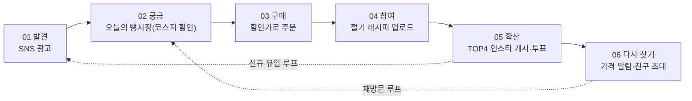
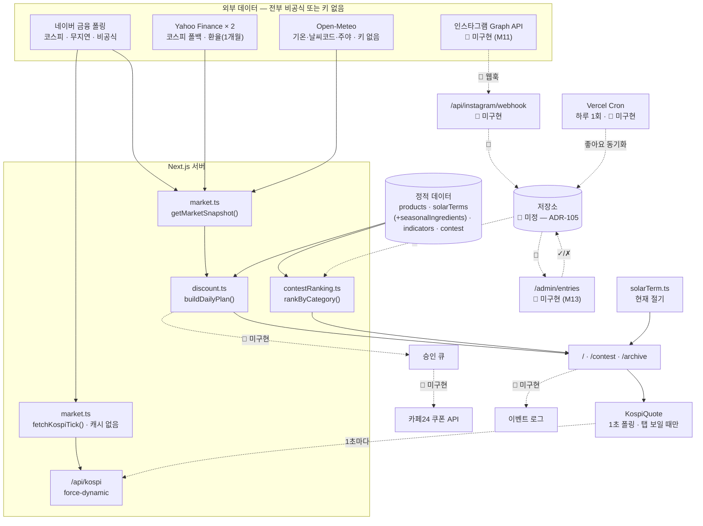
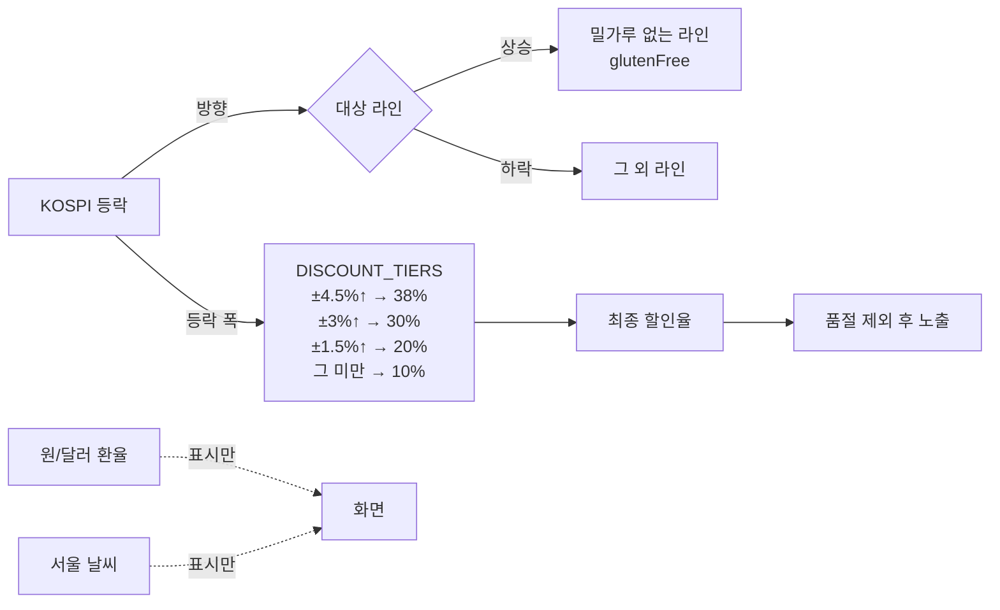
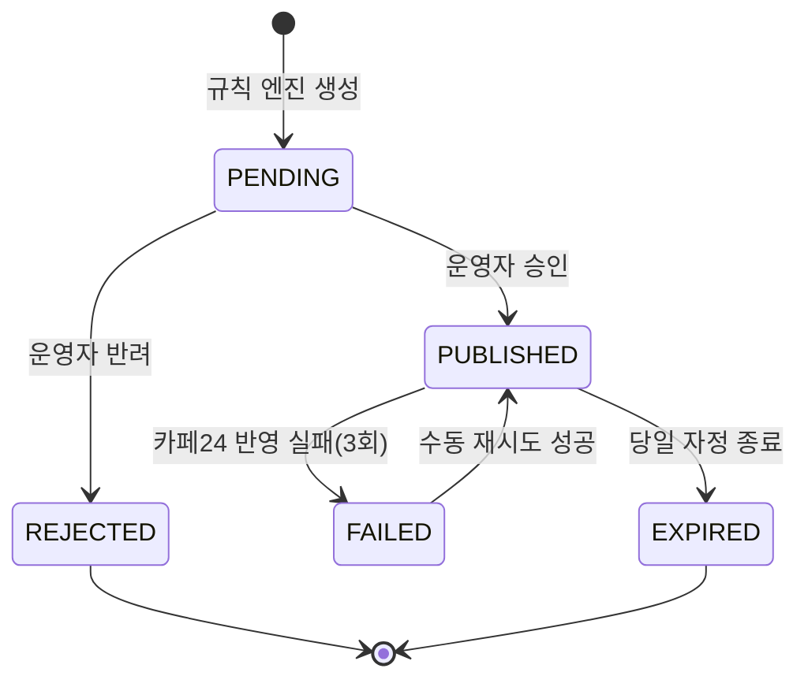
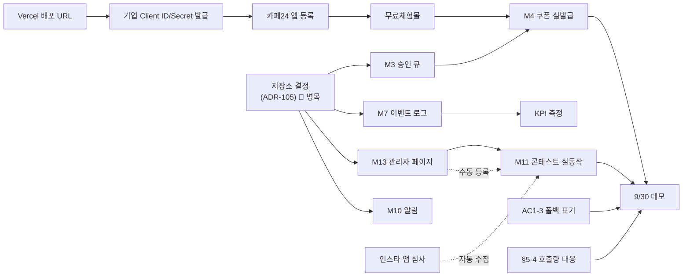

# Bread Market — 오늘의 빵시장 PRD v2.3

- **Owner 팀**: 팀1 (박수빈 · 소병윤 · 신혜원)
- **클라이언트**: ㈜스윗앤스위츠 (SWEETNSWITZ) · 웰니스 베이커리 MAKJI
- **최종 업데이트**: 2026-09-10
- **기준 코드**: `github.com/2ma1995/korea_traditional` @ `b0ad2c2` (콘테스트 갤러리 — 인스타그램 수집 연동 + 카드 정리) + 미커밋 작업분
- **구현 범위**: **두 축** — ① 코스피 연동 할인 + ② 절기 조리법 대회. **⑤ SNS 광고 랜딩은 v2.3에서 정식 폐기**(ADR-112) — 이제 범위가 두 축뿐이다. ②③④(ETF·FX·Index)는 여전히 설계 문서
- **마일스톤**: 9/14 기획안 발표(비대면) · 9/30 최종 발표회(대면)
- **선행 문서**: `01_VPS_BreadMarket_v0.1.md`
- **이전 버전**: `02_PRD_BreadMarket_v2.2.md`

### v2.2 → v2.3 코드 반영 (2026-09-10) — 문서가 코드를 따라잡는 개정

> **v2.2는 기획 결정을 코드보다 먼저 적었다. v2.3은 그 반대다** — 그 사이 코드가 3개 커밋 움직였고, v2.2가 예고한 정리가 실제로 실행되면서 **예고에 없던 삭제까지 함께 일어났다.** v2.3은 실제 저장소 상태를 기준으로 문서를 맞춘다.

| # | 무엇이 바뀌었나 | 근거 커밋 | 문서 조치 | 심각도 |
|---|---|---|---|---|
| 1 | **`/event`·`BreadBuilder` 실제 제거 완료** — v2.2가 예고한 0단계가 끝났다 | `f9f2ad3` | §4-6 0단계 **완료 표시**. "코드와의 간극" 경고 해제 | 예고대로 |
| 2 | **⑤ 광고 랜딩 축 정식 폐기** — `campaign.ts` 삭제는 **팀 결정**이었음이 확인됐다 | `f9f2ad3` | **US-5 전량 폐기 · M9 → Won't · O6·쿠폰 복사율 KPI 삭제 · ADR-112 신설** | **중대(결정)** |
| 3 | ⚠️ **`produceApi.ts` 삭제 → 농산물(aT) 연동 소멸** | `f9f2ad3` | §6-2 demand 계층 축소, §6-5에서 aT 제거, **ADR-106 폐기**, 인증키 필요한 소스가 0개가 됨 | **중대** |
| 4 | **`LiveTicker` 폐기 → `KospiQuote` + `/api/kospi` 1초 폴링** | `3f2a197` + 미커밋 | AC1-2 재작성(후퇴 · R21), **§5-4 호출량 전면 재산정**, R17 신설 후 **완화 구현·실측 완료** | **중대(완화됨)** |
| 5 | **콘테스트를 인스타그램 멘션 수집 기반으로 재설계** — 사이트 투표 폐기, 좋아요는 게시물에서 가져옴 | `b0ad2c2` | **US-6/AC6 전면 재작성**, ADR-110·111 신설 | **중대** |
| 6 | 콘테스트 노출을 **빵 카테고리별 좋아요 1~3위**로 변경 + 관리자 검수 상태(`status`) 도입 | `b0ad2c2` + 미커밋 | AC6 재작성, M13(관리자 페이지) 신설 | 신규 |
| 7 | `/archive` 절기 카드에 **제철 재료 표기** — `solarTerms.ts`에 `seasonalIngredients` 필드 추가 | 미커밋 | §6-4 엔터티 갱신. **삭제된 `seasonalIngredients.ts`의 가치가 필드로 복원됨** | 신규 |
| 8 | 오프닝 연출 개편 — `WeatherScene`·`FxSparkline`·`WeatherTile` 추가, `MarketSnapshot`에 `weatherCode`·`isDay`·`fxSeries` 추가 | `3f2a197` | §6-1·§6-4 갱신 | 신규 |
| 9 | **고아 컴포넌트 2개 발생** — `CouponBox`·`SeasonStrip` 참조 0곳 | `f9f2ad3` | 부록 C에 정리 작업 추가 | 정리 |
| 10 | **`indicators.ts`의 PRODUCE 지표가 호출처 없이 남았다** | `f9f2ad3` | ✅ **11번에서 함께 해소** | 정리 |
| **11** | 🔴 **원가 연동 전량 폐기 — 할인 근거는 코스피 하나로 확정** | 미커밋 | **ADR-102 폐기 · ADR-113 신설**. `costIndex.ts` 삭제, 원자재 4종 수집 중단, `COST_GUARDRAIL` 제거, 지표 6개→3개, 부록 B 고지 문구 수정 | **중대(결정)** |
| **12** | ✅ **기업 회신 — 최대 할인율 38% (전 상품 동일)** | 미커밋 | **U3 해소 · AC4-5 구현**(`MAX_DISCOUNT_RATE = 0.38`). 회신의 판매 상품 5종이 `inStock` 데이터와 일치 → **R10 확정** | 기업 확인 |
| **13** | ✅ **할인 티어 4단계 확정 + 실데이터 검증** | 미커밋 | **±4.5→38% / ±3→30% / ±1.5→20% / ±1→10%.** 코스피 1년치(243거래일)로 시뮬레이션해 **연평균 할인율 19.5%** 확인. 부록 D 신설 | 팀 결정 |
| ~~**14**~~ | ~~정합성 논거 확정 — "국산 쌀가루 ↔ 국내 증시"~~ | — | ⛔ **2026-09-18 폐기·교체.** 막지 쌀가루가 국내산이 아님을 팀이 원재료 표기로 확인. 자급률 논거와 함께 철회하고 **수요 논거**로 교체했다 (아래 16번) | **중대** |
| **16** 🆕 | ⭐ **정합성 논거 교체 — "국장이 흔들린 날 = 소비가 위축되는 날"** | 2026-09-18 | 코스피를 **수요 지표**로 재정의. 근거 **Han (2026)** *Global Economic Review* 55(1)(서울 일별 카드결제 ↔ 코스피 일별 수익률) · **Garg·Wansink·Inman (2007)** *Journal of Marketing* 71(슬플 때 달콤한 것 선택 ↑). 화면에 규칙 한 줄 추가, `DOWN_MARKET_BONUS` +3%p 구현. ADR-113·R3·R22 갱신 | **중대** |
| **16** | 🔴 **일일 할인은 쿠폰이 아니라 할인율 판매 — 쿠폰은 우승자 전용** | — | **ADR-101 폐기 · ADR-115 신설.** M4 용도 변경(Winner Price 전용) → **M4 보류가 ① 축을 막지 않게 됨**. **R9 해소** · U19 신설 | **중대(정정)** |
| **15** | **분류 기준을 `glutenFree`로 둔 이유 문서화** | — | **ADR-114 신설.** 쌀가루 기준이면 4:1이 되어 하락일에 1종만 할인된다. 대신 서사 표현을 **"수입 밀을 쓰지 않은 라인"** 으로 고정. **U1 해소**(원료 구성은 브랜드 페이지에서 확인 완료) | 팀 결정 |

> ⚠️ **v2.3의 핵심 경고 두 개** *(⑤ 축 존폐는 정식 폐기로 결정 완료 — ADR-112)*
>
> **① 호출량이 60배로 뛰었다가, 완화해서 3배로 내려왔다.** `/api/kospi`가 캐시 없이 1초마다 네이버를 호출해 **탭 하나가 시간당 3,600회**였다(v2.2 최악값은 하루 1,440회). **서버 측 1초 공유 캐시 + in-flight 병합 + 장 마감 시 정지**를 넣어 접속자 수와 호출량을 분리했다 — 실측 **22요청 → 5호출**, **동시 30명 → 0호출**. (§5-4 · R17)
>
> **② 저장소 미정이 이제 3개가 아니라 5개를 막고 있다.** M3·M7·M10·M11·M12에 **M13(관리자 페이지)** 가 추가됐다. 콘테스트가 인스타 수집 기반으로 바뀌면서 "웹훅으로 받은 게시물을 어디에 저장하는가"가 콘테스트 동작의 전제 조건이 됐다. ADR-105를 **결정 대기 → 즉시 결정 필요**로 올린다. (R18)

### v2.3 별도 문서

- **`기획_인스타그램_출품수집.md`** 🆕 — 인스타그램 멘션 수집·관리자 검수·좋아요 동기화의 API 제약을 Meta·Vercel 공식 문서로 확인해 정리한 문서. US-6·ADR-110·ADR-111의 근거다.

### v2.1 → v2.2 팀 검토 반영 (2026-09-10) — 기획 중대 수정

> **팀 결정 — 빵 위에 재료를 얹어보는 인터랙티브 조합 빌더(`BreadBuilder`, `/event`)를 폐기한다.**
> 남은 두 축에 집중한다: **① 코스피 등락에 따른 제품 할인 쿠폰**, **② 절기 조리법 대회**. 근거는 ADR-109.

| # | 검토 의견 | 조치 | 영향 |
|---|---|---|---|
| 1 | **인터랙티브 조합 빌더 폐기** | M6·US-2·AC2-1~2-6 전량 삭제, `/event`·`BreadBuilder.tsx`는 Won't로 이동 | CJM 7단계 → 6단계로 축소 |
| 2 | **절기 조리법 대회를 두 축 중 하나로 승격, AC 상세화** | US-6 신설(AC6-1~6-8) — 업로드10일→검수1일(TOP4)→투표3일→발표 전체 흐름을 AC로 명문화 | M11 상태를 "UI 시연용"에서 "운영 흐름 확정"으로 격상 |
| 3 | ADR-108(빵 하나만 판다) | **폐기 — 대상 기능이 없어져 논거 자체가 불필요해짐**. ADR-109로 대체 | AC2-4(대체 빵 제안)도 함께 삭제 |
| 4 | U5(품절 시 대체 빵 매핑) | **삭제** — 매핑 대상이던 조합 기능이 없어짐. "재입고 계획" 확인만 남김 | §9-3 갱신 |
| 5 | 부록 A "최대 토핑 수 4" | 삭제 | — |

> ⚠️ **코드와의 간극** — 이 문서는 기획 결정을 코드보다 먼저 반영한다. `web/src`에는 아직 `BreadBuilder.tsx`·`/event`가 남아 있으므로, **개발 착수 시 이 파일들을 제거하거나 라우트를 비활성화하는 작업이 먼저 필요**하다(§4-6 착수 순서에 반영).

### v2 → v2.1 팀 검토 반영 (2026-09-10)

| # | 검토 의견 | 조치 | v2에서 이미 반영돼 있었나 |
|---|---|---|---|
| 1 | AC2-2 조합 할인가 없음. 빵만 구매 가능 | AC2-2 유지 · **ADR-108 보강** | ✅ 반영돼 있었음 |
| 2 | **품절 시 비슷한 빵으로 연계** | **AC2-4 재작성** — 제외가 아니라 **동일 라인 대체 제안** | 🆕 신규 |
| 3 | AC3-1 할인율 알림 기준을 기업에 정확히 확인 | AC3-1을 **미확정**으로 표시 · **U10 신설** | 🆕 신규 |
| 4 | AC4 쉬운 말로 | "한 줄로 말하면" 열 + "왜 필요한가" 표 | ✅ 반영돼 있었음 |
| 5 | **Given/When/Then 문장 사이에서 삭제** | **AC 전체를 한국어 조건–동작–결과 문장으로 재작성** | 🆕 신규 |
| 6 | M1 코스피 연동은 네이버로 | M1 명칭·설명에 **네이버 금융 폴링** 명시 | 🆕 신규 |
| 7 | **M4 카페24 쿠폰 발급 보류** | M4를 Must → **보류(Hold)** | 🆕 신규 |
| 8 | S1(가격 알림) → **Must** | M10으로 승격 | 🆕 신규 |
| 9 | S3(환율·금 보조 시그널) 폐기 — 다른 시세 없음 | 환율·코코아는 이미 원가 계층에 포함. **금 시세는 채택하지 않음** | ✅ v2에 이미 없었음 |
| 10 | **S5(휴장 대체 콘텐츠) 폐기** | Should에서 삭제 | 🆕 신규 |
| 11 | **C1(예측 게임) 폐기** | Won't로 이동 | 🆕 신규 |
| 12 | **C2(콘테스트)·C3(친구 초대) → Must** | M11 · M12로 승격 | 🆕 신규 |
| 13 | §5-3 계정 분리 강조 | ⭐ 표시 + 별도 행 복원 | 🆕 신규 |

> ⚠️ **범위 영향** — 이 반영으로 **Must가 9개 → 12개**가 되고 M4는 보류로 빠진다.
> 실질 개발 가용일이 10~13일인 상황에서 순증이므로, `04_TASK` 공수 추정 시 **M11(콘테스트)·M12(친구 초대)가 M10(알림)보다 뒤**라는 순서를 먼저 확정할 것. (§4-5)

---

## 0. v0.1 → v2 변경 요약

v0.1은 코드를 보지 않고 기획 문서만으로 작성했다. 저장소를 확인한 결과 **13곳이 실제 구현과 달랐다.** v2는 코드를 기준으로 다시 썼다.

| # | v0.1 가정 | 실제 구현 | v2 조치 |
|---|---|---|---|
| 1 | 구현 대상은 ① 하나 | README: **①과 ⑤ 두 개** (⑤ = 상세·랜딩 프로토타입) | 범위 확대 (§7-1) |
| 2 | 코스피 = 금융위 지수시세 **D+1** | **네이버 금융 폴링(무지연·비공식)** → Yahoo `^KS11` 폴백 | **ADR-004 폐기 → ADR-104** |
| 3 | 환율 = 수출입은행 / 금 = 금융위 | **Yahoo Finance 비공식** (`KRW=X`·`CC=F`·`ZW=F`·`SB=F`·`ZC=F`) | **ADR-103 신설 + R11** |
| 4 | 날씨 = 기상청 단기예보 | **Open-Meteo** (키 없음, 비상업 무료) | 라이선스 확인 항목 (R12) |
| 5 | Supabase DB + Prisma | **DB 없음.** Next.js ISR 캐시 + 정적 TS 데이터 | **아키텍처 전면 재작성 (§6-1)** |
| 6 | shadcn/ui | **Tailwind v4 단독**, Next 16.3.4 / React 19.2.8 | 스택 수정 |
| 7 | 영업일 1회 수집 | **`revalidate: 60`** (1분) + LiveTicker 자동 새로고침 | **호출량·비용 재산정 (§5-4)** |
| 8 | 승인 큐 구현 전제 | **미구현** — 상태 머신 코드 없음 | Must 유지 + 현황 명시 |
| 9 | 카페24 쿠폰 API 발급 | **미구현** — 쿠폰 *코드 문자열* 생성 + 복사 + makji.kr 딥링크 | **ADR-101 재작성** |
| 10 | 3층 신호 구조를 "제안" | v2에서 구현 확인 → **v2.3에서 전량 폐기** | ~~ADR-102~~ → **ADR-113** (원가를 가격 근거로 쓰지 않는다) |
| 11 | AC2-2 "재료 올리면 할인가 적용" | `TOPPING_RULES` 주석: **재료를 올려도 가격은 안 바뀐다** (신선 농산물 미유통) | **AC2 전면 수정** |
| 12 | 품절 5종 (일반 리스크) | 국산 6종 중 **4종 품절** → 코스피 상승일 할인 대상이 3,800원 2종뿐 | **R10 신설 (심각)** |
| 13 | — | `indicators.ts`의 `source` 문자열 ≠ 실제 호출처 | **GAP 신설 (§9-3 U7)** |

> **결론** — 구현이 기획보다 앞서 있는 부분(3층 신호 구조·원가 가드레일·품절 처리·시연용 표기)이 많다. v2는 그 설계를 문서로 승격시키고, **실제 데이터 출처의 위험**을 정면으로 다룬다.

### 0-3. v2.3에서 코드가 잃은 것 ⚠️ 신설

`f9f2ad3` "나만의 절기상(/event) 폐기" 커밋은 **761줄을 삭제**했다. v2.2가 예고한 것은 `/event`·`BreadBuilder` 두 개였지만, 실제로는 그 두 개가 의존하던 파일까지 함께 지워졌다.

| 삭제된 파일 | 줄수 | v2.2에서의 역할 | 문서에 남은 흔적 |
|---|---|---|---|
| `app/event/page.tsx` · `components/BreadBuilder.tsx` | 132 | M6 조합 빌더 | ✅ 예고대로 (ADR-109) |
| `data/seasonalIngredients.ts` | 186 | 절기별 제철 재료 마스터 | ⚠️ **§6-1 아키텍처 도식에 아직 있었다** → v2.3에서 제거. 값 자체는 `solarTerms.ts`의 `seasonalIngredients` 필드로 일부 복원됨 |
| `lib/produceApi.ts` | 144 | **aT 경매정보 연동** (`ProducePrice`) | ⚠️ **§5-4 비용표 · §6-2 demand 계층 · §6-5 4번 · ADR-106의 대상** → 전부 갱신 |
| `lib/campaign.ts` | 123 | **⑤ 광고 랜딩 생성** (`Campaign`·`couponFor`) | ✅ **팀 결정에 따른 정식 폐기** (ADR-112). US-5·M9·O6·쿠폰 KPI를 문서에서도 제거 |
| `lib/validateTopping.ts` · `data/pairingDictionary.ts` | 168 | 토핑 검증·페어링 사전 | ✅ 조합 빌더 종속 |

**이 삭제가 만든 3가지 구조 변화**

| # | 변화 | 왜 중요한가 |
|---|---|---|
| 1 | **인증키가 필요한 외부 소스가 0개가 됐다** | `DATA_GO_KR_KEY`가 유일한 인증키였다. §5-3 "계정 분리"의 대상이 카페24 하나로 줄고, "개발 호출로 운영 한도 소진" 문제는 **사라졌다.** 대신 남은 소스가 **전부 비공식**이 됐다 (R11 악화) |
| 2 | **⑤ 축을 정식 폐기했다** | 랜딩·쿠폰·UTM·근거 문구 생성이 전부 `campaign.ts`에 있었다. 지금 `/`(오늘의 빵시장)만 남았다. **O6·쿠폰 복사율 KPI를 삭제**하고 범위를 두 축으로 확정했다 (ADR-112) |
| 3 | ~~demand 계층이 절반이 됐다~~ | ✅ **무의미해졌다** — v2.3에서 계층 구조 자체를 폐기했다(ADR-113). 기온·환율은 **화면 표시용**이고 할인 계산에 관여하지 않는다 |

> **판단** — 1번은 오히려 좋다(관리 대상 축소). 2번은 **팀 결정이 확인됐다** — 정식 폐기로 처리하고 문서에서 ⑤ 축을 걷어냈다(ADR-112). **3번(demand 계층 축소)만 남았고, 발표에서 질문받을 지점이다.**

---

## 1. 개요 · 목표

### 1-1. 문제 정의 (Pain 지표 포함)

| 항목 | 5월 실측값 | 해석 |
|---|---|---|
| 로그인 | **90회 / 월** (≈3회/일) | 탐색 목적 방문이 사실상 없음 |
| 신규 가입 | **40명 / 월** | 유입 채널이 단발성 |
| 주문 | **147건**, 5/1~5/24 중 23일 발생 | 방문 트리거 불규칙 |
| 판매 SKU | **1종 (ZERO 카스테라 · `product_no=23`) = 100%** | 교차구매율 **0%** |
| 시간대 편중 | **20~24시 28.4%** / 09~15시 26.2% | 야간 소비 우세 |

> **핵심 문제** — 자사몰이 "주문 처리 창구"로만 기능하고, **방문할 이유 자체가 없다.**

> ⚠️ **v2에서 발견** — 5월에 유일하게 팔린 그 제품(`product_no=23`)이 현재 `inStock: false`다. 실판매 이력이 있는 유일한 SKU가 품절 상태다. (R10)

### 1-2. 목표

> **매일 갱신되는 "오늘 이 빵이 이 가격인 이유"를 만들어, 구매 의도가 없는 날에도 방문할 이유를 제공한다.**

| # | 목표 | 기준선 | MVP 목표 | 측정 주기 |
|---|---|---|---|---|
| O1 | 재방문 발생 | 미계측(≈0) | 계측 체계 가동 + 파일럿 15% | 일간 |
| O2 | 시세 화면 → 상품 클릭 | 미계측 | CTR ≥ 20% | 일간 |
| O3 | 할인 노출 → 구매 전환 | 미계측 | 비할인군 대비 +30% | 주간 |
| O4 | 주문당 고유 SKU 수 | **1.00** | ≥ 1.2 | 주간 |
| O5 | 프로모션 게시 리드타임 | 사람 기획 | ≤ 10분 | 일간 |
| ~~O6~~ | ~~광고 랜딩 → 자사몰 이동~~ | ⛔ **v2.3 삭제** — ⑤ 축 정식 폐기 (ADR-112) | — | — |

### 1-3. 성공 지표

**북극성 KPI — 주간 재방문율**

```
주간 재방문율 = (해당 주 2회 이상 방문한 식별 사용자) / (해당 주 방문 식별 사용자)
```

**보조 KPI**

| KPI | 기준선 | 목표 | 측정 창구 |
|---|---|---|---|
| 시세 CTR | — | 20% | 이벤트 로그 |
| 할인 전환율 | — | 비할인 대비 +30% | 이벤트 로그 + Cafe24 |
| 교차구매율 | 0% | 15% | Cafe24 주문 |
| **시세 라이브 비율** | — | **`live: true` ≥ 95%** | `MarketSnapshot.live` 집계 |
| 외부 API 비용 | — | **₩0** | 호출 카운터 |
| ~~쿠폰 코드 복사율 *(⑤)*~~ | ⛔ **v2.3 삭제** — ⑤ 축 정식 폐기 (ADR-112) | — | — |

> **시세 라이브 비율**은 v2 신설 지표다. `market.ts`가 모든 외부 호출에 대해 `live: boolean`을 남기므로, **샘플 폴백으로 화면을 채운 비율**을 그대로 잴 수 있다. 이 값이 낮으면 "실시간 시장 데이터 서비스"라는 주장 자체가 흔들린다.

> ⚠️ **MVP의 정직한 한계** — 4주·현 트래픽으로 O1~O4의 통계적 유의성 확보는 불가능하다. MVP의 성공 정의는 **"파이프라인 실동작 + 계측 가능 상태의 완성"** 이다. (§8)

---

## 2. 사용자와 페르소나

| | P1 지은 (32) | P2 현우 (28) | P3 운영자 (내부) |
|---|---|---|---|
| 특징 | 글루텐 불내성 · 저당 지향 | 국내 주식 소액 투자 | 브랜드 운영진 |
| 핵심 Pain | 늘 같은 것만 삼 (SKU 1종 100%) | 관심→소비 접점 없음 | 매일 다른 이유를 못 만듦 |
| 핵심 JTBD | J1, J2, J3 | J1 | J4 |

### 2-1. Customer Journey (v2.3 — 04·05단계가 인스타그램 기반으로 전환)



| 단계 | 화면 | 구현 현황 (v2.3) | MVP 범위 |
|---|---|---|---|
| 01 발견 | SNS 광고 (기업이 집행) | ⛔ **자체 랜딩은 정식 폐기** (ADR-112) — 광고는 자사몰·`/`로 직접 보낸다 | **Out** |
| 02 궁금 | `/` 오늘의 빵시장 — 코스피 방향·등락폭 기반 할인 | ✅ **구현됨** · v2.3에서 **1초 실시간 갱신**으로 강화 | **① Must** |
| 03 구매 | **할인가로 당일 판매** + makji.kr 딥링크 | ✅ **할인율 적용 판매**(ADR-115). 쿠폰은 우승자 리워드로만 쓴다 | **① Must** |
| 04 참여 | **인스타그램에 @막지 멘션하여 레시피 게시** | 🟡 **수집 방식 확정(웹훅), 저장·수신 미구현** | **① Must (M11)** |
| 05 확산 | 관리자 검수(✓/✗) → 빵 카테고리별 **게시물 좋아요 1~3위** 노출 | 🟡 **노출 화면 완성**(`/contest`), 검수·수집 미구현 | **① Must (M11·M13)** |
| 06 다시 찾기·공유 | 가격 알림(M10) · 친구 초대(M12) | ❌ 미구현 | **① Must (M10·M12)** |

> **v2.3에서 CJM이 5단계로 줄었다.** ⑤ 축(자체 광고 랜딩)을 정식 폐기했으므로 01단계는 기업의 SNS 광고 집행으로 남고, 우리 구현 범위에서 빠진다. 광고는 별도 랜딩을 거치지 않고 **`/`(오늘의 빵시장)로 직접** 보낸다 — 어차피 그 화면이 "오늘 이 가격인 이유"를 담고 있다.

> **04·05단계가 v2.2와 완전히 달라졌다.** v2.2는 *자사몰에 업로드 → 담당자 TOP4 선정 → 인스타 게시 → **사이트 투표** 3일*이었다. v2.3은 *인스타에 먼저 게시(@멘션) → 관리자 검수 → **인스타 좋아요가 곧 순위***다. 방향이 뒤집혔다. 근거는 ADR-110·111.

> **v2.2에서 "03 즐겨보기(절기 조합 빌더)"를 제거했다.** 이유는 두 가지다 — ① 개발 가용일(10~13일×3인) 대비 기능이 과다했다(§4-6) ② 절기별 재료·빵 페어링이라는 콘텐츠 가치는 **콘테스트(04·05단계)가 이미 담당**한다 — 사용자가 직접 레시피를 만들어 올리는 것이 조합 빌더보다 더 강한 참여 신호다.
> 04(참여)는 **구매 후에만** 가능하므로, 콘테스트 참여 자체가 03(구매)의 전환 유인이 되는 구조다.

> `/contest`·`/archive`에는 이미 **`demo-note`로 시연용임을 명시**하고 있다. 강의안 9.7(*Mock Data를 실제 데이터처럼 표시하지 않는다*)을 코드가 이미 지키고 있다.

---

## 3. 사용자 스토리와 수용 기준 (AC)

> **AC 표기 방식 (v2.1 변경)** — Given / When / Then 영문 표기를 문장에서 뺐다.
> 대신 **조건 · 동작 · 결과** 세 칸으로 나눠 쓴다. 구조는 그대로이므로 품질 게이트의 *"AC가 Given–When–Then 구조인가"* 는 계속 충족한다.
>
> | 기존 | v2.1 |
> |---|---|
> | Given | **조건** — 어떤 상태일 때 |
> | When | **동작** — 무엇이 일어나면 |
> | Then | **결과** — 무엇이 보장되는가 (수치 포함) |

### US-1 (J1) 오늘의 이유 확인

> 웰니스 소비자로서, 오늘의 시장 상황과 할인 라인업을 한 화면에서 보고 싶다. 살지 말지를 5초 안에 판단하기 위해서다.

| AC | 한 줄로 말하면 | 조건 | 동작 | 결과 | 현황 |
|---|---|---|---|---|---|
| **AC1-1** | 화면이 빠르게 뜬다 | 시세 스냅샷이 캐시에 있다 | 사용자가 오늘의 빵시장에 들어온다 | 지수·할인 라인업·근거 문구가 **p95 ≤ 500ms** 안에 보인다 | ✅ |
| **AC1-2** ⚠️ | **지금 시세인지, 종가인지 알려준다** | 시세 카드를 그린다 | 화면에 표시된다 | ~~`장중 / 장 마감·종가 기준` · 출처 · 시세 시각 · `N초 전 확인`~~ | 🔴 **v2.3에서 후퇴** — `LiveTicker` 삭제로 **장중/종가·시세 시각 표기가 전부 사라졌다.** `시장 데이터 / 샘플 데이터` 배지만 남음 |
| **AC1-6** 🆕 | **시세가 실시간으로 움직인다** | 장중이다 | 사용자가 화면을 열어 둔다 | `/api/kospi` 폴링으로 **1초마다** 지수·등락률이 갱신되고, 값이 바뀌면 상·하락 색으로 점멸한다. 새로고침·페이지 재렌더가 없어 스크롤·연출이 유지된다 | ✅ `KospiQuote` |
| **AC1-3 (실패)** | **가짜 값을 진짜처럼 안 보여준다** | 외부 호출이 실패해 샘플 값으로 채워졌다 (`live: false`) | 화면을 그린다 | **"예시 데이터입니다"가 화면에 표시된다** | 🔴 **미구현 — 필수 추가** |
| **AC1-4 (실패)** | 휴장일에도 화면이 산다 | 오늘이 휴장일이다 (`kospiMarketOpen === false`) | 사용자가 들어온다 | `장 마감·종가 기준`으로 표시되고, 절기 콘텐츠가 정상 노출되며 직전 할인 규칙이 유지된다 | ✅ |
| **AC1-5 (실패)** | 외부 API가 다 죽어도 화면은 뜬다 | 모든 외부 호출이 실패했다 | 사용자가 들어온다 | 샘플 폴백으로 화면이 정상 렌더되고 **5xx가 발생하지 않는다** | ✅ |

> **AC1-3이 v2의 최우선 신규 항목이다.** `market.ts`는 실패 시 `seedFrom(날짜)` 기반 의사난수로 그럴듯한 시세를 만들어 넣는다. 화면은 그것을 실제 시세와 **똑같이** 보여준다. 강의안 9.7 정면 위반이고, 발표 중 네트워크가 끊기면 **가짜 코스피가 진짜처럼 표시된다.**

### US-2 — ⛔ v2.2에서 전량 삭제

> 이전: "절기에 맞는 제철 재료를 빵 위에 올려보는" 인터랙티브 조합 빌더(`/event`, `BreadBuilder.tsx`)에 대한 사용자 스토리였다.
> **팀 결정으로 이 기능 자체를 폐기**했다 (ADR-109). AC2-1~2-6, ADR-108을 모두 폐기한다. 절기×제철재료라는 콘텐츠 가치는 **US-6(절기 조리법 대회)** 가 대신 담당한다.

### US-3 (J3) 가격 알림 재방문 — ❌ 전량 미구현 · **Must로 승격 (M10)**

> 웰니스 소비자로서, 관심 등록한 빵이 할인될 때 알림을 받고 싶다. 원하는 가격에 사기 위해서다.

| AC | 한 줄로 말하면 | 조건 | 동작 | 결과 |
|---|---|---|---|---|
| **AC3-1** ⚠️ | 관심 빵이 싸지면 알려준다 | 관심 빵이 등록돼 있고, 당일 할인율이 **발송 기준치**를 넘었다 | 일일 배치가 돈다 | 알림이 **1일 최대 1회** 발송된다 |
| **AC3-2** | 알림 클릭이 재방문으로 집계된다 | 알림이 발송됐다 | 사용자가 알림을 눌러 들어온다 | `notification_open`이 기록되어 재방문 KPI에 집계된다 |
| **AC3-3 (실패)** | 같은 알림을 두 번 안 보낸다 | 24시간 내 같은 빵 알림이 이미 나갔다 | 조건이 다시 충족된다 | 발송하지 않는다 (중복률 0%) |
| **AC3-4 (실패)** | 알림 동의 없이 안 보낸다 | 사용자가 알림 수신에 동의하지 않았다 | 발송 조건이 충족된다 | 발송하지 않는다 |

> ⚠️ **AC3-1의 발송 기준치는 미확정이다.** v2까지 `+3%p 이상`으로 적었으나 **근거 없는 임의값**이었다.
> **기업에 정확히 확인할 것** (U10):
>
> | 물어볼 것 | 왜 |
> |---|---|
> | 알림 발송 기준을 **할인율 절대값**(예: 10% 이상)으로 할지, **직전 대비 상승폭**(예: +3%p)으로 할지 | 계산식 자체가 갈린다 |
> | 기준치 숫자 | 너무 낮으면 매일 울려 스팸, 너무 높으면 안 울림 |
> | 1일 최대 발송 횟수와 발송 시각 | 5월 데이터상 **20~24시가 매출 28.4%** → 20시 발송 제안 |
> | 알림 채널 (앱 푸시 / 카카오 알림톡 / 이메일) | 비용·동의 절차가 전부 다름 |
> | 마케팅 수신 동의를 카페24 회원 정보에서 받아올 수 있는지 | 없으면 별도 동의 화면 필요 |

> **전제 조건이 아직 없다** — 사용자 식별 수단과 알림 채널이 정해지지 않았다. (GAP-07)

### US-4 (J4) 운영자 승인 — ❌ 전량 미구현

> **이 스토리가 말하는 것** — 막지 담당자가 매일 "오늘 뭘 할인하지"를 고민하지 않게 만든다.
> 시스템이 **오늘의 할인안을 미리 만들어 두고**, 사람은 **승인 버튼만 누른다.**
> 누르면 실제 쇼핑몰에 쿠폰이 걸리고, 안 누르면 손님에게 아무것도 안 보인다.

| AC | 한 줄로 말하면 | 조건 | 동작 | 결과 |
|---|---|---|---|---|
| **AC4-1** | 시스템이 **할인안을 알아서 만들어 놓는다** | 오늘의 시장 데이터를 다 받아왔다 | 할인 계산 규칙이 돈다 | **① 어떤 빵을 ② 몇 % ③ 왜** 세 가지를 채운 할인안이 만들어져 **승인 대기함**에 들어간다 (`PENDING`) |
| **AC4-2** | 사람이 **승인하면 진짜 쇼핑몰에 걸린다** | 할인안이 승인 대기함에 있다 | 담당자가 승인 버튼을 누른다 | **10분 안에** 카페24에 쿠폰이 만들어지고 상태가 `게시됨`으로 바뀐다 (`PUBLISHED`) |
| **AC4-3** | **승인 안 한 건 손님한테 절대 안 보인다** | 아직 승인되지 않은 할인안이 있다 | 손님이 화면을 연다 | 그 할인안은 **화면에 나오지 않는다** (미승인 노출 0건) |
| **AC4-4 (실패)** | 카페24가 끊겨도 손님 화면은 멀쩡하다 | 쿠폰 생성이 실패했다 | 시스템이 다시 시도한다 | **최대 3번**까지만 하고 안 되면 `실패`로 표시 + 담당자에게 알림. 손님 화면은 **직전 승인 내용을 그대로 유지**한다 |
| **AC4-5** | 할인율이 **최대치를 못 넘는다** | 계산된 할인율이 최대치(기본 20%)를 넘었다 | 할인안이 만들어진다 | **최대치까지만 낮춰서** 만들고(예: 25% → 20%), 잘렸다는 사실을 기록에 남긴다 |

**왜 이 5개가 필요한가**

| AC | 없으면 생기는 일 |
|---|---|
| AC4-1 | 사람이 매일 기획해야 함 → O5 성립 안 됨 |
| AC4-2 | 화면에만 할인, 결제는 정가 |
| AC4-3 | **RFP가 금지한 "AI 자동 게시"에 해당** → 규정 위반 |
| AC4-4 | 외부 장애가 손님 화면까지 무너뜨림 |
| AC4-5 | 지수가 크게 튄 날 할인율 폭주 → 기업 손실 |

> ✅ **v2.3 — AC4-5 구현 완료. 상한은 기업이 확인해준 38%다.**
>
> **기업 회신 (2026-09)**: *"현재 막지 자사몰에서 판매하고 있는 상품 모두 동일하게 최대 할인률 38%로 선정 부탁드립니다."*
>
> `MAX_DISCOUNT_RATE = 0.38` 상수를 신설하고 `discount.ts`에서 `Math.min(tier.rate, MAX_DISCOUNT_RATE)`로 클램프한다. **티어 값과 별개로 한 번 더 막는다** — `DISCOUNT_TIERS`는 협의로 바뀌는 데이터인데, 누군가 티어를 올렸을 때 상한까지 같이 뚫리면 안 되기 때문이다.
>
> 이로써 v2까지 *"근거 없는 임의값(20%)"* 이던 상한이 **기업 확인값**으로 바뀌었다. (U3 해소)

### US-5 (⑤ SNS) 광고 랜딩 → 자사몰 — ⛔ **v2.3에서 전량 폐기**

> 이전: 광고를 본 잠재 고객이 자체 랜딩에서 "오늘 이 빵이 왜 좋은지"를 보고 자사몰로 넘어가는 스토리였다. `lib/campaign.ts`가 헤드라인 템플릿 치환·근거 문구·UTM 5종·쿠폰 코드 생성을 담당했다.
>
> **팀 결정으로 이 축 자체를 폐기했다** (ADR-112). AC5-1~5-5, M9, O6, 쿠폰 코드 복사율 KPI를 모두 폐기한다.
> 광고는 별도 랜딩을 거치지 않고 **`/`(오늘의 빵시장)로 직접** 보낸다 — 그 화면이 이미 "오늘 이 가격인 이유"를 담고 있어 랜딩을 따로 만들 이유가 없다.
> 남은 파일 `CouponBox.tsx`는 참조 0곳의 고아이므로 정리 대상이다(부록 C).

### US-6 (절기 조리법 대회) — 🔄 **v2.3 전면 재설계**: 인스타그램 멘션 수집 기반

> 웰니스 소비자로서, 내가 산 빵으로 만든 절기 레시피를 **내 인스타그램에** 올려 다른 사람과 나누고 싶다. 인정받고 리워드도 받기 위해서다.

**v2.2 → v2.3 흐름 변경** — 방향이 뒤집혔다.

| | v2.2 (폐기) | v2.3 (현행) |
|---|---|---|
| 게시 위치 | 자사몰에 업로드 | **참가자 본인 인스타그램** |
| 수집 방법 | 자사몰 폼 제출 | **@막지 멘션 → mentions 웹훅** |
| 선정 | 담당자가 TOP4 선정 | **관리자가 ✓/✗로 검수** (전체 승인/반려) |
| 순위 기준 | 사이트 내 투표 3일 | **인스타그램 게시물 좋아요** (하루 1회 동기화) |
| 노출 | TOP4 인스타 게시 | **빵 카테고리별 좋아요 1~3위** (왼쪽이 1위) |
| 근거 | — | ADR-110 · ADR-111 · `기획_인스타그램_출품수집.md` |

**전체 흐름**

```
참가자: 피드 게시물 캡션에 @makji 멘션
   ├─ 1차 확인: 인스타그램 앱 알림          ← 개발 불필요
   ▼ Meta가 mentions 웹훅으로 media_id 푸시
POST /api/instagram/webhook (🔴 미구현) → status='pending' 저장
   ▼ 2차 검수
관리자 페이지 /admin/entries (🔴 미구현) → ✓ approved / ✗ rejected
   ▼
/contest "취향이 담긴 한 상" — 카테고리별 좋아요 1~3위   ← ✅ 구현됨
   ▼ 매일 1회 (Vercel Cron)
좋아요 재동기화 (🔴 미구현) → 순위 자동 재정렬
```

| AC | 한 줄로 말하면 | 조건 | 동작 | 결과 | 현황 |
|---|---|---|---|---|---|
| **AC6-1** 🔄 | 인스타에 멘션하면 출품된다 | 참가자가 공개 계정으로 피드 게시물에 `@makji`를 멘션했다 | Meta가 mentions 웹훅을 보낸다 | 게시물이 `status='pending'`으로 저장되고 `username`·`like_count`·`caption`을 함께 받는다 | 🔴 미구현 |
| **AC6-2** 🔄 | 관리자가 승인한 것만 노출된다 | `pending` 출품이 있다 | 관리자가 관리자 페이지에서 ✓를 누른다 | `approved`가 되어 즉시 순위에 등장한다. ✗면 `rejected`로 계속 숨겨진다 | 🟡 **필터는 구현됨**(`rankByCategory`), 관리자 UI 미구현 |
| **AC6-3** 🔄 | 순위는 게시물 좋아요로 정해진다 | 같은 빵 카테고리에 승인된 출품이 여러 건이다 | 화면을 그린다 | 좋아요 많은 순으로 **왼쪽이 1위**, 최대 3위까지 노출된다 | ✅ 구현됨 |
| **AC6-4** 🆕 | 출품 없는 카테고리는 나오지 않는다 | 어떤 빵 카테고리에 승인된 출품이 0건이다 | 화면을 그린다 | 그 카테고리는 줄 자체가 생기지 않는다 (빈 자리 표시도 없다) | ✅ 구현됨 |
| **AC6-5** 🔄 | 좋아요는 누를 수 없다 | 카드에 좋아요 수가 표시돼 있다 | 사용자가 그 영역을 본다 | **버튼이 아니다.** 게시물에서 가져온 값이며 **가져온 시각이 함께 표시**된다 | ✅ 구현됨 |
| **AC6-6** 🆕 | 매일 좋아요를 다시 확인한다 | 승인된 출품이 있다 | 하루 1회 크론이 돈다 | 게시물 좋아요를 다시 받아 값이 달라졌으면 갱신하고, 가져온 시각을 기록한다 | 🔴 미구현 |
| **AC6-7 (실패)** 🔄 | 좋아요 비공개 게시물도 깨지지 않는다 | 작성자가 좋아요 수를 숨겼다 | API가 `like_count`를 주지 않는다 | `null`로 저장되어 카드에 **"좋아요 비공개"**로 표시되고 순위 맨 뒤로 간다 | ✅ 구현됨 (`likeCount: number \| null`) |
| **AC6-8 (실패)** 🆕 | 사라진 게시물을 링크하지 않는다 | 참가자가 게시물을 삭제하거나 계정을 비공개로 바꿨다 | 동기화가 실패한다 | 마지막 좋아요 수는 보존하되 **순위에서 내리고** 관리자 페이지에 "확인 필요"로 뜬다 | 🔴 미구현 |
| **AC6-9 (실패)** 🆕 | 마감 직전 좋아요도 반영된다 | 콘테스트 마감 시점이다 | 관리자가 "지금 동기화"를 누른다 | 즉시 재동기화되어 우승 순위가 확정된다 | 🔴 미구현 |
| **AC6-10 (실패)** | 부적절 게시물은 걸러진다 | 멘션된 게시물이 콘테스트와 무관하거나 부적절하다 | 관리자 검수 단계에서 발견된다 | ✗로 반려되어 노출되지 않는다 | 🔴 **기준 미확정 (U12)** |

**이 재설계가 만든 제약** (Meta 공식 문서 확인 — `기획_인스타그램_출품수집.md`)

| 제약 | 영향 |
|---|---|
| **캡션 @멘션은 목록 조회 API가 없다.** 웹훅만 있다 | 웹훅을 놓친 출품은 되찾을 수 없다 → **관리자 수동 등록(URL 붙여넣기) 필수** |
| **해시태그 검색은 쓸 수 없다** — `username` 요청 불가 + 24시간 내 게시물만 | 해시태그는 홍보용으로만. 수집 근거는 멘션 |
| `mentioned_media` 지원 필드에 **`permalink`가 없다** | "게시물 링크를 가져온다"가 핵심인데 미확인 → **U14** |
| **스토리 멘션 미지원 · 비공개 계정 웹훅 미발송** | 참여 조건에 "공개 계정 · 피드 게시물" 명시 필요 |
| **앱 심사(App Review) 통과 전에는 본인 계정만** | 일정 리스크 → 심사 전까지 수동 등록으로 운영 (R19) |

> **v2.2의 리워드 구조는 유지된다** — 참여 적립금·상위 추가 적립금·1등 상품 + 아카이브 영구 등재. 금액/품목은 여전히 미확정(U12).
> **다만 "구매자만 업로드"라는 전제가 흔들린다** — 인스타 게시물만으로는 구매 여부를 알 수 없다. v2.2가 강조한 *"콘테스트 참여가 구매 전환을 강제한다"*는 논리가 성립하지 않는다. **U16 신설.**

---

## 4. 기능 요구사항 (FR) — MSCW + 구현 현황

### 4-1. Must

| ID | 기능 | 현황 | 남은 일 |
|---|---|---|---|
| **M1** | **시장 신호 수집·정규화 — 코스피는 네이버 금융 폴링** (`market.ts`) | ✅ | `indicators.ts`의 `source`를 **네이버 금융**으로 정정 (U7) |
| **M2** | 규칙 엔진 — **코스피 방향으로 라인 선택 + 등락 폭으로 할인율 티어 + 절대 상한 38%** | ✅ **완료** | — |
| **M3** | **승인 큐** (`PENDING`→`PUBLISHED`) | 🔴 미구현 | 전량 |
| **M5** | 오늘의 빵시장 화면 + 기준시각·출처 | 🟡 **v2.3 후퇴** | **AC1-3 폴백 표기** + **AC1-2 장중/종가·시세시각 복원** (LiveTicker 삭제로 사라짐) |
| ~~M6~~ | ~~절기 × 제철재료 조합~~ | ⛔ **v2.2 폐기** | `/event`·`BreadBuilder.tsx`를 Won't로 이동 (ADR-109) |
| **M7** | **전환 트래킹** | 🔴 미구현 | 전량 |
| **M8** | 데이터 상태 관리 (`live` 플래그) | 🟡 플래그만 있음 | 화면 반영 (AC1-3) |
| ~~M9~~ | ~~⑤ 광고 랜딩~~ | ⛔ **v2.3 정식 폐기** (ADR-112) → §4-5 Won't로 이동 | `CouponBox.tsx` 파일 정리만 남음 |
| **M10** 🆕 | **관심 빵 가격 알림** (US-3) — *v2 S1에서 승격* | 🔴 미구현 | 전량 + **발송 기준 기업 확인 (U10)** |
| **M11** 🔄 | **절기 조리법 대회** — *v2.3에서 인스타 멘션 수집 기반으로 재설계, AC6-1~6-10* | 🟡 **노출 화면 완성**(카테고리별 1~3위·좋아요 표시), 수집·검수·동기화 미구현 | 웹훅 수신 · 좋아요 하루 1회 동기화 · 수동 등록 |
| **M12** 🆕 | **친구 초대 쿠폰** — *v2 C3에서 승격* | 🔴 미구현 | 전량 |
| **M13** 🆕 | **관리자 검수 페이지** (`/admin/entries`) — *v2.3 신설. AC6-2·6-8·6-9* | 🔴 미구현 | `pending` 목록 + ✓/✗ + URL 수동 등록 + "지금 동기화" 버튼 |

> **Must 10개(M13 신설 +1, M9 폐기 −1) — 완료 2 · 부분 3 · 미구현 5.**
> **M3·M7·M10·M11·M12·M13이 모두 상태 저장을 요구한다.** v2.2에서 3개였던 것이 6개로 늘었다 — ADR-105(저장소 도입)는 이제 **선행 조건이 아니라 병목**이다 (R18).
> **v2.2 핵심 구조** — Must는 이제 **① 코스피 할인(M1·M2·M3·M5·M8·M9)** 과 **② 절기 콘테스트(M11)** 두 축, 그리고 이 둘을 잇는 재방문·확산 장치(M7·M10·M12)로 정리된다.

### 4-2. 보류 (Hold) 🆕

| ID | 기능 | 보류 사유 | 해제 조건 |
|---|---|---|---|
| **M4** | **카페24 쿠폰 실제 발급 — Winner Price 전용** *(v2.3 용도 변경)* | 쿠폰 발급 API 사용 가능 여부가 기업 확인 전이다. Client ID/Secret도 미발급 | ① 기업이 발급 방식을 승인 ② Client ID/Secret 수령 ③ 무료체험몰 생성 |

**보류가 만드는 연쇄 영향**

| 영향받는 항목 | 내용 |
|---|---|
| AC4-2 | 승인해도 카페24에 **할인/쿠폰이 자동 반영되지 않는다** → 승인 큐는 **상태 변경까지만** 검증 가능 |
| **Winner Price** | **콘테스트 우승자 쿠폰을 자동 발급할 수 없다** → 당분간 수동 지급 |
| ~~M9 / AC5-5~~ | ⛔ ⑤ 축 폐기로 무관해짐 (ADR-112) |
| O3 (할인 전환율) | 실측 불가 → 파일럿 이관 |

> ✅ **v2.3 — M4 보류가 ① 축을 막지 않게 됐다.** 일일 할인을 **쿠폰이 아니라 할인율 적용 판매**로 확정했으므로(ADR-115), 카페24 쿠폰 API가 없어도 오늘의 빵시장은 정상 동작한다. **M4는 이제 Winner Price 발급 전용**이다.

> 보류 상태에서도 M3(승인 큐)는 **Mock Adapter로 진행한다.** 발급이 풀리는 즉시 Adapter만 교체하면 되도록 인터페이스를 먼저 고정해 둔다.

### 4-3. Should

| ID | 기능 | 현황 |
|---|---|---|
| **S1** | 관리자 대시보드 — 신호·후보·호출량 | ❌ |
| **S2** | **공식 API 전환** (네이버·Yahoo → 공공데이터포털) | ❌ — **파일럿 필수 (ADR-103)** |

### 4-4. Could

없음. *(v2의 C1·C2·C3가 각각 폐기 또는 Must로 이동)*

### 4-5. Won't (제외 이유 명시)

| 제외 항목 | 이유 |
|---|---|
| **UP/DOWN 예측 미니게임** 🆕 | **팀 판단으로 폐기.** 4주 범위에 맞지 않고, Gamification은 **M11 콘테스트 + M12 친구 초대**로 대응한다 |
| **휴장·연휴 대체 콘텐츠 편성** 🆕 | **불필요.** 절기 축이 증시와 무관하게 매일 동작하므로 별도 편성 작업이 필요 없다 (AC1-4로 충분) |
| **금 시세 연동** | **채택하지 않음.** 금은 MAKJI 원재료와 무관하고, v2.3에서 **원가 연동 자체를 폐기**했다 (ADR-113) |
| **원가 연동 할인율 조정 (`costIndex.ts`·원자재 시세)** 🆕 | **v2.3 팀 결정으로 폐기 (ADR-113).** 할인 근거는 코스피 하나다. 코코아·밀·설탕·옥수수 수집도 함께 중단 |
| 실시간 KRX 공식 시세 | KRX·코스콤 이용계약 필요, **별도 견적** (강의안 부록 C) |
| 개인화 추천 엔진 | 구매이력이 단일 SKU → **② 문서로 이관** (ADR-107) |
| SNS(X API) 수집 | 반환 게시물당 과금, NAVER로 대체 가능 |
| AI 콘텐츠 생성·자동 업로드 | **RFP 명시 금지** — 템플릿 치환으로 대체 (AC5-1) |
| 상품가(정가) 직접 변경 | **정가는 그대로 두고 당일 할인가를 적용한다** (ADR-115). 네이버쇼핑 노출가와의 불일치를 피한다 |
| **빵 + 재료 인터랙티브 조합 빌더 (`/event`·`BreadBuilder.tsx`)** | **v2.2 팀 결정으로 폐기.** 두 축(코스피 할인·절기 콘테스트)에 집중하기 위함. 절기×제철재료라는 콘텐츠 가치는 콘테스트(US-6)가 대신 담당한다 (ADR-109) |
| **⑤ 자체 광고 랜딩 + 쿠폰 코드 생성 (`campaign.ts`·`CouponBox`)** 🆕 | **v2.3 팀 결정으로 폐기 (ADR-112).** 광고는 별도 랜딩 없이 `/`(오늘의 빵시장)로 직접 보낸다. 쿠폰은 카페24 실발급(M4)이 풀릴 때 그쪽에서 다룬다 |

### 4-6. 범위 영향 ⚠️

v2.1 반영으로 Must가 **9 → 11개**(+ 보류 1)가 됐다. 실질 개발 가용일은 **10~13일 × 3인**으로 변함이 없다.

| 구분 | v2 | v2.1 | v2.2 | v2.3 | 증감(v2.2→v2.3) |
|---|---|---|---|---|---|
| Must | 9 | 11 | 10 | **10** | ±0 (M13 신설 +1, M9 폐기 −1) |
| 보류 | 0 | 1 (M4) | 1 (M4) | 1 (M4) | 변동 없음 |
| Should | 4 | 2 | 2 | 2 | 변동 없음 |
| Could | 3 | 0 | 0 | 0 | 변동 없음 |
| Won't | 6 | 9 | 10 | **11** | +1 (⑤ 광고 랜딩 추가) |

> **v2.2는 실질 공수를 줄이는 방향의 조정이다** — Must가 11→10으로 줄고, M11(콘테스트)이 이미 운영 흐름까지 확정돼 있어 개발 착수 시 설계 재작업이 필요 없다.

**권장 착수 순서** — 의존성과 위험도 기준. `04_TASK` 공수 추정 시 이 순서를 전제로 한다.

```
0단계  ✅ v2.3에서 완료 (f9f2ad3)
  `/event`·`BreadBuilder.tsx` 제거 — 다만 campaign.ts·produceApi.ts까지 함께 삭제됨(§0-3)

0.5단계 (v2.3 신규 — 삭제 정리 · 오늘 가능)
  ① ⑤ 축 존폐 결정 (campaign.ts 되살리기 vs 정식 폐기)
  ② 고아 파일 정리 (CouponBox·SeasonStrip)
  ③ indicators.ts에서 PRODUCE 지표 제거 또는 호출 복원
  ④ /api/kospi 호출량 대응 (§5-4 · R17)

1단계 (의존성 없음 · 오늘 가능)
  AC1-3 폴백 표기 → AC1-2 장중/종가 표기 복원 → U7 source 정정 → AC4-5 상한

2단계 (저장소 도입 후) ← 병목
  ADR-105 저장소 → M13 관리자 페이지 → M7 이벤트 로그 → M3 승인 큐(Mock)

3단계 (저장소 위에 얹는 것)
  M11 콘테스트 수집·동기화 → M10 알림 → M12 친구 초대

M4는 기업 회신 시점에 어디든 끼어든다 (Adapter 교체)
```

> **v2.3에서 M13(관리자 페이지)을 M11보다 앞에 둔다.** 콘테스트 노출 화면은 이미 완성됐고, 지금 막혀 있는 것은 "출품을 어떻게 넣는가"다. 관리자 페이지 + 수동 등록만 있으면 **앱 심사 없이도 콘테스트를 돌릴 수 있다.**

> **M11·M12를 M10보다 뒤에 두는 이유** — M10(알림)은 **북극성 KPI(재방문율)에 직결**되고, M11·M12는 유입·참여 지표다. 시간이 부족해지면 뒤에서부터 잘린다.

---

## 5. 비기능 요구사항 (NFR)

### 5-1. 성능

| 항목 | SLO | 현황 |
|---|---|---|
| 오늘의 빵시장 화면 | p95 ≤ 500ms (ISR 캐시 히트) | ✅ |
| 페이지 스냅샷 캐시 수명 | 60초 (`REVALIDATE_SECONDS`) | ✅ |
| **`/api/kospi` 시세 갱신 주기** 🆕 | **1초** (`force-dynamic` + `cache: 'no-store'`) | ✅ **캐시 없음 — §5-4 참조** |
| **`/api/kospi` 응답 타임아웃** 🆕 | 5초 (`AbortSignal.timeout`) | ✅ 초과 시 마지막 값 유지 |
| ~~농산물 시세 캐시~~ | ⛔ **v2.3 삭제** (`produceApi.ts` 제거) | — |
| 승인 → 카페24 반영 | ≤ 10분 | ❌ |

### 5-2. 신뢰성

| 항목 | SLO | 현황 |
|---|---|---|
| 월 가용성 | ≥ 99% | — |
| 고객 화면 5xx | ≤ 0.5% | ✅ 전 호출 try/catch + 폴백 |
| **시세 라이브 비율** | **`live: true` ≥ 95%** | 🔴 미계측 |
| 부분 실패 격리 | 외부 1개 장애가 다른 기능에 전파 안 됨 | ✅ `Promise.all` + 개별 폴백 |
| 농산물 데이터 신선도 | 조사일 30일 이내 | ✅ |

### 5-3. 보안

| 항목 | 기준 | 현황 |
|---|---|---|
| API Key 분리 | `.env.local`, `.gitignore` 포함 | ✅ |
| `.env.example`만 공유 | 값이 아닌 **변수명만** 공유 | ✅ |
| 외부 호출 위치 | **서버 컴포넌트 전용** — 브라우저에서 직접 호출 0건 | ✅ |
| ⭐ **계정 분리** | ⭐ **개발 · 스테이징 · 운영 계정을 분리한다**<br/>⭐ **팀원 개인계정과 기업 운영계정을 구분한다**<br/>⭐ **프로젝트 종료 시 교육생 개인 API Key를 폐기한다**<br/>⭐ 담당자 변경 시 권한을 회수한다 | 🔴 **미정 — 최우선 정리 필요** |
| 로그 | 인증키 전체가 로그에 출력되지 않는다 | 🟡 확인 필요 |
| 관리자 인증 | `/api/admin/*` 접근 통제 + 승인 이력 감사 로그 | ❌ (GAP-15) |

> ⭐ **계정 분리가 왜 중요한가**
>
> 지금은 팀원 개인 `data.go.kr` 계정 하나로 모든 환경이 돌아간다. 이 상태로 두면 세 가지가 한꺼번에 터진다.
>
> | 문제 | 결과 |
> |---|---|
> | 개발·운영이 같은 키 | 개발 중 호출로 **운영 한도(10,000/일)를 소진**한다 |
> | 개인계정으로 운영 | **프로젝트 종료 = 서비스 중단.** 우수팀 선정 시 자사몰 연동이 불가능해진다 |
> | 키 폐기 계획 없음 | 교육 종료 후에도 개인 명의 키가 기업 서비스에 남는다 |
>
> **파일럿 전환의 필수 조건**이기도 하다 (강의안 부록 A.3 · 부록 B.3).
> 카페24 Client ID/Secret은 애초에 **기업이 발급**하므로 처음부터 기업 계정이다 — 나머지(data.go.kr · KAMIS · Vercel · 저장소)를 여기에 맞춰야 한다.

### 5-4. 비용 · 호출량 — v2.3 전면 재산정 🔴 **가장 큰 변화**

v2.2는 "60초 revalidate"를 전제로 최악 **월 34.6만 건**을 산정했다. v2.3에서 `/api/kospi`가 **캐시 없이 1초마다** 네이버를 호출하므로 전제가 무너졌다.

**호출 경로가 두 개로 갈렸다**

| 경로 | 무엇을 호출 | 캐시 | 트리거 |
|---|---|---|---|
| **A. 페이지 스냅샷** (`getMarketSnapshot`) | 네이버 1 + Yahoo 2 + Open-Meteo 1 = **4건** *(v2.3에서 8건 → 4건, ADR-113)* | ISR 60초 | 페이지 요청 |
| **B. 시세 폴링** (`/api/kospi` → `fetchKospiTick`) | **네이버 1건** (실패 시 Yahoo 1건) | **없음** (`no-store`) | **보이는 탭 1개당 1초마다** |

**재산정**

| 소스 | 경로 | 1일 최악 | 1개월 최악 | v2.2 대비 | 비용 |
|---|---|---|---|---|---|
| 네이버 금융 (페이지) | A | 1,440 | 43,200 | 동일 | ₩0 |
| **네이버 금융 (폴링)** 🆕 | **B** | ~~86,400 /탭~~ → **✅ 24,300 (탭 수 무관)** | **729,000** | **+1,588%** | ₩0 |
| Yahoo Finance ~~× 6~~ **× 2** | A | ~~8,640~~ → **2,880** | **86,400** | **−67%** ⬇️ | ₩0 |
| Open-Meteo | A | 1,440 | 43,200 | 동일 | ₩0 |
| ~~aT 경매정보~~ | ⛔ | **0** | **0** | **−720** | — |
| **합계 (완화 적용 후, 접속자 수 무관)** | | **≈30,060** | **≈901,800** | **약 2.6배** | **₩0** |

> ✅ **아래 완화 장치를 구현해 위 수치가 됐다.** 완화 전 최악값은 탭 1개당 하루 97,920건이었고 **접속자 수에 정비례**했다. 지금은 접속자가 몇 명이든 고정이다.

**읽는 법 — 숫자보다 이 세 줄이 중요하다**

1. **탭 하나를 1시간 열어두면 네이버에 3,600회 요청한다.** 발표 리허설로 화면을 종일 띄워두면 그 하루에 **8만 건이 넘는다.** v2.2가 산정한 네이버 최악값(하루 1,440건)의 60배다.
2. **동시 접속자 수에 정비례한다.** 페이지 스냅샷은 ISR 캐시라 방문자가 늘어도 호출이 안 늘지만, **폴링은 탭 수 × 3,600/시간**이다. 30명이 동시에 보면 시간당 10.8만 건이다.
3. **비용은 여전히 ₩0이지만, 차단 위험이 비용이다.** 네이버 폴링 API는 공식 문서도 이용약관도 없다. 이 호출량은 **정상 사용자 패턴이 아니라 스크래핑 패턴**으로 보인다.

**v2.3에서 이미 들어간 완화 장치**

| 장치 | 코드 | 효과 |
|---|---|---|
| **탭이 안 보이면 폴링 정지** | `if (document.hidden) return` | v2.2 "대응 1번" 요구사항 — **구현 완료.** 백그라운드 탭은 0건 |
| 중복 요청 방지 | `if (inFlight) return` | 응답이 느려도 요청이 쌓이지 않는다 |
| 5초 타임아웃 | `AbortSignal.timeout(5000)` | 멈춘 요청이 폴링을 막지 않는다 |

**대응 — ✅ v2.3에서 구현 완료**

| # | 조치 | 상태 | 실측 효과 |
|---|---|---|---|
| 1 | **장 마감 시 폴링 정지** (`marketOpen === false`면 `clearInterval`) | ✅ **구현** | 장이 닫힌 하루 17시간 호출 **0건**. 탭으로 돌아올 때 재확인하므로 개장 후 복귀 가능 |
| 2 | **서버 측 1초 공유 캐시** (`fetchKospiTick`의 `cachedTick` + `inFlightTick`) | ✅ **구현** | **접속자 수와 호출량을 분리했다.** 아래 실측 참조 |
| 3 | 탭이 안 보이면 폴링 정지 (`document.hidden`) | ✅ 기존 구현 | 백그라운드 탭 0건 |
| 4 | 호출 카운터를 관리자 화면에 노출 | 🔴 미구현 | R11 조기 감지용. S1 대시보드와 함께 |

**실측** — 프로덕션 빌드(`next build && next start`)에서 응답에 임시 카운터를 실어 측정했다.

| 시나리오 | 우리 서버가 받은 요청 | **네이버로 나간 호출** |
|---|---|---|
| 5초 동안 초당 4회 (순차) | 22회 | **5회** ← 초당 1회 |
| **30명 동시 접속** (같은 순간 병렬 30회) | 32회 | **0회** ← 캐시 공유 + in-flight 병합 |

> ⚠️ **Next의 fetch 캐시로는 안 됐다.** `next: { revalidate: 1 }`을 걸어도 라우트 핸들러에서 동작하지 않았다 — 프로덕션 빌드에서 **요청 22회 → 네이버 21회**. `dynamic = 'force-dynamic'`을 떼도, `fetchCache = 'default-cache'`를 붙여도 같았다. 그래서 `market.ts`에 **직접 1초 캐시를 구현**했다.
>
> 두 겹으로 막는다 — `cachedTick`(1초 안 재요청은 같은 값) + `inFlightTick`(캐시가 빈 순간 요청이 몰려도 호출은 하나만). 두 번째가 없으면 30명이 동시에 들어온 첫 순간에 30번 호출된다.
>
> **남은 한계** — 서버 인스턴스마다 따로 캐시하므로 인스턴스가 N개면 초당 N회다. Vercel 서버리스는 트래픽에 따라 인스턴스를 늘리므로, 현 트래픽(로그인 3회/일)에서는 사실상 1개다.

> ✅ **줄어든 것도 있다** — `produceApi.ts` 삭제로 **인증키가 필요한 외부 소스가 0개**가 됐다. `DATA_GO_KR_KEY` 관리·개발/운영 한도 분리 문제가 사라졌다 (§5-3 · §0-3).

**파일럿 예산** — 월 **$60~150** (CurrencyAPI Small $9.99 + Metals-API Copper $19.99 + X API $10~50 + 예비비). 실시간 KRX는 **별도 견적**. 인스타그램 Graph API는 **무료**.

### 5-5. 컴플라이언스

| 항목 | 기준 | 현황 |
|---|---|---|
| AI 콘텐츠 자동 게시 | **금지** — 승인 큐 필수 | 🟡 문구는 템플릿 치환(✅), 승인 큐(❌) |
| 이미지·상품 콘텐츠 | 기업 승인 에셋만 | 🟡 확인 필요 |
| **Mock/샘플 데이터 구분 표시** | 실제처럼 표시 금지 | 🟡 `/contest`·`/archive` ✅ / **시세 폴백 🔴** |
| 금융 오인 방지 | 수익률·투자가치·원금보장·매수추천 금지 | ✅ 현재 문구에 없음 |
| 출처 표시 | 데이터 제공처 명시 | 🟡 `sourceLabel` 존재, **실제 출처와 일치 확인 필요 (U7)** |
| **비공식 엔드포인트 이용조건** | 상업 이용 가능 여부 | 🔴 **미확인 (R11)** |

---

## 6. 데이터 · 인터페이스 개요

### 6-1. 아키텍처 (v2.3 — 실제 구현 기준)



> **v2.2 도식과 달라진 점 4가지**
>
> | # | 변화 |
> |---|---|
> | 1 | **`produceApi.ts`·`campaign.ts` 노드 삭제** — aT 연동과 광고 랜딩 생성이 코드에서 사라졌다 (§0-3) |
> | 2 | **`LiveTicker` → `KospiQuote` + `/api/kospi`** — 60초 `router.refresh()`(페이지 전체 재요청)가 1초 폴링(시세만 교체)으로 바뀌었다. 페이지를 다시 그리지 않으므로 스크롤·절기 연출이 유지된다 |
> | 3 | **인스타그램 수집 경로 추가** — 웹훅 → 저장소 → 관리자 검수 → 순위. **전부 저장소에 걸려 있다** |
> | 4 | **`contestRanking.ts` 추가** — 승인된 출품을 빵 카테고리별로 묶어 좋아요 순으로 세운다 |

> **핵심은 그대로다** — DB가 없다. **ISR 캐시가 곧 캐시 계층**이고 상품·절기는 `src/data/*.ts` 정적 파일이다. 브라우저는 외부 API를 직접 호출하지 않는다(강의안 8.2 회피) — `/api/kospi`도 **우리 서버를 부르고 서버가 네이버를 부른다.**
> **달라진 것은 저장소가 이제 6개 기능(M3·M7·M10·M11·M12·M13)의 병목이라는 점이다.** (ADR-105 · R18)

### 6-2. 지표 역할 — v2.3에서 2개로 단순화

> ⛔ **v2.2까지의 "신호 3계층"(support/cost/demand)은 폐기했다.** 원가를 가격 근거로 쓰지 않기로 확정했으므로 `cost` 계층이 존재 이유를 잃었고, `demand`(농산물)는 코드가 이미 삭제된 상태였다. (ADR-113)

| 지표 | `role` | 역할 | 할인 계산에 관여하나 |
|---|---|---|---|
| **코스피** | `discount` | **방향 → 할인 대상 라인**(상승 = 밀가루 없는 라인) · **등락 폭 → 할인율** | ✅ **이것 하나뿐** |
| 원/달러 환율 | `display` | "오늘의 시장" 화면에 스파크라인 | ❌ |
| 서울 기온·날씨 | `display` | 날씨 타일 | ❌ |



**이 단순화가 발표에서 갖는 의미**

| | v2.2 (3계층) | v2.3 (단일 근거) |
|---|---|---|
| 정합성 질문 답변 | "코스피는 대상만 고르고 **가격 상한은 원가 지표가 정한다**" | **"코스피가 빵 원가를 바꾸지는 않습니다. 하지만 국장이 흔들린 날은 소비가 위축되는 날이고, 저희는 그날 재고를 돕니다. 코스피는 원가 지표가 아니라 수요 지표입니다"** (ADR-113 개정 2026-09-18) |
| 뒤따르는 질문 | *"그럼 환율이 오르면 할인율이 어떻게 바뀌나요?"* → 계산식을 설명해야 함 | 없음 — 환율은 계산에 안 들어간다 |
| 코드와의 일치 | `priceJustification: true`가 3개 있었다 | **화면에 보이는 것과 코드가 같은 말을 한다** |

> ⚠️ **발표에서 "환율도 반영합니다"라고 말하면 안 된다.** 화면에 환율이 보이기 때문에 오해하기 쉬운데, **"함께 보여주지만 할인율은 코스피만으로 계산합니다"** 가 정확한 답이다.

### 6-3. 프로모션 상태 머신 (🔴 미구현 — M3)



### 6-4. 핵심 엔터티 (v2.3 — 실제 타입 기준)

| 엔터티 | 위치 | 주요 필드 | v2.2 대비 |
|---|---|---|---|
| `Product` | `data/products.ts` | `productNo`(카페24 실값) · `price` · **`glutenFree`** · `label` · `inStock` · `recipe` | ⚠️ **`line` 필드 삭제** — `glutenFree`와 100% 일치해 오해를 줘서 제거됨. 할인 대상 선정은 이제 `glutenFree`만 본다 |
| `MarketSnapshot` | `lib/market.ts` | `kospi` · `fxUsdKrw` · `tempC` · `weatherCode` · `isDay` · `fxSeries` · `fetchedAt` · `kospiMarketOpen` | ⚠️ **`commodities`·`costIndexPct`·`costCoverage` 삭제** (ADR-113) |
| `Quote` | `lib/market.ts` | `value` · `changePct` · `live` · `updatedAt` | 동일 |
| **`KospiTick`** 🆕 | `lib/market.ts` | `Quote` + `marketOpen` + `fetchedAt` | `/api/kospi`가 1초마다 내려주는 한 틱 |
| `DailyPlan` | `lib/discount.ts` | **`targetGlutenFree`** · `rate` · `headline` · `reason` · `items[]` · `soldOut[]` | ⚠️ `targetLine` → `targetGlutenFree` 개명 · **`guardrailApplied` 삭제** |
| **`ContestEntry`** 🔄 | `data/contest.ts` | `title` · **`productNo`**(빵 카테고리) · `toppings` · **`instagram`** · **`status`** · `sourceTag` · `note` | ⚠️ **전면 변경** — `author`·`votes`·`product`(문자열) 삭제. 카테고리를 `productNo`로 연결 |
| **`InstagramPost`** 🆕 | `data/contest.ts` | `mediaId` · `permalink` · `username` · **`likeCount: number \| null`** · `likeCountAt` | 좋아요·작성자가 게시물에서 온다. `null` = 작성자가 좋아요 수 숨김 |
| **`EntryStatus`** 🆕 | `data/contest.ts` | `'pending' \| 'approved' \| 'rejected'` | 관리자 검수 상태. `approved`만 노출 |
| **`RankedCategory`** 🆕 | `lib/contestRanking.ts` | `productNo` · `name` · `ranked[]`(최대 3) · `total` | 빵 카테고리별 좋아요 순위 |
| `ArchiveItem` | `data/contest.ts` | `term` · `title` · `author` · `votes` · **`productNo`** | 🆕 `productNo` 추가 (우승작 카드 사진) |
| `SolarTerm` | `data/solarTerms.ts` | `ko` · `hanja` · `longitude` · `month`/`day` · `food` · **`seasonalIngredients[]`** · `rationale` · `strength` | 🆕 **`seasonalIngredients`** — 24절기 전부. 출처는 `절기_베이커리_캘린더.html`의 '전통 음식·재료' 열 |
| `Indicator` | `data/indicators.ts` | `code` · **`role: 'discount' \| 'display'`** · `source` · `updateCycle` · `free` | ⚠️ **`layer`·`priceJustification` 삭제.** 지표 6개 → **3개**(KOSPI·FX·WEATHER). `source`를 실제 호출처로 정정 (U7 해소) |
| ~~`costIndex.ts`~~ | — | ⛔ **v2.3 파일 삭제** (ADR-113) | |
| ~~`Campaign`~~ | ~~`lib/campaign.ts`~~ | ⛔ **v2.3 삭제** | §0-3 |
| ~~`ProducePrice`~~ | ~~`lib/produceApi.ts`~~ | ⛔ **v2.3 삭제** | §0-3 |
| `conversion_event` | 🔴 미정의 | GAP-06 | |
| `promotion_candidate` | 🔴 미정의 | M3 | |
| **`contest_entry` (저장소)** 🆕 | 🔴 미정의 | 웹훅 수신분 저장 — M11·M13 전제 | ADR-105 |

> **`seasonalIngredients` 복원에 대해** — `f9f2ad3`이 `data/seasonalIngredients.ts`(186줄)를 지웠지만, 절기별 제철 재료라는 **콘텐츠 가치는 `/archive`에서 되살아났다.** 별도 파일이 아니라 `SolarTerm`의 필드로 들어가, 절기 데이터와 한 곳에서 관리된다. 값은 새로 만든 것이 아니라 원본 문서 표에서 옮긴 것이다.

### 6-5. 외부 API 명세 (v2.3 — 실제 호출 기준)

| # | 실제 호출처 | 엔드포인트 | 공식 여부 | 갱신 | 캐시 | 인증 |
|---|---|---|---|---|---|---|
| 1 | **네이버 금융 폴링** (페이지) | `polling.finance.naver.com/api/realtime/domestic/index/KOSPI` | 🔴 **비공식** (Referer 필요) | 무지연 | 60s | 없음 |
| **1′** | **네이버 금융 폴링** (`/api/kospi`) 🆕 | 동일 | 🔴 **비공식** | 무지연 | 🔴 **없음 (`no-store`)** | 없음 |
| 2 | **Yahoo Finance × 2** — `^KS11`(코스피 폴백) · `KRW=X`(환율, 1개월) | `query1.finance.yahoo.com/v8/finance/chart/{symbol}` | 🔴 **비공식** | 실시간~지연 | 60s | 없음 |
| ~~2′~~ | ~~Yahoo 원자재 4종~~ (`CC=F`·`ZW=F`·`SB=F`·`ZC=F`) | — | ⛔ **v2.3 수집 중단** (ADR-113) | — | — | — |
| 3 | **Open-Meteo** | `api.open-meteo.com/v1/forecast` (기온·`weathercode`·`is_day`) | ✅ 공식 | 시간별 | 60s | 없음 |
| 4 | ~~aT 경매정보~~ | ~~`apis.data.go.kr/B552845/recent/price`~~ | ⛔ **v2.3 삭제** — `produceApi.ts` 제거 | — | — | ~~`DATA_GO_KR_KEY`~~ |
| 5 | ~~KAMIS~~ | ~~kamis.or.kr~~ | ⛔ 보조 소스였으나 주 소스가 사라져 무의미 | — | — | — |
| 6 | 카페24 Admin API | — | ✅ 공식 | — | — | 🔴 **미발급** |
| **7** | **인스타그램 Graph API — mentions 웹훅** 🆕 | Meta → `POST /api/instagram/webhook` | ✅ 공식 | **푸시(실시간)** | — | 🔴 **앱 심사 필요** |
| **8** | **인스타그램 Graph API — `mentioned_media`** 🆕 | `graph.facebook.com/{ig-user-id}?fields=mentioned_media.media_id({id}){...}` | ✅ 공식 | 요청 시 | — | 🔴 **앱 심사 필요** |

**7·8번 핵심 제약** (`기획_인스타그램_출품수집.md` 참조)

| 제약 | 내용 |
|---|---|
| **목록 조회 불가** | 캡션 @멘션을 "다 달라"는 API가 없다. 웹훅이 푸시할 때 저장해야 하고, 놓치면 되찾을 수 없다 |
| 받을 수 있는 필드 | `username` ✓ `like_count` ✓ `caption` ✓ `media_url` ✓ `timestamp` ✓ / **`permalink` 미확인** (U14) |
| 미지원 | 스토리 멘션 · 비공개 계정 게시물 |
| 해시태그 검색 대안 불가 | `username` 요청 불가 + 24시간 내 게시물만 → 수집 근거로 못 씀 |
| 비용 | **무료** |

**제외한 API와 이유** — X API(반환 게시물당 과금) · CurrencyAPI/Metals-API(파일럿 이관) · Twelve Data(해외시장 불필요) · 실시간 KRX(별도 계약) · Google Trends(Alpha).

> ⚠️ **v2.3에서 리스크 구조가 바뀌었다.** v2.2는 "1·2번이 최대 리스크"였고 4번(aT)만 공식이었다. 지금 **시세 소스는 100% 비공식**이고, 그중 1′번은 **캐시 없이 1초마다** 호출한다. ADR-103(파일럿에서 공식 전환)의 시급성이 올라갔다. (R11 · R17)

---

## 7. 범위 · 리스크 · 가정 · ADR

### 7-1. In / Out

| In (구현) | Out (문서 또는 차기) |
|---|---|
| ① 시장 신호 수집·정규화 — **네이버 금융 코스피** ✅ | 실시간 KRX 공식 시세 |
| ① 규칙 엔진 (코스피 단일 근거) ✅ | 머신러닝 개인화 → **②** |
| — | **원가 연동 할인율 조정** — v2.3 폐기 (ADR-113) |
| ① 승인 큐 🔴 | 환율 전면 프로모션 → **③** |
| — | 브랜드 지수 실산출 → **④** |
| — | **절기 조합 인터랙티브 빌더(`/event`·`BreadBuilder`)** — v2.2 폐기 |
| ① 전환 트래킹 🔴 | **UP/DOWN 예측 게임** (폐기) |
| ① **관심 빵 가격 알림 (M10)** 🔴 | **휴장 대체 콘텐츠 편성** (불필요) |
| ① **조리법 대회 (M11)** 🟡 | **금 시세 연동** (미채택) |
| ① **친구 초대 쿠폰 (M12)** 🔴 | **빵 + 재료 조합 판매** (빵만 판매) |
| ① **관리자 검수 페이지 (M13)** 🔴 | **⑤ 자체 광고 랜딩 + 쿠폰 코드 생성** — v2.3 정식 폐기 (ADR-112) |
| — | SNS 광고 집행(기업 영역) |
| — | **인스타그램 해시태그 검색 수집** (username 불가·24시간 제약) |
| — | **카페24 쿠폰 실발급 (M4)** — ⏸️ **보류** |

### 7-2. 리스크

| # | 리스크 | 영향 | 확률 | 대응 |
|---|---|---|---|---|
| **R1** | 카페24 Client ID/Secret 발급 지연 | **치명** | 중 | 배포 URL 즉시 제출. 미발급 시 Mock Adapter + **화면에 Mock 명시** |
| **R2** | 증시 휴장 · 3주차 연휴 | 높음 | **확정** | 절기 축이 무관하게 동작 ✅ |
| **R3** | 정합성 공격 — *"코스피랑 빵값이 무슨 상관인가"* | 높음 | 중 | **답은 수요다** — *"원가는 안 바뀝니다. 국장이 흔들린 날은 소비가 위축되는 날이고, 그날 재고를 돕니다."* 근거는 **Han (2026) 서울 일별 카드결제 데이터**(코스피 일별 수익률 ↔ 그날 지출)와 **Garg·Wansink·Inman (2007)**(슬플 때 달콤한 것 선택 ↑). 항공·호텔의 수요 기반 가격결정과 같은 구조 (ADR-113 개정) |
| **R22** | **원산지 주장 위험** — *"국내산 쌀가루"* 는 **사실이 아니다**(2026-09-18 원재료 표기 전수 확인). 국내산 확인분은 벌꿀·난백액·우유 정도이고 주재료가 아니다. 발표에서 원재료표를 열면 무너진다 | 높음 | **해소** | **원산지를 근거·마케팅에 쓰지 않는다.** 라인 분기 자체를 껐다(`LINE_MODE='all'`, 전 상품 같은 폭). 배지는 표기로 확인되는 것만 — 글루텐프리 · 무설탕 · 보존료 無. *"쌀가루를 쓴다"*(사용 사실)까지는 가능하나 **"국내산"은 금지**. 원산지를 쓰려면 기업 공식 회신이 선행 |
| ~~R9~~ | ~~작동하지 않는 쿠폰 배포~~ | ✅ **해소** | | **일일 할인이 쿠폰을 쓰지 않게 됐다**(ADR-115). 쿠폰은 우승자에게만 지급하므로 불특정 배포가 없다 |
| **R14** 🆕 | **Must 순증(+2)으로 4주 범위 초과** | 높음 | **높음** | §4-6 착수 순서 고정. 부족 시 **M12 → M11 → M10 순으로 잘라낸다** |
| **R15** 🆕 | **콘테스트 UGC 운영 리스크** — 사진 저작권·부적절 게시물 | 중 | 중 | U12 회신 전까지 **업로드 없이 조합 데이터만 저장**. 사진 업로드는 승인 후 |
| **R16** 🆕 | **친구 초대 어뷰징** (다계정) | 중 | 중 | 쿠폰 사용을 **최소 주문금액 조건**과 묶고, 동일 결제수단·IP 중복 제한 |
| **R10** ⚠️ | **판매 중인 제품이 5종뿐** → 코스피 **상승일 할인 대상이 3,800원 2종**(휘낭시에·스콘)뿐 | 높음 | **확정** | **2026-09 기업 회신으로 확인됨** — 회신이 명시한 판매 상품 5종이 코드의 `inStock: true` 5종과 정확히 일치한다. 데이터 오류가 아니라 실제 상황이다. **라인 재분류 또는 상승일 대상 확대를 기업과 협의해야 한다** |
| **R11** | **비공식 엔드포인트 차단·ToS** (네이버·Yahoo) | 높음 | 중 | 호출량은 완화했으나(R17) **aT 삭제로 시세 소스가 100% 비공식**이 됐다. 공식 API 폴백 마련(S4). 발표 시 **전환 계획을 먼저 밝힌다** |
| **R17** 🆕 | **`/api/kospi` 1초 폴링 호출량** — 완화 전: 탭 1개 = 시간당 3,600건, 동시접속에 정비례 | 치명 | **낮음** ⬇️ | ✅ **완화 완료** — 서버 측 1초 공유 캐시 + in-flight 병합 + 장 마감 시 정지. 실측 22요청→5호출, 동시 30명→0호출 (§5-4). 남은 것은 호출 카운터(관리 화면) |
| **R18** 🆕 | **저장소 미정이 Must 6개를 막는다** (M3·M7·M10·M11·M12·M13) | **치명** | **확정** | ADR-105를 **즉시 결정**으로 격상. 후보: Neon / Supabase / Upstash. 콘테스트는 저장소 없이는 출품을 받을 수조차 없다 |
| **R19** 🆕 | **인스타그램 앱 심사 지연** — 통과 전에는 본인 계정 데이터만 조회 | 높음 | 중 | 심사와 무관하게 **관리자 수동 등록(게시물 URL 붙여넣기)** 경로를 먼저 만든다 (M13) |
| ~~R20~~ | ~~⑤ 축 코드가 ADR 없이 사라졌다~~ | ✅ **해소** | | 팀 확인 결과 **의도된 삭제**였다. ADR-112로 정식 폐기 처리 완료 |
| **R21** 🆕 | **AC1-2 후퇴** — `LiveTicker` 삭제로 장중/종가·시세 시각 표기가 사라졌다 | 중 | **확정** | `KospiQuote`에 표기 복원. 강의안 출처 표시 요건과도 관련 |
| **R12** | Open-Meteo **비상업 무료** 라이선스 | 중 | 중 | 상업 전환 시 기상청 단기예보로 교체 |
| **R13** | **샘플 폴백이 실제 시세처럼 보임** | 높음 | **높음** | **AC1-3 즉시 구현** |
| R4 | 품절 제품 노출 | 중 | 낮 | ✅ 이미 처리 |
| R6 | AI 콘텐츠 금지 위반 | 높음 | 낮 | 템플릿 치환 ✅ + 승인 큐 필요 |
| R7 | 4주·3인 대비 범위 과다 | 높음 | 중 | Must 9개 중 미구현 3개로 집중 |

### 7-3. 가정

| # | 가정 | 미충족 시 |
|---|---|---|
| A1 | 기업이 원재료 구성을 제공한다 | `recipe` 추정치 유지, **문서에 추정 명시** |
| A2 | 할인율 상한이 회신된다 | 기본 **상한 20%**로 자체 파라미터화, 회신 시 값만 교체 |
| A3 | 카페24 쿠폰 API로 자동 발급이 가능하다 | R9 — 쿠폰 노출 자체를 보류 |
| A4 | 승인 담당자가 1일 1회 승인 가능 | 자동 승인 + 사후 검토로 전환(기업 협의 필수) |
| **A5** | **비공식 엔드포인트를 발표·데모까지는 써도 된다** | 공식 API 전환을 앞당김 (S4) |
| **A6** 🆕 | **1초 폴링 수준의 호출을 네이버가 차단하지 않는다** | 즉시 §5-4 대응 2·3번 적용. **발표 중 차단되면 샘플 폴백이 뜨고 AC1-3 미구현이라 가짜 시세가 노출된다** |
| **A7** 🆕 | **참가자가 공개 계정으로 피드에 게시한다** | 스토리·비공개 계정은 웹훅이 오지 않음 → 참여 안내에 명시 |
| **A8** 🆕 | **`mentioned_media`에서 `permalink`를 받을 수 있다** | 못 받으면 관리자 수동 URL 등록이 **필수 경로**가 된다 (U14) |

### 7-4. ADR

#### ADR-101 — ⛔ **v2.3 폐기** — 일일 할인은 쿠폰이 아니라 **할인율로 직접 판매**한다
- v2까지 이 결정은 *"정가는 고정하고 쿠폰으로만 할인한다"* 였다. **팀 확인 결과 실제 기획과 달랐다.** ADR-115로 대체한다.
- 폐기 근거는 ADR-115 참조.

#### ADR-115 — 일일 할인은 할인율로 판매하고, 쿠폰은 콘테스트 우승자 리워드다 🆕 *(v2.3 신설)*

- **맥락**: v2까지 문서는 *"정가 고정 + 쿠폰 발급"* 으로 적었고, `couponFor()`가 `MAKJI{황경}{MM}{DD}` 코드를 로컬 생성했다. **팀 확인 결과 기획은 처음부터 달랐다.**

- **결정**:

  | 구분 | 방식 |
  |---|---|
  | **일일 할인** (오늘이 정한 혜택) | **정해진 할인율을 적용한 가격으로 당일 판매.** 쿠폰 코드 없음 |
  | **쿠폰 (Winner Price)** | **콘테스트 우승자에게만 지급하는 리워드** |

- **이유**:
  1. **일일 할인에 쿠폰을 쓰면 고객이 한 단계를 더 밟아야 한다.** 코드를 복사해 결제창에 넣는 과정에서 이탈이 생긴다. 화면에 "오늘 2,350원"이 바로 보이는 것이 전환에 유리하다.
  2. **쿠폰은 희소성이 있어야 의미가 있다.** 매일 나가는 쿠폰은 리워드가 아니다. 콘테스트 우승자에게만 주면 **참여 동기**가 된다.
  3. **작동하지 않는 쿠폰을 배포할 위험이 사라진다** — 일일 할인에 쿠폰이 필요 없으므로, 카페24 쿠폰 API(M4)가 보류인 상태에서도 ① 축이 정상 동작한다.

- **⚠️ 주의 — "정가는 고정"이라는 논거는 유지된다**: 할인율로 판매한다는 것은 **상품 정가를 바꾸는 것이 아니라 당일 할인가를 적용하는 것**이다. 정가 자체는 그대로 두고, 할인 표기(정가 취소선 + 할인가)로 노출한다. 웬디스 사례(ADR-113·§2-4)의 교훈은 *"가격을 올리지 않는다"* 이고, 양방향 할인이 그 방어이므로 이 결정과 충돌하지 않는다.

- **결과**:
  - **M4(카페24 쿠폰 실발급)의 용도가 바뀐다** — 일일 할인용이 아니라 **우승자 리워드 발급용**이다. 따라서 보류가 ① 축을 막지 않는다. §4-2 갱신.
  - **R9(작동하지 않는 쿠폰 배포) 해소** — 일일 할인에 쿠폰 코드를 노출하지 않는다.
  - 화면 표기: 「오늘이 정한 혜택 · 정해진 할인율로 당일 판매」
  - **미확정**: Winner Price 쿠폰의 금액·유효기간·중복 사용 조건 (U19)

#### ADR-102 — ⛔ **v2.3 폐기** — 3계층 분리를 버리고 코스피 단일 근거로 간다
- v2.2까지 이 결정이 정합성 논거의 중심이었다: *"코스피는 대상만 고르고, 가격 상한은 원가 지표가 정합니다."*
- **v2.3에서 폐기한다.** 팀이 기획한 것은 코스피 연동 하나이고, 원가 연동은 처음부터 화면을 채우기 위해 붙어 있던 것이었다. ADR-113으로 대체한다.
- 관련 코드(`costIndex.ts`·`COST_GUARDRAIL`·원자재 수집·`priceJustification` 플래그)는 전량 삭제했다.

#### ADR-113 — 할인 근거는 코스피 하나다. 원가는 쓰지 않는다 🆕 *(v2.3 신설)*

- **맥락**: v2까지 문서는 "3계층 신호 구조"를 핵심 논거로 삼았고 코드도 `COST_GUARDRAIL`(원가지수 10% 초과 시 할인율 ×0.6)을 실제로 적용하고 있었다. 그런데 **팀이 기획한 것은 코스피 연동 하나**였고, 환율·원자재·기온은 "오늘의 시장" 화면을 채우기 위한 표시용이었다. 문서가 코드에 없는 의도를 부여하고 있었던 셈이다.

- **결정**: **할인 대상과 할인율은 코스피만으로 정한다.**
  - 방향(상승/하락) → 할인 대상 라인
  - 등락 폭 → 할인율 티어 (`DISCOUNT_TIERS`)
  - **원가·환율·기온은 할인 계산에 관여하지 않는다.** 환율과 날씨는 화면에 표시만 한다.

- **이유**:
  1. **없는 인과를 주장하지 않는다.** 원가 가드레일이 있으면 *"환율이 오르면 할인율이 어떻게 바뀌나요?"* 에 계산식으로 답해야 하는데, 그 계산의 가중치(`products.ts`의 `recipe`)가 **기업 원재료표가 아니라 팀의 추정치**였다. 추정치로 만든 가격 조정을 "원가 반영"이라 부르는 것이 더 위험하다.
  2. **정합성 질문의 답이 원래 따로 있었다.** *"코스피랑 빵값이 무슨 상관인가"* 의 답은 원가가 아니라 **수요다** — **국장이 크게 흔들린 날은 소비가 위축되는 날이고, 그날 재고를 돈다. 그리고 그날 손님은 달콤한 것으로 기운다.** 원가 인과는 이 서사에 필요하지 않다.

     > ⚠️ **2026-09-18 개정.** 이 자리에는 원래 *"막지는 국내산 쌀가루를 쓰는 브랜드이고 코스피는 국내 증시다"* + 쌀 자급률 96% vs 밀 1.5% 64배 격차가 있었다. **팀이 막지 상품 페이지 원재료 표기를 전수 확인한 결과 쌀가루가 국내산이 아니었다.** 국내산으로 확인된 것은 벌꿀·난백액·우유 정도다. 자급률 수치 자체는 맞지만 막지 제품에 연결되지 않으므로 서사와 함께 폐기한다. 화면·코드에는 이 주장이 나간 적이 없다.
     >
     > 대체 근거: **Han, Hyojin (2026)** 「Does Consumption Spending Respond to Daily Stock Market Returns?」 *Global Economic Review* 55(1) 78–96 — 서울 일별 카드결제 데이터로 코스피 일별 수익률과 그날 지출의 정(+) 관계, 손실회피 증거. **Garg·Wansink·Inman (2007)** *Journal of Marketing* 71, 194–206 — 슬플 때 hedonic food 섭취 증가, 기쁠 때 덜 hedonic한 것 증가. 후자가 위로가=달콤 / 자축가=담백 라인 설계와 정확히 일치한다.
     >
     > **방향은 실측이 예상과 반대였다** — 오르면 지갑이 열리고 내리면 닫힌다. 그래서 하락일에 더 깎는다(`DOWN_MARKET_BONUS` +3%p): 안 팔릴 날일수록 문턱을 낮춰야 하고, 그날 선호가 달콤한 쪽으로 기울어 있다.
  3. **설명이 하나로 줄어든다.** 발표에서 계층 구조를 설명하는 데 쓰던 시간을 양방향 할인 구조 설명에 쓸 수 있다.

- **삭제한 것**:

  | 대상 | 내용 |
  |---|---|
  | `lib/costIndex.ts` | 파일 삭제 |
  | `COST_GUARDRAIL` | 상수 삭제 |
  | `DailyPlan.guardrailApplied` | 필드 삭제 |
  | Yahoo 원자재 4종 (`CC=F`·`ZW=F`·`SB=F`·`ZC=F`) | 수집 중단 → **페이지당 외부 호출 8건 → 4건** |
  | `MarketSnapshot.commodities`·`costIndexPct`·`costCoverage` | 필드 삭제 |
  | `Indicator.layer`·`priceJustification` | → `role: 'discount' \| 'display'` 로 교체 |
  | 지표 COCOA·BUTTER·PRODUCE | 삭제 (6개 → 3개) |
  | 화면 문구 "원가 상승으로 할인폭이 조정되었습니다" | 삭제 |
  | 부록 B 고지 "할인 폭은 원료 시세를 반영해 조정됩니다" | **삭제 — 허위 고지가 되므로** |

- **결과**: ADR-102 폐기 · §6-2 재작성 · R3 논거 교체 · **U7 해소**(지표 `source`를 실제 호출처로 정정) · §5-4 호출량 추가 감소.

- **⚠️ 남은 위험**: 가드레일이 **유일한 할인율 상한 장치**였다. 지금은 `DISCOUNT_TIERS` 최대값이 15%라 넘지 않지만, **기업 협의로 티어를 올리는 순간 상한이 없어진다.** AC4-5(절대 상한 20%)를 먼저 넣어야 한다.

- **되살릴 조건**: 기업이 **실제 원재료 배합비**를 제공하고 원가 연동을 요구할 때. 추정치로는 되살리지 않는다. 코드는 git 이력에 있다.

#### ADR-114 — 할인 대상은 `glutenFree`로 가르고, 서사는 "수입 밀을 쓰지 않은 라인"으로 말한다 🆕 *(v2.3 신설)*

- **맥락**: 원래 서사는 **"막지는 국내산 쌀가루를 쓴다 → 국내 증시가 오르면 할인"** 이었고(구 ADR-113), 그렇다면 할인 대상을 **쌀가루 사용 여부**로 가르는 것이 맞았다. 실제 제품 구성이 그것을 허락하지 않았고(아래), **2026-09-18 원재료 확인으로 원산지 전제 자체가 무너졌다.** 지금은 대상을 방향으로 가르지 않는다 — `LINE_MODE = 'all'`로 전 상품 같은 폭이고, 방향은 **기분**(자축가/위로가)과 **하락장 +3%p**만 정한다.

  **판매 중 5종의 원료 구성** (막지 브랜드 페이지에서 팀이 직접 확인)

  | 제품 | 글루텐프리 | 쌀가루 |
  |---|---|---|
  | 글루텐프리 휘낭시에 | O | ❌ **아몬드가루 기반** |
  | 글루텐프리 스콘 | O | ✅ |
  | 테트리스 브레드 | X | ✅ |
  | 제로 무설탕 모닝롤 | X | ✅ |
  | 비건 잉글리시 머핀 | X | ✅ |

- **결정**: **분류 기준은 `glutenFree`로 둔다.** 서사를 말할 때는 *"국산 쌀가루 라인"* 이 아니라 **"수입 밀을 쓰지 않은 라인"** 이라고 표현한다.

- **이유 — 균형**:

  | 분류 기준 | 상승일 | 하락일 | 결과 |
  |---|---|---|---|
  | 쌀가루 사용 | **4종** | **1종** | 하락일에 3,800원 휘낭시에 하나만 할인 → "오늘의 혜택"이 성립하지 않는다 |
  | **`glutenFree`** ← 채택 | 2종 | 3종 | 양쪽 다 굴러간다 |

- **서사가 깨지지 않는 이유**: 글루텐프리 = **밀가루를 쓰지 않았다**는 뜻이고, **밀 자급률은 1.5%로 거의 전량 수입**이다. 따라서 *"국장이 오른 날엔 수입 밀을 쓰지 않은 라인을 할인한다"* 는 정확한 문장이다. 화면 문구도 이미 **"밀가루를 쓰지 않은 글루텐프리 라인을 할인합니다"** 로 나간다 — 코드·화면·사실이 일치한다.

- **말해도 되는 것 / 안 되는 것**:

  | ✅ | ❌ |
  |---|---|
  | "수입 밀을 쓰지 않은 라인" | ~~"국산 쌀가루로 만든 라인"~~ |
  | "쌀가루를 쓴다" (사용 사실) | ~~"브랜드가 국내산 쌀가루를 쓴다"~~ (원산지 확인 실패, 2026-09-18) |
  | "국내산으로 확인된 원재료는 벌꿀·난백액·우유" | ~~"상승일 할인 제품이 전부 쌀가루다"~~ |

- **결과**: R22 · §6-2 도식 라벨 · 부록 B 고지 문구.
- **재검토 조건**: 품절 4종이 재입고되면 균형이 달라진다. 그때 쌀가루 기준으로 바꿀 수 있는지 다시 본다.

#### ADR-103 — MVP는 비공식 엔드포인트를 쓰고, 파일럿에서 공식 API로 교체한다 🔴 신설
- **맥락**: 무지연 시세를 무료로 얻기 위해 네이버 금융 폴링과 Yahoo Finance를 쓴다. 공공데이터포털 금융위 API는 **D+1**이라 "장중에 화면이 움직이는" 경험을 만들 수 없다.
- **결정**: MVP·데모는 비공식 유지. **파일럿 전환 시 공식 API로 교체**(S4). Adapter 구조라 비즈니스 로직 변경 없이 교체 가능.
- **이유**: 트레이드오프가 명확하다 — 무지연 경험 vs 이용조건 안정성. MVP 목적은 가설 검증이므로 전자를 택하되, **이 선택을 숨기지 않고 발표에서 먼저 밝힌다.**
- **결과**: R11 · §5-5 컴플라이언스 미확인 항목.
- **반드시 함께 말할 것**: *"MVP는 무지연 체감을 검증하기 위해 비공식 소스를 썼고, 파일럿에서는 금융위 공공 API 또는 KRX 정식 계약으로 전환합니다."*

#### ADR-104 — D+1 전제를 폐기한다 *(v0.1 ADR-004 대체)*
- **맥락**: v0.1은 금융위 D+1을 전제로 `전 영업일 종가 기준` 표기를 요구했다. 실제 데이터는 **무지연**이다.
- **결정**: `LiveTicker`가 `장중 / 장 마감·종가 기준`을 **동적으로** 표시한다.
- **결과**: 랜딩·CJM의 정적 표기(`KOSPI 2,647.32 ▲+1.24%`)는 **예시 데이터임을 명시**해야 한다.

#### ADR-105 — 저장소는 필요해질 때 도입한다 → ⬆️ **v2.3: 지금이 그 시점이다**
- **맥락(v2.2)**: DB가 없다. ISR 캐시 + 정적 TS로 모든 화면이 동작한다. "필요해질 때 도입"으로 미뤄 뒀다.
- **v2.3 변경**: **미룰 수 없게 됐다.** 저장소를 요구하는 Must가 3개 → **6개**(M3·M7·M10·M11·M12·M13)로 늘었고, 그중 M11(콘테스트)은 이미 노출 화면이 완성돼 **"출품을 넣을 곳이 없어서" 멈춰 있다.** 인스타그램 웹훅은 놓친 멘션을 되찾을 수 없으므로, 저장소가 없으면 수집 자체가 불가능하다.
- **결정**: **즉시 결정한다.** 후보와 판단 기준:

  | 후보 | 장점 | 단점 |
  |---|---|---|
  | **Neon Postgres** (Vercel 마켓플레이스) | 클릭 몇 번으로 연결. "검수 대기 목록", "카테고리별 좋아요 순" 같은 질의를 SQL로 그대로 씀 | — |
  | **Supabase Postgres** | 같은 Postgres + **콘솔에 테이블 편집기 내장** → M13 만들기 전까지 그것으로 ✓/✗ 대체 가능 | 관리 콘솔 접근 권한 관리 필요 |
  | **Upstash Redis** | 설정 최소 | 카테고리별 묶음·정렬을 코드로 직접 짜야 해서 출품이 늘면 손이 감 |

- **이유**: 상태가 필요 없는 화면에 DB를 넣지 않는다는 원칙(강의안 8.1)은 유지한다. **다만 이제 상태가 필요한 기능이 과반이다.** 데이터 규모는 수십~수백 건이므로 성능 고민은 없다.
- **결과**: R18. 저장소 결정이 §4-6 2단계 전체의 시작점이다.
- **미결정 상태로 발표하면** — "콘테스트 출품을 어떻게 받나요?"에 답할 수 없다.

#### ADR-106 — ⛔ **v2.3 폐기** — 대상 코드(`produceApi.ts`)가 삭제됨
- `f9f2ad3`이 `lib/produceApi.ts`(144줄)를 지웠다. aT 경매정보 연동도, 그 소비처였던 `campaign.ts`도 함께 사라졌다.
- 아래는 v2.2 시점 기록으로 남긴다. **농산물 신호를 되살릴 경우 이 결정을 다시 채택**하면 된다(파일이 git 이력에 있다).
- **부수 효과 하나는 긍정적이다** — 인증키가 필요한 외부 소스가 0개가 되어 §5-3 계정 분리 대상이 카페24 하나로 줄었다.

<details><summary>v2.2 원문 (참고용)</summary>

#### ADR-106 — 농산물은 aT 경매정보를 쓰고 KAMIS는 보조로 둔다 *(v0.1 ADR-006 수정)*
- **맥락**: v0.1은 "KAMIS → aT로 교체"라고 썼다. 실제 구현은 **aT가 주, KAMIS는 밤·대추·쑥처럼 도매시장 데이터에 없는 품목용 보조**다.
- **결정**: 현 구조 유지. v0.1의 "교체" 지시는 **철회**한다.
- **부가**: aT 응답에 **단종 품종의 2011년·2019년 레코드**가 섞여 있어 `MAX_AGE_DAYS = 30` 필터가 필수다.

</details>

#### ADR-107 — 개인화는 MVP에서 구현하지 않는다
- **맥락**: 5월 구매이력이 단일 SKU 100%, 고객 식별자 없음.
- **결정**: 규칙 기반(절기·기온·재고)으로 한정. 학습 기반은 **② 문서로 이관**.
- **이유**: 없는 데이터로 만든 개인화는 데모에서 즉시 들통난다. **Cold Start를 전제로 설계했다는 사실 자체가 ②의 설득 포인트**가 된다.

#### ADR-108 — ⛔ 폐기 (v2.2) — 대상 기능(조합 빌더) 자체가 없어짐
- 이전 결정("파는 것은 빵 하나다 · 조합에 할인가 없음 · 품절 시 대체 빵 제안")은 조합 빌더가 있을 때만 의미가 있었다. ADR-109로 대체한다.

#### ADR-109 — 절기 조합 인터랙티브 빌더를 폐기하고, 콘테스트로 통합한다 🆕 *(v2.2 신설)*
- **맥락**: 개발 가용일이 **10~13일 × 3인**으로 고정된 상태에서, v2.1까지 Must가 11개까지 늘었다(§4-6). 그중 절기 조합 빌더(M6)는 "빵 위에 재료를 얹어 페어링을 체험"하는 콘텐츠였는데, **가격에 영향을 주지 않는 콘텐츠성 기능**이라 우선순위상 가장 먼저 덜어낼 수 있는 항목이었다.
- **결정**: M6·US-2·AC2-1~2-6·ADR-108을 전량 폐기한다. `/event`·`BreadBuilder.tsx`는 Won't로 이동한다. 팀은 **① 코스피 연동 할인 쿠폰**과 **② 절기 조리법 대회** 두 축에 집중한다.
- **이유**: 절기×제철재료라는 콘텐츠 가치는 사라지지 않는다 — **콘테스트(US-6)가 같은 가치를 더 강하게 담당**한다. 사용자가 직접 빵을 사서 실제 레시피를 만들어 올리는 행동은, 화면에서 가상으로 재료를 얹어보는 것보다 구매 전환·재방문 신호로서 더 강하다. 또한 콘테스트는 이미 절기 주기(약 15일)에 맞춰 업로드 10일·검수 1일·투표 3일이라는 자체 콘텐츠 리듬을 갖고 있어, 별도의 조합 빌더 없이도 "절기마다 다른 경험"이라는 목표를 달성한다.
- **결과**: Must 11→10개(§4-6). U5에서 "대체 빵 매핑" 요청은 삭제하고 "재입고 계획" 확인만 남는다(§9-3). 부록 A의 "최대 토핑 수" 파라미터도 삭제한다.
- **코드와의 간극**: ✅ **v2.3에서 해소됨** — `f9f2ad3`으로 `/event`·`BreadBuilder.tsx`가 실제 제거됐다. 다만 예고에 없던 `campaign.ts`·`produceApi.ts`까지 함께 삭제됐다(§0-3 · R20).

#### ADR-110 — 콘테스트 출품은 **인스타그램 @멘션**으로 수집한다 (해시태그 아님) 🆕 *(v2.3 신설)*
- **맥락**: v2.2는 "자사몰에 업로드 → 담당자가 TOP4 선정 → 인스타 게시"였다. 실제로 인스타그램 API를 조사하니 **수집 가능한 경로가 두 개**였고 둘의 제약이 크게 달랐다.

  | 경로 | `username` | 시간 제약 | 조회 방식 |
  |---|---|---|---|
  | 해시태그 검색 | 🔴 **요청 불가** | 🔴 **24시간 내 게시물만** | 폴링 |
  | **캡션 @멘션** | ✅ 받을 수 있음 | 없음 | 🔴 **웹훅만** (목록 조회 API 없음) |

- **결정**: **@멘션을 수집 근거로 삼는다.** 해시태그(`#막지_절기레시피`)는 홍보·노출용으로만 안내한다. 자사몰 업로드 폼은 만들지 않는다.
- **이유**: 해시태그 검색은 **작성자를 표기할 수 없어** 콘테스트가 성립하지 않는다(누가 올렸는지 못 쓴다). 24시간 제약도 치명적이다 — 관리자가 하루 지나 검수하면 게시물이 조회에서 사라진다. @멘션은 그 두 문제가 없다.
- **대가**: 웹훅 수신 엔드포인트가 **필수**가 된다. 목록 조회 API가 없어서 **놓친 멘션은 되찾을 수 없다.** 따라서 **관리자 수동 등록 경로를 반드시 함께 만든다**(M13).
- **결과**: US-6 전면 재작성 · §6-5 7·8번 · R19 · U14 · A7.
- **근거 문서**: `기획_인스타그램_출품수집.md` (Meta 공식 문서 인용)

#### ADR-111 — 순위는 **게시물 좋아요**로 정하고, 사이트 투표를 만들지 않는다 🆕 *(v2.3 신설)*
- **맥락**: v2.2는 "TOP4를 인스타에 올리고 **3일간 사이트에서 투표**"였다. 구현 중 확인한 사실 — 출품이 이미 인스타그램에 있으므로 **좋아요라는 검증된 인기 지표가 이미 존재**한다.
- **결정**: 사이트 내 투표 기능을 만들지 않는다. **게시물 좋아요를 순위 기준으로 쓴다.** 화면의 좋아요는 **누를 수 없는 표시**이며, 하루 1회 동기화한 값과 **기준 시각을 함께 표시**한다.
- **이유**: ① 투표 기능은 저장소·중복 방지·어뷰징 대응이 필요한데, 같은 목적의 지표가 이미 있다 ② 참가자가 자기 팔로워에게 홍보할 동기가 생겨 **확산 루프가 자연스럽다** ③ 사이트 투표는 우리 트래픽(로그인 3회/일)에서 n이 안 모인다.
- **대가와 그 처리**:

  | 문제 | 처리 |
  |---|---|
  | 좋아요는 실시간이 아니다 | 하루 1회 동기화(Vercel Cron 무료 플랜의 최대치). **카드에 기준 시각 표기** |
  | 마감 직전 좋아요가 안 잡힌다 | 관리자 페이지에 **"지금 동기화"** 버튼 (AC6-9) |
  | 작성자가 좋아요를 숨기면 값이 없다 | `likeCount: null` → "좋아요 비공개" + 순위 맨 뒤 (AC6-7) |
  | 팔로워 많은 참가자가 유리하다 | ⚠️ **미해결.** 공정성 이슈다. 빵 카테고리별로 나눠 1~3위를 뽑는 구조가 완화하긴 하나 근본 해결은 아니다 → **U17** |

- **결과**: AC6-3·6-5·6-6·6-7·6-9 · 투표 관련 AC·리워드(투표 참여 추첨) 전면 재검토 필요.

#### ADR-112 — ⑤ 자체 광고 랜딩을 폐기하고, 광고는 `/`로 직접 보낸다 🆕 *(v2.3 신설)*
- **맥락**: v2까지 ⑤(SNS 광고 랜딩)는 ①과 함께 구현 범위였다. `lib/campaign.ts`(123줄)가 승인 문형 템플릿 치환·근거 문구·UTM 5종·쿠폰 코드 생성을 담당했고, `CouponBox`가 코드 복사 UI였다. `f9f2ad3`에서 **팀 결정으로 삭제**했다.
- **결정**: **⑤ 축을 정식 폐기한다.** 자체 광고 랜딩 페이지를 만들지 않는다. SNS 광고는 별도 랜딩을 거치지 않고 **`/`(오늘의 빵시장)로 직접** 보낸다.
- **이유**:
  1. **랜딩이 하려던 일을 `/`가 이미 한다.** "오늘 이 빵이 왜 이 가격인지"를 보여주는 화면이 랜딩의 목적이었는데, `/`가 코스피 시세·할인율·할인 대상·근거 문구를 모두 담고 있다. 같은 내용을 두 화면으로 나눌 이유가 없다.
  2. **쿠폰 코드가 실체가 없었다.** `couponFor()`는 `MAKJI{황경}{MM}{DD}` 문자열을 로컬에서 만들 뿐이고 카페24에 그 쿠폰은 없다. 광고에 실으면 **고객이 입력해도 안 먹는 쿠폰을 배포**하게 된다(R9). M4가 보류인 상태에서 쿠폰 UI를 유지하는 것은 위험만 남기는 선택이었다.
  3. **개발 가용일이 10~13일 × 3인**이다. 두 축(코스피 할인·콘테스트)에 집중한다는 v2.2 ADR-109의 판단을 ⑤에도 일관되게 적용한다.
- **결과**: US-5 전량 폐기 · M9 → Won't · **O6 목표 삭제** · **쿠폰 코드 복사율 KPI 삭제** · CJM 6단계 → 5단계 · R9·R20 해소 · U18 해소. `CouponBox.tsx` 정리 대상.
- **버리지 않는 것**: 광고 문구를 **AI로 생성하지 않고 승인 문형 템플릿에 값만 끼워 넣는다**는 원칙(구 AC5-1)은 유효하다. RFP 금지조항 대응 논거이므로 §5-5 컴플라이언스에 남긴다.
- **되살릴 조건**: 기업이 별도 랜딩 URL을 요구하거나, M4(카페24 쿠폰 실발급)가 풀려 실제 쿠폰을 배포할 수 있게 되면 재검토한다. 코드는 git 이력(`f9f2ad3^`)에 있다.

### 7-5. 의존성



> **v2.3에서 크리티컬 패스가 둘로 늘었다.**
>
> | 패스 | 내용 | 우리가 통제 가능? |
> |---|---|---|
> | ① 기존 | `배포 URL → 기업 발급 → 체험몰 → M4` | ❌ 기업 회신 대기 |
> | **② 신규** | **`저장소 결정 → M13 → M11 실동작`** | ✅ **전부 우리 손안에 있다** |
>
> **②가 ①보다 급하다.** 콘테스트는 두 축 중 하나인데 지금 출품을 넣을 곳이 없다. 저장소만 정하면 앱 심사 없이도 **수동 등록으로 콘테스트를 돌릴 수 있다** — 인스타 앱 심사는 자동 수집을 위한 점선 경로일 뿐 필수 경로가 아니다.
>
> **의존성 없이 오늘 가능한 것 3개** — AC1-3(폴백 표기) · §5-4 호출량 대응 · ⑤ 축 존폐 결정.

---

## 8. 실험 · 롤아웃 · 측정

### 8-1. 롤아웃

| 시점 | 산출물 | 게이트 |
|---|---|---|
| **9/14 기획안 발표** | 핵심 가설 · PRD v2 · API 명세서 | **배포 URL 기업 제출 완료** |
| 2주차 | M3 승인 큐 + 저장소 도입 | AC1-3 완료 |
| 3주차 (연휴 전) | M4 카페24 연동 + M7 트래킹 | 배치 3일 연속 `live` ≥95% |
| **9/30 최종 발표** | 프로토타입 · 인수인계 문서 · ①⑤ + ②③④ 문서 | 리허설 2회 |

### 8-2. 실험 설계

| 가설 | 설계 | 지표 | 성공 기준 | 4주 내 검증 |
|---|---|---|---|---|
| **H1** 근거 문구가 클릭률을 올린다 | 노출/미노출 A/B | 시세 CTR | 상대 +20% | ❌ n 부족 → 방향성만 |
| **H2** 조합 경험자가 더 산다 | 코호트 비교 | 전환율 | 경험군 우위 | ❌ 동일 |
| **H3** 가격 알림이 재방문을 만든다 | 발송 → 24h 재방문 | `notification_open` | 10% | ❌ 동일 |
| **H4** 파이프라인이 매일 작동한다 | 운영 실증 | **`live: true` 비율** | **≥ 95%** | ✅ **검증 가능** |
| **H5** 승인 리드타임이 10분 이내다 | 운영 실증 | 후보→반영 소요 | ≤ 10분 | ✅ **검증 가능** |
| **H6** 무지연 시세가 D+1보다 체감이 낫다 | 정성 비교 | 사용자 반응 | — | 🟡 ADR-103 근거 보강용 |

> **MVP 합격선은 H4·H5다.** RFP도 MVP를 *"핵심 가설과 데이터 흐름이 실제로 작동하는지 검증"* 으로 정의한다.

### 8-3. 벤치마크

| 대안 | 축 | Bread Market | 측정 |
|---|---|---|---|
| 자사몰 현행 | 콘텐츠 갱신 | 월 0회 → **매 영업일** | 스냅샷 로그 |
| 수기 프로모션 | 게시 리드타임 | 사람 기획 → **≤10분** | O5 |
| 유료 데이터 | 월 비용 | $60~150 → **₩0** | §5-4 |
| D+1 공공 API | 체감 신선도 | 종가 → **무지연** | `updatedAt` |

---

## 9. 근거 (Proof)

### 9-1. 1차 자료

| # | 자료 | 쓰인 곳 |
|---|---|---|
| P1 | 기업 RFP (2026.09) | §1 · §4 · §5-5 |
| P2 | 5월 주문내역 147건 (단일 SKU) | §1-1 · O4 · ADR-107 |
| P3 | 5월 시간별 분석 (20~24시 28.4%) | §1-1 |
| P4 | `CJM.png` · `랜딩페이지.png` | §2-1 |
| P5 | **저장소 코드 `@b0ad2c2`** + 미커밋 작업분 | **§0 · §4 · §5-4 · §6 전반 · §7-4** |
| **P7** 🆕 | **Meta 공식 문서** (mentions 웹훅 · `mentioned_media` · 해시태그 검색 제약) | **US-6 · §6-5 · ADR-110·111** |
| **P8** 🆕 | **Vercel Cron 공식 문서** (Hobby = 하루 1회 · ±59분) | **AC6-6 · ADR-111** |
| **P9** 🆕 | `기획_인스타그램_출품수집.md` (P7·P8 정리 문서) | US-6 전반 |
| P6 | 강의안 외부 API 가이드 3~10장 · 부록 A~D | §5 · §6 |

### 9-2. 2차 자료

| 주장 | 출처 |
|---|---|
| 쌀 96.0% · 밀 1.5% 자급률 | 농림축산식품부 2024 |
| 버터 자급률 16% · 자연치즈 2.5% | 국내 유제품 시장 통계 |
| 코코아 2024년 3배 폭등 | ICE Cocoa |
| 기온 임계값별 수요 급증 | 세븐일레븐 사례 (`indicators.ts` 주석) |
| 웬디스 다이나믹 프라이싱 철회 | restaurantdive.com |

### 9-3. 미검증 · 확인 필요

| # | 항목 | 영향 |
|---|---|---|
| ~~U1~~ | ~~제품별 원재료 구성~~ | ✅ **해소** — 원료 구성은 **막지 브랜드 페이지에서 팀이 직접 확인**했다. 원가지수 용도는 폐기됐고(ADR-113), 서사 표현은 ADR-114로 정리 |
| U2 | 4종 밀 함유 여부 | `line` 분류 근거 |
| ~~U3~~ | ~~할인율 상한~~ | ✅ **해소 (2026-09 기업 회신)** — **최대 38%, 전 상품 동일.** `MAX_DISCOUNT_RATE`로 반영 |
| **U19** 🆕 | **Winner Price 쿠폰 조건** — 금액(또는 할인율) · 유효기간 · 중복 사용 · 지급 방식(자동/수동) | ADR-115 — 콘테스트 리워드의 핵심. 일일 할인과 분리된 별도 정책이다 |
| U4 | CSV 3개 금액 불일치 | 모든 KPI 베이스라인 |
| U5 | **품절 5종 재입고 계획** (v2.2 — 대체 빵 매핑 요청은 삭제. 매핑 대상 기능(AC2-4)이 폐기됨) | **R10** |
| U6 | 카페24 발급 소요 기간 | R1 크리티컬 패스 |
| **U7** | **`indicators.ts`의 `source` 문자열이 실제 호출처와 불일치** | 발표 신뢰도 |
| **U8** | **네이버·Yahoo 엔드포인트 이용조건** | R11 |
| **U9** | **Open-Meteo 상업 이용 조건** | R12 |
| **U10** 🆕 | **가격 알림 발송 기준** — 기준 방식(절대 할인율 vs 직전 대비 상승폭) · 기준치 · 1일 최대 횟수 · 발송 시각 · 채널 · 수신동의 확보 경로 | **M10 / AC3-1 — 이게 없으면 알림 로직을 못 짠다** |
| **U11** 🆕 | **카페24 쿠폰 발급 API 사용 가능 여부** | **M4 보류 해제 조건** |
| **U12** 🆕 | **콘테스트 운영 정책** — 업로드·동의·리워드 구조는 v2.2에서 확정(US-6). **남은 것**: 참여·TOP4·1등 리워드 정확한 금액/품목, 부적절 게시물 처리 기준 | M11 |
| **U13** | **친구 초대 쿠폰 금액 상한과 중복 사용 정책** | M12 |
| **U14** 🆕 | **`mentioned_media`에서 `permalink`를 받을 수 있는가** — 지원 필드 목록에 없다 | **M11 — "게시물 링크 가져오기"가 기획 핵심.** 못 받으면 관리자 수동 URL 등록이 필수 경로 |
| **U15** 🆕 | **인스타그램 앱 심사 소요 기간** · 프로페셔널 계정·페이스북 페이지 연결 상태 | **R19 — 일정 리스크** |
| **U16** 🆕 | **"구매자만 콘테스트 참여" 전제를 유지할 것인가** — 인스타 게시물만으로는 구매 여부를 알 수 없다 | v2.2가 강조한 *"콘테스트 참여가 구매 전환을 강제한다"* 논리가 성립하지 않는다. 주문번호 입력 등 별도 확인 수단이 필요한지 기업 판단 |
| **U17** 🆕 | **좋아요 순위의 공정성** — 팔로워 많은 참가자가 유리 | ADR-111의 미해결 사항. 카테고리 분리로 완화되나 근본 해결 아님. 기업이 수용 가능한 기준인지 확인 |
| ~~U18~~ | ~~`campaign.ts` 삭제가 기획 결정인가~~ | ✅ **해소** — 팀 결정 확인. ADR-112 |

**U7 상세** — 문서상 출처와 실제 호출처가 다르다.

| 지표 | `indicators.ts` `source` | 실제 호출처 |
|---|---|---|
| KOSPI | 한국거래소 / 공공데이터포털 | **네이버 금융 폴링** |
| FX_USDKRW | 한국은행 ECOS | **Yahoo `KRW=X`** |
| COCOA | ICE Cocoa 지연 시세 | **Yahoo `CC=F`** |
| WEATHER_TEMP | 기상청 API | **Open-Meteo** |
| PRODUCE | 공공데이터포털 (가락시장) | 🔴 **v2.3 — 호출하는 코드가 없다** (`produceApi.ts` 삭제) |
| BUTTER | USDA AMS | 🔴 **호출하는 코드가 없다** (원가지수는 환율로 대체) |

> 평가자가 코드를 열면 즉시 드러난다. **둘 중 하나를 택해야 한다** — ① `source`를 실제 호출처로 수정하고 ADR-103으로 설명 ② 공식 API로 실제 교체. **9/14까지는 ①, 파일럿에서 ②.**
>
> ✅ **v2.3에서 해소됐다.** 호출처 없던 PRODUCE·BUTTER·COCOA 지표를 삭제하고(지표 6개 → 3개), 남은 3개의 `source`를 **실제 호출처로 정정**했다. 이제 `indicators.ts`에 있는 지표는 전부 실제로 호출되고, 출처 문자열도 사실이다.
>
> | 지표 | 정정 후 `source` |
> |---|---|
> | KOSPI | 네이버 금융 폴링 API (비공식) → 실패 시 Yahoo ^KS11 |
> | FX_USDKRW | Yahoo Finance KRW=X (비공식) |
> | WEATHER_TEMP | Open-Meteo (키 없음) |

---

## 부록 A. 규칙 엔진 파라미터 (현재 코드값)

| 파라미터 | 코드 위치 | 현재값 | 비고 |
|---|---|---|---|
| 할인 티어 | `DISCOUNT_TIERS` | ±4.5%↑ → **38%** / ±3%↑ → **30%** / ±1.5%↑ → **20%** / ±1%↑ → **10%** / 그 미만 → **10%** | 최상단 38%는 기업 확인값. **4단계 구조와 기준선은 팀 결정 (2026-09-11)** |
| **절대 할인 상한** 🆕 | `MAX_DISCOUNT_RATE` | **38%** — 전 상품 동일 | **기업 확인값 (2026-09).** 티어와 별개로 클램프 |
| ~~원가 가드레일~~ | ~~`COST_GUARDRAIL`~~ | ⛔ **v2.3 삭제** (ADR-113) | 상한 역할은 `MAX_DISCOUNT_RATE`가 대신한다 |
| **절대 할인 상한** | — | 🔴 **없음** | **AC4-5 — 20% 상한 추가 필요** |
| 금액 절사 | `floorTo10()` | 10원 단위 내림 | 카페24 쿠폰 금액 정합 |
| ~~최대 토핑 수~~ | ~~`TOPPING_RULES.maxToppings`~~ | ⛔ v2.2 삭제 | 조합 빌더 폐기(ADR-109)로 무의미 |
| 페이지 스냅샷 캐시 | `REVALIDATE_SECONDS` | 60초 | |
| **시세 폴링 주기** 🆕 | `KospiQuote.POLL_MS` | **1000ms** (장 마감 시 정지) | ✅ 서버 1초 캐시로 호출량 분리 |
| **폴링 공유 캐시 수명** 🆕 | `market.TICK_TTL_MS` | **1000ms** | 접속자 수와 무관하게 초당 1회로 묶는다 |
| **폴링 타임아웃** 🆕 | `KospiQuote.POLL_TIMEOUT_MS` | 5000ms | |
| **순위 노출 자리 수** 🆕 | `contestRanking.RANK_SLOTS` | **3** (카테고리별 1~3위) | 데이터로 분리돼 있어 숫자만 교체 가능 ✅ |
| **좋아요 동기화 주기** 🆕 | 🔴 미구현 (`vercel.json` 크론) | **하루 1회** | Vercel Hobby 최대치. ±59분 오차 |
| ~~농산물 캐시 / 신선도~~ | ~~`produceApi.ts`~~ | ⛔ **v2.3 삭제** | |
| ~~쿠폰 코드~~ | ~~`couponFor()`~~ | ⛔ **v2.3 삭제** (`campaign.ts`) | R20 |

## 부록 B. 화면 고지 문구

**실시간 데이터일 때** — 🔴 **v2.3에서 이 표기가 사라졌다** (`LiveTicker` 삭제)
```
v2.2 (있었음):  ● 장중 · 네이버 금융 · 시세 14:32:05 · 12초 전 확인
v2.3 (현재):    시장 데이터                      ← 배지 하나만 남음
```
> **복원 필요** (AC1-2 · R21) — 장중/종가 구분과 시세 시각은 "실시간 시장 데이터 서비스"라는 주장의 근거다. 없으면 화면의 숫자가 언제 것인지 알 수 없다.

**콘테스트 좋아요 표기** 🆕 (현재 `ContestGallery`)
```
♥ 2,341   9. 10. 13:00 기준          ← 누를 수 없는 표시. 동기화 시각 병기
좋아요 비공개                          ← 작성자가 좋아요 수를 숨긴 경우
```

**샘플 폴백일 때** 🔴 신규 필수 (AC1-3)
```
⚠ 예시 데이터입니다. 실제 시장정보가 아닙니다.
   외부 시세 연결이 일시적으로 원활하지 않습니다.
```

**공통 고지**
```
코스피는 원가 지표가 아니라 오늘의 할인 대상을 정하는 응원 지표입니다.
할인 대상과 할인율은 코스피의 방향과 등락 폭만으로 정합니다.
화면의 환율·날씨는 함께 보여드리는 정보이며 할인율에 반영되지 않습니다.
본 서비스의 지수·포트폴리오 표현은 브랜드 경험 지표이며, 금융투자상품이 아닙니다.

⚠️ v2.3 변경 — 기존 문구 *"할인 폭은 원료 시세(환율·코코아)를 반영해 조정됩니다"* 는
   원가 연동 폐기(ADR-113)로 **사실이 아니게 되어 삭제했다.** 화면에 이 문구가
   남아 있으면 허위 고지가 된다.
```

## 부록 C. v2.3 작업 목록 (우선순위)

**0.5단계 — v2.3 신규. 삭제 정리. 의존성 없음** 🔴

| 순위 | 작업 | 근거 | 소요 |
|---|---|---|---|
| ~~1~~ | ~~`/api/kospi` 호출량 대응~~ | ✅ **완료** — 1초 공유 캐시 + in-flight 병합 + 장 마감 시 정지 (§5-4 실측) | — |
| **1** | **AC1-3 — 샘플 폴백 화면 표기** | R13 · 강의안 9.7 위반. **최우선** — 외부가 죽으면 가짜 시세가 진짜처럼 뜬다 | 낮음 |
| ~~2~~ | ~~⑤ 축 존폐 결정~~ | ✅ **완료** — 정식 폐기 (ADR-112) | — |
| ~~2~~ | ~~`indicators.ts` 정리~~ | ✅ **완료** — 지표 6개→3개, `source` 정정, 원가 연동 전량 폐기 (ADR-113) | — |
| **3** | **고아 파일 정리** — `CouponBox.tsx`(⑤ 폐기로 확정) · `SeasonStrip.tsx` | 코드 위생 | 낮음 |
| **4** | **AC1-2 복원** — 장중/종가 · 시세 시각 표기 | **R21** | 낮음 |

**1단계 — 기존. 의존성 없음**

| 순위 | 작업 | 근거 |
|---|---|---|
| **6** | **AC1-3 — 샘플 폴백 화면 표기** | R13 · 강의안 9.7 위반. **여전히 미구현** |
| **7** | **U7 — `source`를 실제 호출처로 수정** | 발표 신뢰도 |
| **8** | **배포 URL 기업 제출** | R1 크리티컬 패스 ① |
| **9** | ⭐ **계정 분리 정리** — v2.3에서 대상이 카페24 하나로 줄었다 | §5-3 |
| **10** | 절대 할인 상한 20% 추가 | AC4-5 |

**2단계 — 저장소 결정 후. 크리티컬 패스 ②** 🔴

| 순위 | 작업 | 근거 | 의존성 |
|---|---|---|---|
| **11** | **저장소 결정·연결 (ADR-105)** | **R18 — Must 6개의 병목** | 없음. **오늘 결정 가능** |
| **12** | **M13 관리자 페이지** — `pending` 목록 + ✓/✗ + **URL 수동 등록** + "지금 동기화" | AC6-2·6-8·6-9. **앱 심사 없이 콘테스트를 돌릴 수 있게 하는 열쇠** | 11 |
| **13** | **M11 좋아요 동기화 크론** (`vercel.json` + `/api/contest/sync-likes`) | AC6-6 | 11 |
| **14** | **M11 웹훅 라우트** (`hub.challenge` + `X-Hub-Signature-256` 검증) | AC6-1 | 11 · U15(앱 심사) |
| **15** | M7 이벤트 로그 | 모든 KPI | 11 |
| **16** | M3 승인 큐 (Mock Adapter) | RFP 금지조항 대응 | 11 |
| **17** | **M10 관심 빵 가격 알림** | 북극성 KPI 직결 | 11 · U10 |
| **18** | **M12 친구 초대 쿠폰** | Must | 11 · U13 |
| — | M4 카페24 쿠폰 발급 | **보류** | U11 · R1 회신 시 |

**기업 확인 발송** — U5(재입고) · U10(알림 기준) · U11(쿠폰 API) · U12(콘테스트 리워드·검수 기준) · U13(초대 쿠폰) · **U14(permalink)** · **U15(앱 심사·계정)** · **U16(구매자 한정 유지 여부)** · **U17(좋아요 공정성)**

> **1~10번은 의존성이 없고 오늘 착수 가능하다.**
> **11번(저장소 결정)이 이번 개정의 최우선 항목이다** — 12~18번 전부가 여기 걸려 있고, 우리 손으로 오늘 풀 수 있는 유일한 병목이다.
> 시간이 부족해지면 **18 → 17 → 16 순으로 잘라낸다.** 단 **12번(관리자 페이지)은 자르지 않는다** — 자르면 콘테스트 축이 화면만 있고 동작하지 않는 상태로 발표하게 된다.

---

## 부록 D. 할인 티어 실데이터 검증 🆕 *(2026-09-11)*

**왜 검증했나** — 기업이 최대 38%를 확인해준 뒤, 기존 기준선(±1.5%)을 그대로 두면 **38%가 얼마나 자주 나오는지** 알 수 없었다. 코스피 1년치 일봉(Yahoo `^KS11`, 243거래일)을 받아 직접 돌렸다.

### 문제 — 기존 기준선은 지금 변동성에 맞지 않았다

| 지표 | 값 |
|---|---|
| 일일 등락 **절대값 평균** | **±2.40%** |
| 중앙값 | ±1.59% |
| 최대 | ±17.91% |

**±1.5%는 "큰 변동"이 아니다 — 중앙값보다 낮다.** 기존 기준선(±1.5%)으로 38%를 주면 **1년 중 132일(54.3%)**, 한 달에 11.4일이 최대 할인이 된다. 기업이 말한 "최대 할인률"의 의미와 맞지 않는다.

### 확정한 티어와 실제 빈도

| 등락 구간 | 할인율 | 1년 일수 | 비율 | 한 달 |
|---|---|---|---|---|
| **±4.5% 이상** | **38%** | 40일 | 16.5% | **3.5일** |
| ±3 ~ 4.5% | 30% | 26일 | 10.7% | 2.2일 |
| ±1.5 ~ 3% | 20% | 66일 | 27.2% | 5.7일 |
| ±1 ~ 1.5% | 10% | 21일 | 8.6% | 1.8일 |
| ±1% 미만 | 10% | 90일 | 37.0% | 7.8일 |

> **연평균 할인율 19.5%** (기존 설정이었다면 28.0%)
> 38%는 **한 달에 3~4번** 나온다 — "오늘 운이 좋다"가 성립하는 빈도다.

**±1% 미만도 10%를 준다.** `tierFor()`의 폴백이 마지막 티어를 돌려주므로 **할인이 없는 날은 생기지 않는다.** 매일 방문할 이유를 만드는 것이 목표이므로 의도된 동작이다.

### 제품별 실제 판매가

| 제품 | 정가 | 10% | 20% | 30% | **38%** |
|---|---:|---:|---:|---:|---:|
| 글루텐프리 휘낭시에 | 3,800원 | 3,420원 | 3,040원 | 2,660원 | **2,350원** |
| 글루텐프리 스콘 | 3,800원 | 3,420원 | 3,040원 | 2,660원 | **2,350원** |
| 테트리스 브레드 | 11,000원 | 9,900원 | 8,800원 | 7,690원 | **6,820원** |
| 제로 무설탕 모닝롤 | 4,500원 | 4,050원 | 3,600원 | 3,150원 | **2,790원** |
| 비건 잉글리시 머핀 | 1,500원 | 1,350원 | 1,200원 | 1,050원 | **930원** |

*10원 단위 내림(`floorTo10`) 적용. 카페24 쿠폰 금액과 맞추기 위함이다.*

> ⚠️ **이 검증은 최근 1년 기준이다.** 코스피 변동성이 낮아지면 38%가 더 드물어지고, 높아지면 더 잦아진다. **파일럿 시점에 다시 돌려볼 것.**
