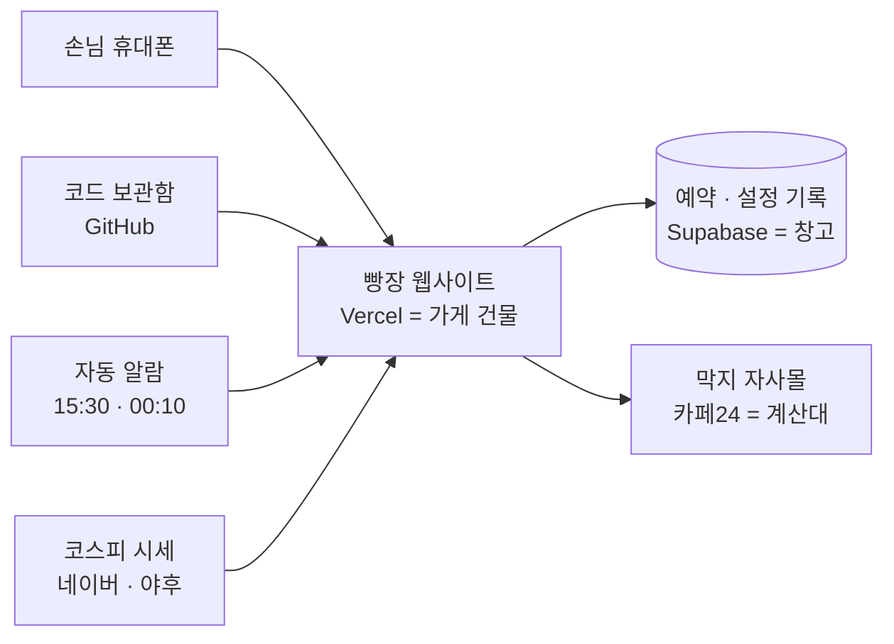

# 막지 빵장 세팅 가이드

> 2026-09-23 기준

막지 빵장은 인터넷 서비스 세 곳(Supabase · 카페24 · Vercel)이 서로 열쇠를 주고받으며 돌아갑니다. 이 문서 순서대로 가입하고, 열쇠를 복사해 붙여 넣으면 막지가 직접 운영할 수 있습니다. 코딩은 하지 않습니다.

## 한눈에 보기

빵장은 가게 하나를 여는 것과 같습니다. **가게 건물**(Vercel), **창고**(Supabase), **본점 계산대**(카페24 자사몰)가 있고, 이 셋을 **열쇠**(환경변수)로 연결합니다.

손님은 빵장에서 오늘 가격을 보고, 실제 결제는 막지 자사몰(카페24)에서 합니다. 코스피 시세는 공개 정보라 따로 가입할 필요가 없습니다.

### 시작 전에 준비할 것

- [ ] 회사 이메일 하나 — 아래 모든 가입에 **같은 이메일**을 쓰면 나중에 헷갈리지 않습니다
- [ ] GitHub 계정 — 가입 후 아이디를 개발팀에 알려 주세요. 팀이 코드를 이 계정으로 옮겨 드립니다
- [ ] 결제용 법인카드 — Vercel 유료 요금제(3단계)에 필요합니다
- [ ] 카페24 막지몰 **대표 운영자** 로그인 정보 — 마지막에 빵장 연결을 '동의'할 때 필요합니다
- [ ] 열쇠를 잠깐 적어 둘 곳 — 회사 비밀번호 관리 도구 또는 내 컴퓨터 메모장. **카톡·메일로 보내지 마세요**

순서는 **Supabase → 카페24 → Vercel → 마무리**입니다. 앞 단계에서 받은 열쇠를 뒤 단계에서 쓰기 때문에 순서를 바꾸면 안 됩니다.

## 1단계 — Supabase: 창고 만들기

창고에는 예약, 관심빵, 할인 구간, 카페24 연결 열쇠가 쌓입니다. 이 단계가 끝나면 **열쇠 2개**(`SUPABASE_URL`, `SUPABASE_SERVICE_ROLE_KEY`)를 손에 쥐고 있어야 합니다.

### ① 가입하고 창고 만들기

1. [supabase.com](https://supabase.com)에 들어가 **Start your project**를 누르고 회사 이메일로 가입합니다.
2. **New project**를 누르고 아래처럼 채운 뒤 **Create new project**를 누릅니다. 1\~2분 기다리면 준비됩니다.

| 칸 | 넣을 값 |
| --- | --- |
| Name | `makji-breadmarket` (알아보기 쉬운 이름이면 무엇이든 됩니다) |
| Database Password | **Generate a password**를 누르고 나온 값을 메모장에 저장. 빵장에는 안 쓰지만 잃어버리면 나중에 곤란합니다 |
| Region | **Northeast Asia (Seoul)** — 손님과 가까울수록 빠릅니다 |
| Plan | Free로 시작해도 됩니다 (아래 참고) |

무료 요금제는 **1주일 동안 아무도 안 쓰면 창고가 잠듭니다**([Supabase 요금제](https://supabase.com/pricing)). 빵장은 평일마다 자동으로 창고를 열어서 보통은 잠기지 않지만, 며칠 쉼 때는 대시보드에서 **Restore**를 눌러 깨워야 합니다. 신경 쓰고 싶지 않다면 Pro(월 $25부터)로 올리면 됩니다.

### ② 창고에 선반 짜기 — 붙여넣고 버튼 한 번

창고는 처음엔 텅 빈 방이라 선반을 짜 줘야 합니다. 선반 설계도는 코드 보관함(GitHub)에 **파일 하나**로 들어 있어서, 붙여넣고 버튼 한 번이면 끝납니다.

1. GitHub에서 [`web/supabase/지금_실행할_SQL.sql`](../web/supabase/지금_실행할_SQL.sql) 파일을 열고, 오른쪽 위 **Copy raw file** 버튼(겹친 네모 모양)으로 내용을 통째로 복사합니다.
2. Supabase 왼쪽 메뉴에서 **SQL Editor** → **New query**를 누릅니다.
3. 빈 칸에 붙여넣고 오른쪽 아래 **Run**을 누릅니다.
4. 화면 아래에 표가 나오고 **모든 줄이 ✅ 있음**이면 성공입니다.

- 실수로 두 번 눌러도 괜찮습니다. 몇 번을 다시 돌려도 안전하게 만들어 두었습니다.
- ❌ 없음이 보이거나 빨간 오류가 나오면 화면을 캡처해 개발팀에 보내 주세요. 중간에 실패하면 전부 없던 일로 되돌아가니 창고가 망가지지는 않습니다.

### ③ 열쇠 2개 복사하기

왼쪽 아래 톱니바퀴 **Settings** → **API Keys**로 갑니다.

| 열쇠 이름 (Vercel에 넣을 때) | 무엇을 복사하나 | 모양 |
| --- | --- | --- |
| `SUPABASE_URL` | Project URL (화면 위쪽 **Connect** 버튼을 눌러도 보입니다) | `https://영문숫자.supabase.co` |
| `SUPABASE_SERVICE_ROLE_KEY` | **Secret keys** 칸의 키. 없으면 **같은 화면에서 새**로 만듭니다 | `sb_secret_`로 시작 |

**Publishable key(`sb_publishable_`)를 복사하면 안 됩니다.** 빵장의 창고는 문을 잠가 두었기 때문에, Secret key가 아니면 아무것도 읽거나 쓸 수 없습니다. 반대로 Secret key는 **창고 마스터키**라 절대 남에게 보내면 안 됩니다.

## 2단계 — 카페24: 자사몰 열쇠 받기

빵장이 자사몰 판매가를 바꾸고 옵션·재고를 읽으려면, 카페24가 "이 앱은 막지몰을 만져도 된다"고 허락한 열쇠가 필요합니다. 이 단계가 끝나면 **열쇠 3개**(`CAFE24_MALL_ID`, `CAFE24_CLIENT_ID`, `CAFE24_CLIENT_SECRET`)를 쥐고 있어야 합니다.

1. **몰 아이디 확인** — 카페24 기본 주소 `○○○.cafe24.com`에서 `○○○` 부분입니다. 이것이 `CAFE24_MALL_ID`입니다. `makji.kr` 같은 개인 도메인이 아니라 카페24 기본 주소의 아이디입니다.
2. [카페24 개발자센터](https://developers.cafe24.com)에 로그인하고 **Apps → App 관리**에서 새 앱을 만듭니다. 이름은 `막지 빵장`처럼 알아보기 쉽게 짓습니다.
3. 앱 설정에서 아래 두 가지를 넣습니다.
4. 앱 정보에 보이는 **Client ID**와 **Client Secret**을 메모장에 복사합니다.

| 설정 | 넣을 값 |
| --- | --- |
| Redirect URI (돌아올 주소) | `https://makji-breadmarket.vercel.app/api/cafe24/callback` — 우선 이렇게 적고, 3단계에서 실제 주소가 나오면 4단계에서 다시 맞춥니다 |
| 권한 | **상품** 읽기+쓰기 · **프로모션** 읽기+쓰기 · **주문** 읽기(선택) |

- **Redirect URI는 글자 하나만 달라도 실패합니다.** `https`로 시작하고, 끝에 `/`를 붙이지 않습니다.
- **주문 읽기를 켰다면** 3단계에서 `CAFE24_ORDER_SCOPE`를 `on`으로 넣습니다. 반대로 앱에 주문 권한이 없는데 `on`을 넣으면 카페24가 동의 화면을 아예 띄우지 않습니다(`invalid_scope`). 지금 빵장은 주문 권한 없이도 동작합니다.
- **Client Secret은 자사몰 마스터키**입니다. 이걸 가진 사람은 막지몰 가격을 바꿀 수 있습니다.
- 개발자센터의 메뉴 이름은 카페24가 바꿀 수 있습니다. 위 이름이 안 보이면 화면 캡처를 개발팀에 보내 주세요.

## 3단계 — Vercel: 가게 문 열기

Vercel은 코드 보관함(GitHub)에서 코드를 가져와 손님이 들어오는 웹사이트로 만들어 줍니다. 이 단계가 끝나면 **빵장 주소**(`https://○○○.vercel.app`)가 생깁니다.

### 요금제는 Pro가 필요합니다

무료(Hobby) 요금제는 막지에 맞지 않습니다. 이유는 두 가지입니다.

|  | Hobby (무료) | Pro |
| --- | --- | --- |
| 회사 사업에 써도 되나 | **안 됩니다** — 개인·비상업용만 ([근거](https://vercel.com/docs/plans/hobby)) | 됩니다 |
| 15:30 개장이 제시간에 되나 | **15:30\~16:29 사이 아무 때나** ([근거](https://vercel.com/docs/cron-jobs/usage-and-pricing)) | 1분 단위로 정확 |
| 가격 | 0원 | 개발자 1명당 월 $20 (보기 전용 멤버는 무료) |

### 따라 하기

1. [vercel.com](https://vercel.com)에서 **Sign Up** → **Continue with GitHub**를 누릅니다. 코드를 받은 바로 그 GitHub 계정으로 들어갑니다.
2. **Settings → Billing**에서 **Upgrade**를 눌러 Pro로 올립니다.
3. 대시보드에서 **Add New… → Project**를 누르고, 저장소 목록에서 빵장 코드(지금 이름 `korea_traditional`) 옆 **Import**를 누릅니다.
4. 설정 화면을 아래 표처럼 채웁니다.
5. **Deploy**를 누르고 몇 분 기다립니다. 축하 화면이 나오면 화면에 보이는 주소를 메모합니다. 4단계에서 씁니다.
6. (권장) 프로젝트의 **Settings → Functions → Function Regions**에서 **Seoul (icn1)** 하나만 고르고 저장합니다. 기본값은 미국 워싱턴이라, 서울 창고를 열 때마다 태평양을 왕복합니다.

| 칸 | 넣을 값 |
| --- | --- |
| Project Name | `makji-breadmarket` — 주소가 `https://makji-breadmarket.vercel.app`이 됩니다. 이미 누가 쓰는 이름이면 뒤에 글자가 붙습니다 |
| Root Directory | **`web`** — **Edit**을 눌러 `web` 폴더를 고릅니다. 가장 많이 틀리는 칸입니다 |
| Framework Preset | Next.js (자동으로 잡힙니다) |
| Environment Variables | 바로 아래 **환경변수 표**를 보고 하나씩 넣습니다 |

**열쇠를 바꾸면 반드시 다시 배포해야 합니다.** 바꾼 값은 새 배포에만 들어갑니다([근거](https://vercel.com/docs/environment-variables)). **Deployments** → 맨 위 배포의 **⋯** → **Redeploy**를 누릅니다. 이 문서에서 "다시 배포"는 전부 이 버튼입니다.

## 환경변수 표 — Vercel에 넣을 열쇠

환경변수는 **이름표가 붙은 열쇠**입니다. Vercel 화면의 **Key** 칸에 이름을, **Value** 칸에 값을 넣고 **Add**를 누릅니다. 나중에 바꿀 때는 프로젝트의 **Settings → Environment Variables**로 갑니다.

- 이름은 **대문자·밑줄까지 한 글자도 틀리면 안 됩니다.** 표에서 복사해 붙여넣으세요.
- 값의 앞뒤에 띄어쓰기·따옴표가 들어가지 않게 합니다.
- 환경(Production · Preview · Development)은 기본으로 체크된 그대로 둡니다.

### 꼭 넣어야 하는 것 (9개)

| 이름 (Key) | 무엇인가 | 넣을 값 (Value) |
| --- | --- | --- |
| `SUPABASE_URL` | 창고 주소 | 1단계 ③에서 복사한 Project URL |
| `SUPABASE_SERVICE_ROLE_KEY` | 창고 마스터키 | 1단계 ③에서 복사한 `sb_secret_…` |
| `CAFE24_MALL_ID` | 자사몰 아이디 | 2단계 1번의 `○○○` |
| `CAFE24_CLIENT_ID` | 카페24 앱 이름표 | 2단계 4번의 Client ID |
| `CAFE24_CLIENT_SECRET` | 자사몰 마스터키 | 2단계 4번의 Client Secret |
| `NEXT_PUBLIC_SHOP_BASE` | 손님이 결제하러 가는 자사몰 주소 | `https://makji.kr` — **`CAFE24_MALL_ID`와 같은 몰이어야 합니다** |
| `PRICE_SYNC` | 15:30에 자사몰 판매가를 실제로 내리고, 00:10에 되돌리는 스위치 | `on` |
| `ADMIN_PASSWORD` | 관리자 화면(`/admin`) 비밀번호 | 새로 정합니다. 영문+숫자 16자 이상 |
| `CRON_SECRET` | 자동 알람(15:30 · 00:10)만 아는 암호 | 새로 만듭니다. 영문+숫자 32자 이상. 사람은 외울 필요 없습니다 |

- **직접 만드는 두 값**(`ADMIN_PASSWORD`, `CRON_SECRET`)은 비밀번호 관리 도구의 '비밀번호 생성' 기능으로 만들면 편합니다. 띄어쓰기와 특수문자는 빼고 영문+숫자만 씁니다. 두 값은 서로 달라야 합니다.
- `CRON_SECRET`이 없으면 **15:30 개장이 잠깁니다.** 아무나 가격 변경을 부르지 못하게 막아 둔 것이라, 빠뜨리면 빵장이 열리지 않습니다.
- `ADMIN_PASSWORD`가 없으면 아무도 관리자 화면에 들어갈 수 없습니다. **15분 안에 5번 틀리면 잠시 잠깁니다.**
- `PRICE_SYNC`를 빼면 빵장 화면에만 할인가가 보이고, 자사몰에서는 **정가로 결제**됩니다. 손님에게 약속한 가격과 실제 가격이 달라집니다.

### 필요할 때만 넣는 것

| 이름 (Key) | 언제 넣나 | 넣을 값 (Value) |
| --- | --- | --- |
| `NEXT_PUBLIC_SHOP_CATE` | 자사몰 빵 목록 번호가 24가 아닐 때 | 자사몰 빵 목록 페이지 주소에서 `cate_no=` 뒤의 숫자 |
| `CAFE24_ORDER_SCOPE` | 2단계에서 주문 읽기 권한을 켰을 때 | `on` |
| `NEXT_PUBLIC_VAPID_PUBLIC_KEY` | 관심빵 할인 알림(웹 푸시)을 쓸 때 | 개발팀이 만들어 드립니다 (3개 한 세트) |
| `VAPID_PRIVATE_KEY` | 위와 같이 | 개발팀이 만들어 드립니다 |
| `VAPID_SUBJECT` | 위와 같이 | `mailto:회사이메일@makji.kr` 형태 |
| `FILL_PER_IP` | 한 인터넷 주소(IP)가 한 빵에 잡을 수 있는 자리 수를 바꿀 때 | 기본 `5`. 사무실·집이 인터넷을 함께 쓰는 걸 감안한 값입니다 |
| `SITE_ORIGIN` | `bread.makji.kr`처럼 회사 도메인을 붙일 때 | `https://bread.makji.kr` — 카페24 Redirect URI도 같이 바꿉니다 |

웹 푸시 3개를 안 넣으면 알림 버튼만 '지원 안 됨'으로 보이고 나머지는 정상 동작합니다.

### 넣으면 안 되는 것

개발팀 인수인계 문서나 예전 설정에서 아래 이름을 보더라도 Vercel에 넣지 마세요.

| 이름 | 넣으면 생기는 일 |
| --- | --- |
| `MARKET_ALWAYS_OPEN` | 시험용입니다. 빵장이 **24시간 주말 없이** 열려 있게 됩니다 |
| `INVENTORY_SYNC` | 예약 한 건에 자사몰 재고가 **2개씩** 줄어들고, 예약한 손님이 품절을 만납니다 |
| `DISCOUNT_DELIVERY` | 비워 두면 판매가 변경으로 할인합니다. 다른 값을 넣으면 할인이 손님에게 전달되지 않습니다 |

## 4단계 — 연결 마무리

마지막으로 빵장과 자사몰을 악수시킵니다. **점검 → 연결 → 확인** 순서이고, 점검을 건너뛰면 안 됩니다. 아래에서 `빵장주소`는 3단계에서 메모한 주소입니다(예: `https://makji-breadmarket.vercel.app`).

### ① 돌아올 주소 맞추기

3단계에서 받은 주소가 2단계에 적은 것과 다르면, 카페24 개발자센터의 Redirect URI를 `빵장주소/api/cafe24/callback`으로 고칩니다. 같으면 넘어갑니다.

### ② 점검 — 연결 버튼을 누르기 전에

1. `빵장주소/admin`을 열고 `ADMIN_PASSWORD`로 로그인합니다.
2. 같은 브라우저에서 `빵장주소/api/health`를 엽니다. 영어와 기호로 된 글자 화면이 나오는데, 아래 표의 단어를 찾아 옆의 값을 확인합니다.

| 찾을 단어 | 이렇게 보이면 정상 |
| --- | --- |
| `mallId` | 2단계의 몰 아이디 |
| `clientId` · `clientSecret` | 둘 다 `true` |
| `redirectUri` | 카페24에 적은 주소와 **글자까지 똑같음** |
| `scopes` | `mall.read_product` 등 4개. 주문 권한을 켰으면 `mall.read_order`까지 5개 |
| `configured` | `true` |
| `cafe24_tokens` · `discount_tiers` | 둘 다 `OK` |
| `cafe24Token` | `아직 인증 전` (지금은 이게 정상) |

하나라도 다르면 **연결 버튼을 누르지 말고** 환경변수를 고친 뒤 다시 배포하고 다시 점검합니다. 카페24는 열쇠 발급 횟수를 2시간에 15번으로 제한해서, 틀린 채로 누르면 횟수만 깎입니다.

### ③ 연결 — 동의 버튼 한 번

1. `빵장주소/api/cafe24/authorize`를 엽니다. 카페24 로그인·동의 화면으로 넘어갑니다.
2. 막지몰 관리자로 로그인하고 **동의**를 누릅니다. 카페24가 준 인증코드는 **1분**만 유효하니 이 화면에서 오래 머물지 마세요.
3. **카페24 연동이 완료됐습니다**라는 글자가 나오면 성공입니다.

다른 글자가 나오면 이렇게 합니다.

| 화면의 글자 | 할 일 |
| --- | --- |
| state 값이 맞지 않습니다 | 10분이 지났습니다. 1번부터 다시 합니다 |
| 카페24 인증이 거부됐습니다 (`invalid_scope`) | 앱에 없는 권한을 요청했습니다. 주문 권한이 없는데 `CAFE24_ORDER_SCOPE=on`이 들어 있는지 봅니다 |
| 토큰 발급에 실패했습니다 | Redirect URI나 Client Secret이 틀렸을 가능성이 큽니다. ② 점검부터 다시 합니다 |

### ④ 확인

1. `빵장주소/api/health`를 다시 엽니다. `cafe24Token`에 몰 아이디와 시각(`expiresAt`)이 보이면 연결된 것입니다.
2. `빵장주소/api/health?product=29`를 엽니다. 29번은 마틸다 초코케이크입니다. `product_name`과 `price`가 보이면 빵장이 자사몰 가격을 읽을 수 있는 것입니다.
3. `빵장주소`를 휴대폰으로 열어 봅니다. 평일 15:30 이후에는 오늘의 할인 가격이 보여야 합니다.

여기까지 되면 세팅은 끝입니다. 첫 평일 15:30과 다음 날 00:10에 자사몰 가격이 내려갔다 돌아오는지 카페24 관리자 화면에서 한 번 확인해 주세요.

## 매일 자동으로 도는 것 · 관리자 화면

세팅이 끝나면 평일마다 두 번 자동 알람이 울리고, 사람이 눌러야 할 버튼은 없습니다. 알람 목록은 Vercel 프로젝트의 **Settings → Cron Jobs**에서 볼 수 있습니다.

| 언제 (한국 시간) | 무엇을 하나 |
| --- | --- |
| 월\~금 15:30 | 코스피 종가로 오늘 할인을 정하고, **자사몰 판매가와 옵션 추가금을 내립니다.** 관심빵이 할인된 손님에게 알림을 보냅니다 |
| 화\~토 00:10 | 전날 15:30에 내린 가격을 **원래대로 되돌립니다** |
| 토·일 | 휴장. 가격을 바꾸지 않습니다. 평일인 거래소 휴장일(공휴일·선거일·연말)도 같습니다 |

### 관리자 화면 (`빵장주소/admin`)

아래 값은 코드를 고치거나 다시 배포하지 않고 화면에서 바로 바꿉니다.

| 화면의 칸 | 무엇을 정하나 | 처음 값 |
| --- | --- | --- |
| 오늘 자사몰에 반영할 가격 | 오늘 빵장에 올라갈 빵과 가격. **자사몰에 반영**으로 손으로 반영할 수도 있습니다 | 코스피 방향에 따라 자동 |
| 목록 옆 **+** | 오늘 목록에 없는 빵을 넣거나 뺍니다 | — |
| 예약 n건 | 빵(또는 옵션)마다 하루에 받을 예약 수 | 30건 |
| 할인 구간 설정 | 코스피가 몇 % 움직이면 몇 % 할인할지 | 코스피 5년 실측으로 정한 5구간, 최대 38% |
| 주말 배당 | 기준 객단가 · 배당률 · 주간 예산 | 8,000원 · 10% · 50만원 |
| 공모주 | 절기빵 공모 기능 켜기·끄기 | 꺼짐 |

**새 빵을 빵장에 추가하는 것은 화면에서 안 됩니다.** 빵 목록(이름 · 정가 · 자사몰 상품번호)은 코드에 들어 있어서 개발자가 고쳐야 합니다.

## 꼭 알고 있어야 할 것

빵장은 **자사몰의 진짜 판매가**를 바꿉니다. 그래서 아래 다섯 가지는 운영하는 분이 꼭 알고 있어야 합니다.

1. **15:30\~00:10에는 자사몰 모든 손님이 할인가를 봅니다.** 빵장을 거치지 않고 자사몰에 바로 들어온 손님도 같은 가격으로 삽니다. 할인 코드가 아니라 판매가 자체를 내리기 때문입니다.
2. **그 시간에 카페24에서 가격을 손으로 고치지 마세요.** 00:10에 빵장이 15:30 직전에 적어 둔 가격으로 되돌리기 때문에, 그사이 바꾼 값은 사라집니다. 정가를 바꾸려면 00:10 이후 또는 주말에 합니다.
3. **자동 알람은 가끔 건너뛸 수 있고, Vercel은 다시 울려 주지 않습니다**([근거](https://vercel.com/docs/cron-jobs/manage-cron-jobs)). 드물지만 00:10 복원이 빠지면 다음 날까지 할인가가 남습니다. 처음 한두 달은 아침마다 자사몰 가격이 정가인지 한 번 봐 주세요.
4. **휴장일 달력은 2027년까지만 들어 있습니다.** 주말과 거래소 휴장일(설·추석·선거일 등)에는 빵장이 쉬고 가격을 바꾸지 않습니다. 화면에는 직전 거래일 종가와 다음 장 날짜가 나옵니다. 한국거래소가 매년 12월에 다음 해 휴장일을 공고하면 개발자가 달력에 한 해를 추가해야 하고, 안 하면 2028년부터는 평일 공휴일에도 빵장이 열립니다. 갑자기 지정되는 임시공휴일도 같은 방법으로 넣습니다.
5. **열쇠가 새어 나갔다면 바로 새로 받습니다.** Supabase Secret key나 카페24 Client Secret을 다른 사람이 봤다면, 각 서비스에서 새로 발급 → Vercel 값 교체 → 다시 배포합니다. 카페24 열쇠를 바꿨다면 4단계 ②\~④도 다시 합니다.

### 한 달에 한 번 확인

- `빵장주소/api/health`에서 `cafe24Token`의 시각이 최근 날짜인지 봅니다. 카페24 연결은 **14일** 동안 한 번도 안 쓰면 끊깁니다([카페24 문서](https://apidocs.cafe24.com/docs/guide/intro)). 빵장이 평일마다 쓰기 때문에 보통은 이어지지만, 사이트가 2주 넘게 멈췄다면 4단계 ③을 다시 합니다.
- Supabase 무료 요금제라면 창고가 잠들지 않았는지 대시보드를 한 번 열어 봅니다.

## 문제가 생기면

대부분은 **열쇠가 빠졌거나, 바꾼 뒤 다시 배포를 안 한 경우**입니다. 아래 표로 안 풀리면 화면 캡처와 함께 `빵장주소/api/health` 화면을 개발팀에 보내 주세요. 이 화면에는 열쇠 값이 나오지 않아 보내도 안전합니다.

| 이런 일이 생기면 | 보통 이것 때문 | 이렇게 합니다 |
| --- | --- | --- |
| 환경변수를 바꿨는데 그대로다 | 다시 배포를 안 했다 | **Deployments → ⋯ → Redeploy** |
| 15:30이 지났는데 빵장이 안 열린다 | 오늘이 거래소 휴장일이거나(정상입니다), Hobby 요금제이거나 `CRON_SECRET`이 없다 | Pro인지 확인. **Settings → Cron Jobs → View Logs**에서 오늘 기록을 봅니다 |
| 00:10이 지났는데 자사몰이 아직 할인가다 | 복원 알람이 건너뛰었거나 카페24 연결이 끊겼다 | 카페24 관리자에서 정가로 직접 되돌리고 개발팀에 알립니다. 관리자 화면에는 복원 버튼이 없습니다 |
| 화면에 "이번 서버 세션의 메모리에만 기록됩니다"가 보인다 | 창고(Supabase)에 못 들어간다 | `SUPABASE_URL` · `SUPABASE_SERVICE_ROLE_KEY` 확인. 창고가 잠들었으면 Supabase에서 **Restore** |
| 관리자 로그인이 안 된다 | 비밀번호를 15분 안에 5번 틀렸다 | 15분 기다렸다가 다시. 계속 안 되면 `ADMIN_PASSWORD`를 새로 정하고 다시 배포 |
| `/api/health`에 카페24 오류가 나온다 | 카페24 연결이 끊겼다 | 4단계 ② 점검 → ③ 연결을 다시 합니다 |
| 구매 버튼이 다른 몰로 가거나 정가가 나온다 | `NEXT_PUBLIC_SHOP_BASE`가 `CAFE24_MALL_ID`와 다른 몰이다 | 두 값을 같은 몰로 맞추고 다시 배포 |
| 알림 버튼이 '지원 안 됨'으로 나온다 | 웹 푸시 열쇠 3개가 없다 | 넣고 다시 배포. 아이폰은 빵장을 **홈 화면에 추가**해야 알림을 받을 수 있습니다 |
| 빵장이 토·일에도, 밤에도 계속 열려 있다 | `MARKET_ALWAYS_OPEN`이 들어 있다 | Vercel에서 지우고 다시 배포 |
